# ACERの2-in-1タブレット，Aspire switch　10を分解，SSD化してみる…その１

📅 投稿日時: 2018-10-17 00:59:27

🏷️ カテゴリ: [PC,カメラ&小物](c0d8caed13e597efe97b661a8ae56bed0.md)

えー．

ダイビングと車ネタの宝庫，

徒然スキーヤー日記へようこそ．

ここしばらく．

ダイビングと車ネタが続いていましたが．

本日は，このスキーヤーBlogで良くやるネタ．

そう．PCの分解・改造ネタです！←なんかツッコミどころだらけなのだが

えー．

普段，自作デスクトップPCを使っている私．

外出先でのネットやBlog記事作成やら，

スキー場で撮ったビデオの確認やら，

ダイビング遠征先で大量に撮った写真の

バックアップやら，いろいろと活用しているのが，

こいつ．

今はもう販売していない，Acer Aspire switch 10です～！

もう，4年ほど前に発売されたPCですね…

基本的にWindows8.1が乗ったノートパソコンですが．

画面がタッチパネルになっていて．

画面部分を外せば，タブレットとして使えるという．

いわゆる2-in-1タブレット機です．

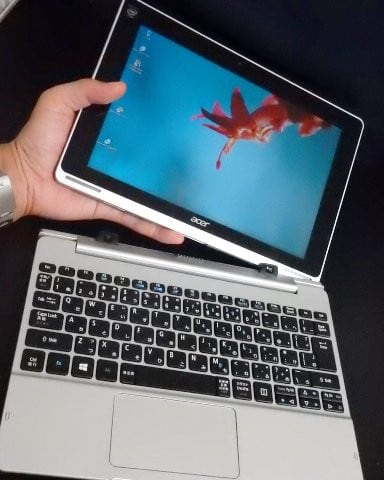

で．

こいつの便利なところが．

なんと．

キーボードドッグの方に，500Gのハードディスクが

搭載されているんですよ！

だもんで．

この大容量HDDを活かして．

スキーでの動画やら，ダイビングで撮った

大量の写真のバックアップ用に，すごい便利なんです．

まぁ，ノートパソコン兼ポータブル（？）HDDですね．

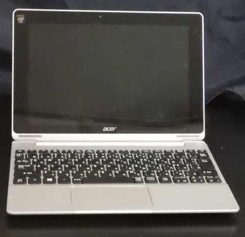

でも．

大容量HDDを積んでいるデメリットとして．

HDDが載っているキーボードドックを繋ぐと．

HDDがスピンアップして，電力を食います…

HDDを使ってないと休止状態に入ってくれるんですが．

ときどきHDDにアクセスするような使い方をすると．

HDDが回りっぱなしで，電池のもちが短くなります…

システム自体は，画面（タブレット本体）側の

64G eMMCに乗っているので，このHDDはあくまで

システムとは別ドライブの，データ領域なので．

HDDアクセス速度が遅くてシステムが遅い！

…という問題は無いのですが．

今回，電池もちを延ばすのと，もう一つの目的のために．

こいつのHDDを，SSDに換装することにしました…！

まぁ，もう一つの目的は，後で述べるとして．

購入したのは，こいつ．

120GBのSSDです．

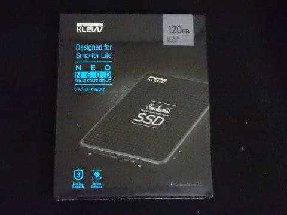

なんと．

こいつは．

秋葉原で￥2,999+消費税という超格安で売ってました…

うーむ．

ここ2年ほど，SSDはかなり値上がりしてましたけど．

最近また値崩れしてきましたね…

消費者にとっては，有り難いことです．

元からある500GBのHDDから，かなり容量は減りますが．

私の使い方だと，120Gもあれば余りまくるので．

この格安SSDで十分だな…！

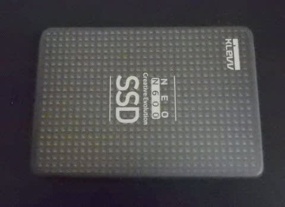

では，PC本体…というか，キーボードドックの分解に

かかりましょうか．

まずは，キーボード部分を裏返して．

この9本のネジを外せば．

裏蓋が外れるはず…

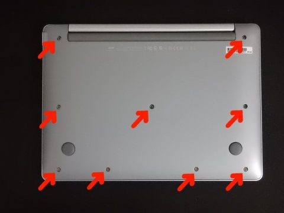

…

はず…

はずなんだけど．

外れない（涙）．

どうしたことだ…

どうやら，この赤枠で囲んだ，ゴム足の下にも

ネジが隠れているようです…

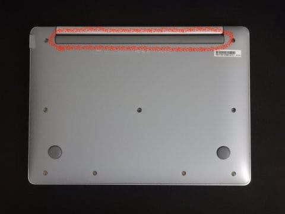

って．

このゴム足，どうやったら外れるんだ？？

両面テープででも止めてあるのかな？

…うむ．

ここは強引に，ドライバーを突っ込んで剥がすしか

無いか…←典型的なダメ人間の発想（笑）．普通は知らないものは強引に分解しない方が良い

と，ドライバーを突っ込んでみたところ．

うむ！？？？

はがれた！！！

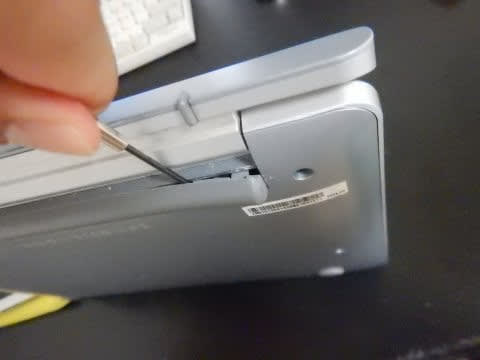

って，これ，ツメで留まってたの？？

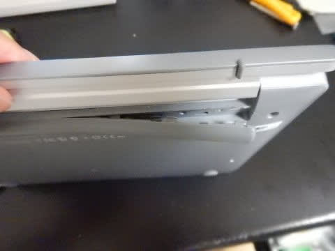

ってな感じで．

グイグイ引っ張っていくと．ツメが

バキバキと外れていき．

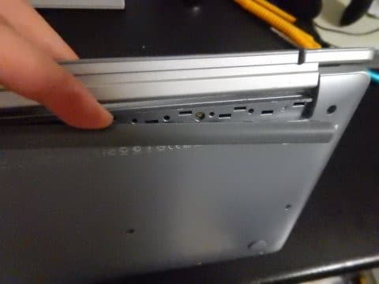

最後はこんな感じで外れました！

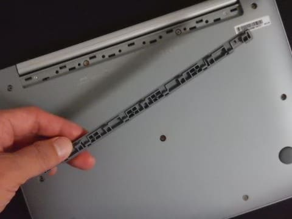

うーむ．

でも，これ．

かなり固いので，外すのにすごい苦労します…

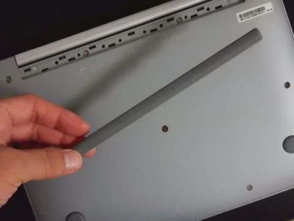

ってな感じで．

結局は，この11カ所のネジを外せば．

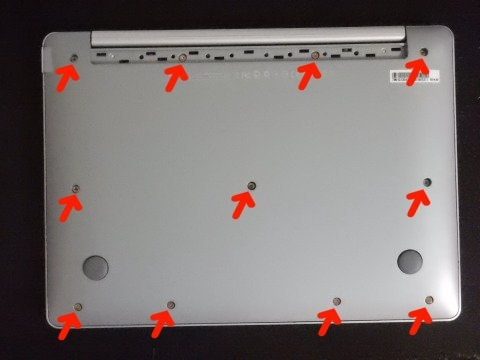

こんな感じで，ハードディスクを拝むことが

できました～！

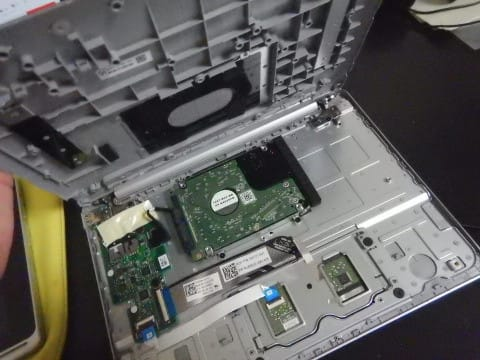

（続く）

## 💬 コメント一覧

### 💬 コメント by (つーちゃん)
**タイトル**: 浦島太郎
**投稿日**: 2018-10-17 20:44:43

この前、自作PCのHDDが昇天したのでSSDに交換したのですが、

５００Gで１万円ほどで買いました。

作って以来あまりパーツ類に興味を示していなかったので、

大容量化とお値段に驚いています(笑)

他にもメモリの規格がDDR”４”になってたり、COREiシリーズが今や第9世代ですか！？（自分のは初代）

もう骨董品ですねー

### 💬 コメント by (Skier_S)
**タイトル**: つーちゃんさま
**投稿日**: 2018-10-18 01:22:19

SSDは2年ほど前から値上がりが続いていたんですが．

ここ数か月で一気にお値段がこなれてきましたね…

一度SSDの快適さを知ってしまうと，もうシステムディスクは

HDDに戻せません（笑）．

Coreiは，第9世代が発表されましたね～．

でも，もうCPUはこれ以上速くてももう差が分からないです（笑）．

