# 1月21日，土曜日の志賀高原は…またもかなりの積雪デー！

📅 投稿日時: 2017-01-22 01:01:59

🏷️ カテゴリ: [2017スキー滑走日記](c7d777cecfc91bdf0fa464ad62c6d49ab.md)

えー．

相変わらず，本日も志賀高原に来ているわけですが．

本日．

朝イチゴンドラを逃しました………

…というより．

かなり屈辱的なことに．

リフト営業開始2時間後の10時半にゲレンデ到着

という失態を犯してしまいました…（涙）

まさか．

まさか，この自分がそんな失態を犯すとはっ！！（泣）

いや．

水曜日に自分で

　高速道路は長野県に入る前からチェーン規制がかかりそうなので，

　移動時間がかかることを覚悟！

と，予想しておきながら．

自分が高速道の積雪にやられてちゃ，ダメだろ～っ！！←（自己突っ込み）

なんてったって，横川からチェーン規制で，

高速がかなりの積雪路…（泣）

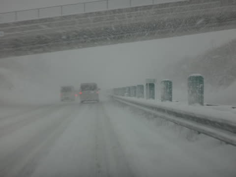

除雪車に先導されてのかなりのゆっくりペースでの移動やら

渋滞やらに，何度も巻き込まれました（涙）

ちなみに，渋滞の原因は．

こんな感じの車が，何台かいたことですね…

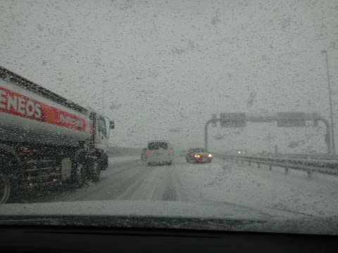

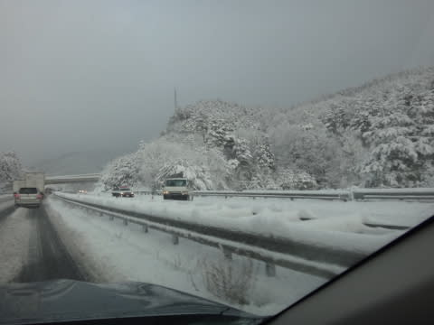

当然，志賀の登りはかなりヘビーな

積雪路だし．

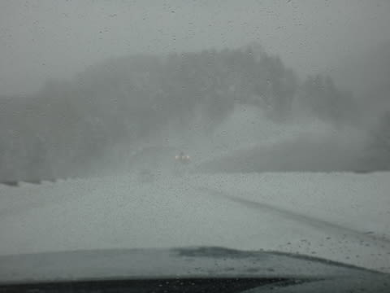

そして…

…焼額の第1ゴンドラ前日帰り駐車場がすごいことに！

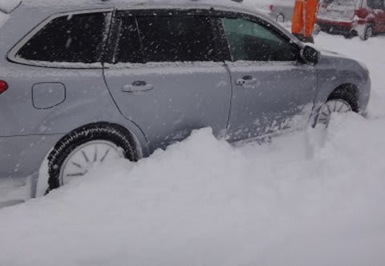

雪が深すぎて，駐車場の中に入れない…（涙）

第2高速の駐車場も，除雪が間に合っておらずクローズ（泣）

第2ゴンドラ前駐車場に何とか止めましたが…

…なんと．

なんということだ！！

本日一日，強風で第2ゴンドラ営業中止（涙）

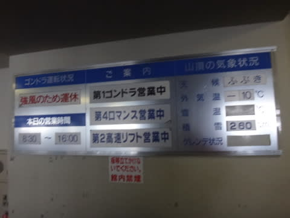

…こ，これは，予想していなかった…←天気予想外したということだな

奥志賀は，今日はゴンドラも高速リフトもすべて

営業できず．第1ペアしか動かなかったようで…

まぁ，ヤケビで止まっているのは2ゴンだけ．

1ゴンは動いているので，ペアリフトに乗って，

1ゴンへ向かいますが…

1ゴン山頂の気温は-9℃．

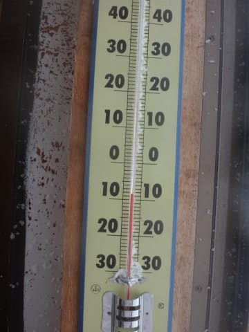

そして雪が激しい勢いで降り続けてるので…

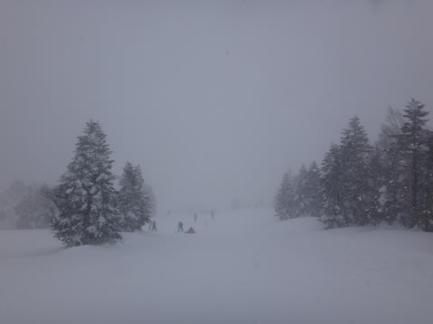

圧雪コース上も，うっすら新雪！

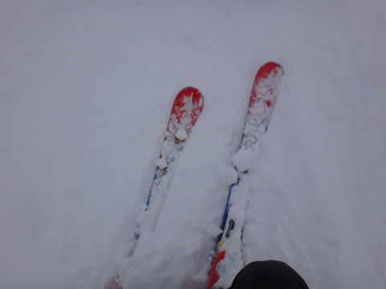

これは，パフパフのオリンピックコースへ行かねば！

…と，向かうものの．

あれ？

駐車場の状況から，もう少し深いと思ったけど…

やっぱり，予想通りブーツ～脛パフ．

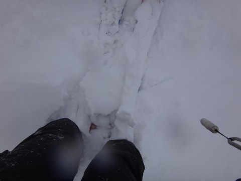

それも．

10時半到着で，もうかなり踏み荒らされてるので．

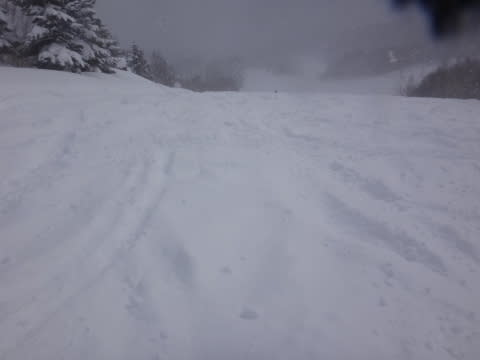

まぁ，パウダー感はところどころ残ってる

けど．

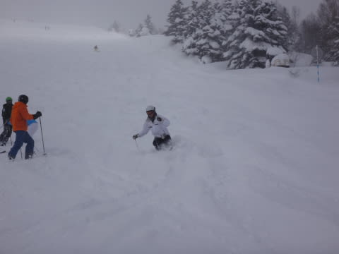

まぁ，楽しい時間は終わった感じ…（涙）

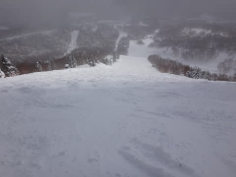

…惜しい．

出遅れたのが，あまりにも惜しい…（泣）

天気は，終日激しく降ったり，時折やんだりで．

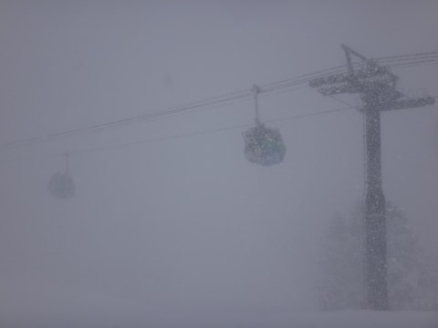

おかげで，コース上は終日うっすら

新雪が…

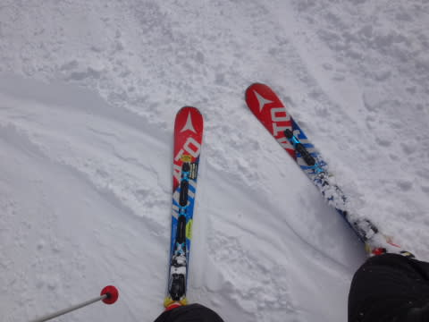

…確か．

午後，雪止むはずじゃなかったっけ…

誰だ！適当な天気予想した奴は！！←だから，自分でしょ

結局．

雪は夕方までふりつづけました…

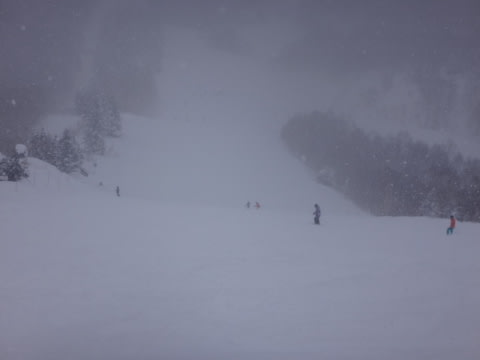

で．

天気は雪降りで，視界は悪めなのに．

2ゴンや奥志賀が動いてないってことで．

コースの人口密度は割と高めでしたね～．

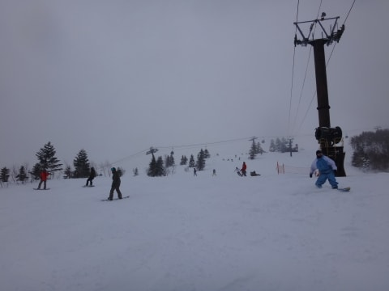

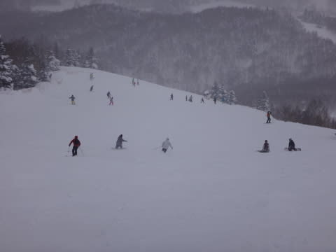

でも．

ゴンドラ待ちはそれほどひどくなかったのが救いかな．

午後も，こんな感じで．

1-2分待つタイミングがあったとはいえ．

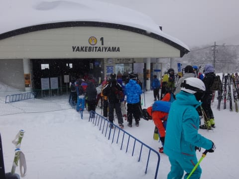

待ちが駅舎の外に延びることは，数回

あったかな～，って程度．

でも．

コースの人は多かったので．

夕方は予想通り，斜度のあるところは

そこそこの凸凹バーン化…（ちょっと涙）

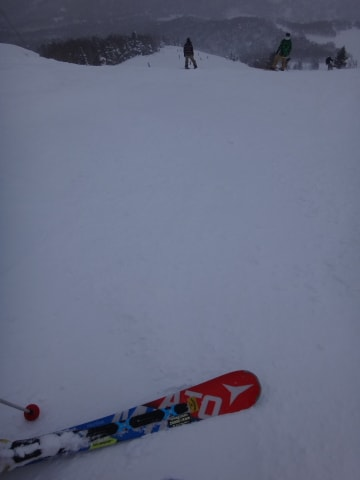

あまり快感度が高くないよ…（残念）

ってことで．

リフトストップまで滑ったけど．

やはり．

朝のスタートが出遅れたのが痛い…

当然，全く滑り足りない！

ってことで．

…はい．

その通り．

予想通りのナイター参戦っ！！

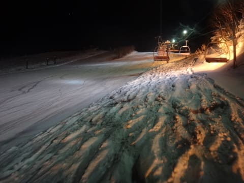

ナイターは，かなりやわらかい圧雪．

今日の朝に滑りそびれたシマシマを，

腹いっぱいいただくのだ！！！

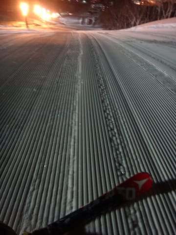

…と．

朝遅れた憂さを晴らすべく，

ひたすらダイヤモンドリフトをグルグルしていたのでした…

ってことで．

2週連続のパウダーデーとなった本日ですが．

もう，今日は朝出遅れたのがショック…（激烈涙）

でも．

気温は冷えて，雪質も良かったし．

ゴンドラ待ちがすごい延びるわけでもなかったし．

コースのいろんなところでパフパフ楽しめたし．

まぁ，良かったかな．

うん．

雪不足の去年に比べれば，ずっと良かったよ！！

…と，比較対象のレベルを激烈に下げるワザで

何とか自分をごまかそうとする，Skier_Sなのだった…

## 💬 コメント一覧

### 💬 コメント by (國井)
**タイトル**: お疲れ様です。
**投稿日**: 2017-01-22 19:10:52

明らかに言える事は、スキー場に行くのと志賀高原に行くのは違う事です。

スキー場に行くイコール楽しく滑る

志賀高原に行くイコール気合で滑るw

お疲れ様でした。

### 💬 コメント by (Skier_S)
**タイトル**: 國井さま
**投稿日**: 2017-01-23 01:58:09

コメントありがとうございます～．

…私にとっては．

志賀高原に行くのも楽しく滑るため…

のはずなんですが（笑）

しかし．

この日の志賀高原は．

スキー場に着くまでには気合が必要な

道路でした（＾＾；

