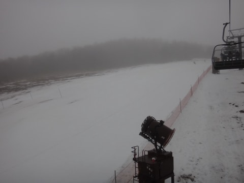
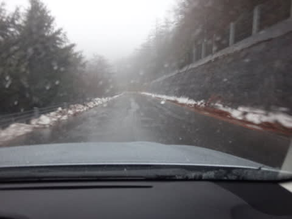
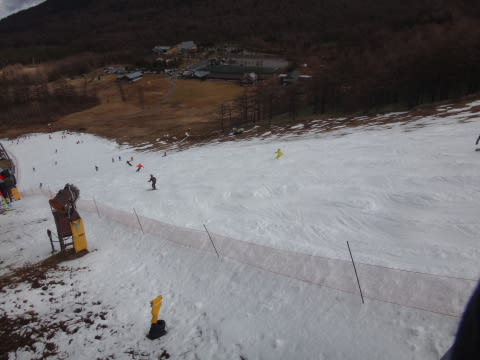
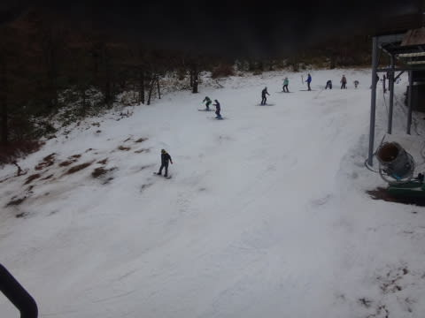
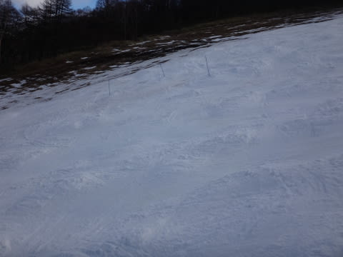
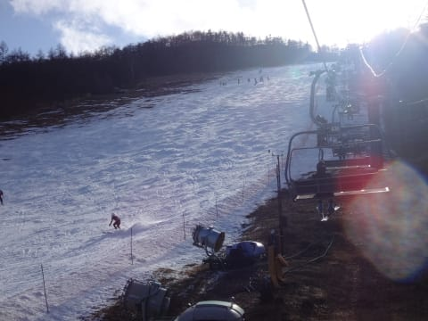
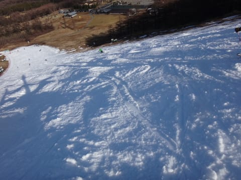

# 11月29日のアサマ2000速報…11月30日も営業するよ！

📅 投稿日時: 2014-11-29 21:11:28

🏷️ カテゴリ: [2015スキー滑走日記](c09ea645cfc085f86dfcd80f49599dd89.md)

えー．

本日，予告通り，アサマ2000に行ってきました．

午前中はすごい雨でした…（涙）．

（朝の雨にぬれるゲレンデ）

とりあえず，詳細報告は後日するとして．

明日，アサマ2000に行こうかな～…って，

思っている人のために，速報しておきます…

あー．

スキー場までの道路は，雪がなくなっちゃてるので．

今日は，問題なく夏タイヤで突っ切れました．

今晩は冷えないはずなので，明日も夏タイヤで

大丈夫だと思います…

んで．

ゲレンデの雪ですが．

人工降雪で結構しっかりつけてあったからか．

午前中の雨に関わらず，そんなに壊滅的にならずに

済みました…

午後でも，こんな感じで．

雪はけっこう持っています…

土が出ているのは，リフト降り場近辺と．

コースのごく一部，ブッシュが出ている程度で．

こんな感じで，コース中数か所，

ブッシュが出ている場所を示す

ポールが立ってますが．

まー，コース自体は結構大丈夫でした！

私の日ごろの行いが良かったからか．

12時頃からは．

こんな感じで日も射す感じで．

結構楽しめました！

＃午前中は死んでたけど

ただ，雪が薄くなってしまったため．

土を掘り返してしまわないように．

明日はコース整備しないで営業するようです…

＃今日の営業中に何度か放送がかかってました．

ということで．

明日の朝は，こんな感じのゲレンデ状況でスタートですが．

でも，雪はまだありますよ～！

## 💬 コメント一覧

### 💬 コメント by (komu)
**タイトル**: 鹿沢
**投稿日**: 2014-11-29 22:22:42

土砂降りだったら草津温泉に変更するつもりで鹿沢に逝って来ました。雨は本格的でしたがまずまず楽しめましたね。

それにしても今年は雪少ないですね

困った困った

### 💬 コメント by (Skier_S)
**タイトル**: komuさま
**投稿日**: 2014-11-29 23:01:12

あ，鹿沢に逝ってしまいましたか…

鹿沢も楽しめたんですね．

アサマ2000は，コース幅も広く，

予想以上に楽しめてかなり

満足でしたよ～！！

来週は，どっかり積もるので大丈夫なはず！！

### 💬 コメント by (いか)
**タイトル**: Unknown
**投稿日**: 2014-11-29 23:38:12

ことしはなかなか本格的にシーズンが始まりませんね。

私はまだ初滑りの儀を執り行っておりません、昨年にはもう天然雪で滑っていたのですが、笑

来週の雪に期待です(^-^)b

### 💬 コメント by (Skier_S)
**タイトル**: いかさま
**投稿日**: 2014-11-29 23:43:53

お久しぶりです！

初滑り，まだですか…

来週はすごい冷えますよ．

一週間，休みなく冷え続けですよ．

日本海側は，豪雪吹雪ですよ．

だもんで．

来週は，かなりのスキー場がオープンすると

思われ．

ぜひ，初滑りに行ってください．

私は来週から，定番の志賀高原通い

が始まります…

