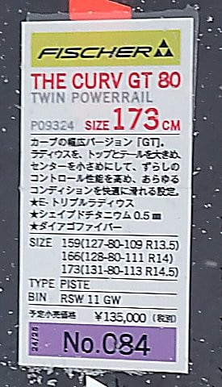

# 2025シーズンモデルのスキー板，試乗レポートその9…FISCHER The CURV GT 80

📅 投稿日時: 2024-06-04 03:18:19

🏷️ カテゴリ: [スキー板試乗](c0bd8048615710cee890e403a36cc9a2b.md)

おばあちゃんのぽたぽた焼って，

怖いネーミングだよね…

と言っても，なかなか共感を得られない

Skier_Sです．

いや．

だって．

ぶりの照り焼

ウナギのかば焼

おばあちゃんのぽたぽた焼

…って並べると．

いきなりホラーな図柄が目に浮かびませんか…？？

ぽたぽたしてるのはやっぱり血…なのか？

という謎の前フリの後は本題へ．

今日は昨日のネタの続きを行こうかと思ったの

ですが．

あの記事，過去の記録を調べて，過去の写真を

ひっくり返して…と，書くのに結構手間暇

かかるんですよ…

なので．

今日はまた2025シーズンのスキー板の

試乗レポート！

今回はまたフィッシャー編です！

〇FISCHER The CURV GT 80 173cm

オールラウンド

前回レポートしたGT85のシリーズで，

センター幅80mmになったモデルですが…

センター幅が違うだけじゃなく，

どうやら85がトップモデルで，こちらは85より

マイルドな位置づけになる，一つ下の

グレード的な扱いになるようで．

お値段もGT85の19万（M-track）~

21万円ちょい（REDEFINE)に比べると，

定価14万8500円とかなりお値段にも

差がついてます．

滑ってみると…

うん．GT85よりたわみが出やすく，低い

スピードからトップが雪面に食いついて，

楽にカービングに入っていけます．

かなり旋回性が高いと感じる板．

旋回性が高いので，スピードを出していくと

結構小さめの半径で回っていきます．

R=14.5となっていますが，複合ラディウスで

トップとテールのRが大きめ，センターのRが

小さめということらしく…

でも，R14.5という数字より小さい半径で

クイクイカービングしていく感じ．

乗り手が何も仕掛けなくても，ターン始動で

いたを傾けると勝手に板が捉えて，

オートマチックに楽に回っていく感じ．

ターンはすごい楽にできます．

それも，新雪が乗ったモフモフ斜面でも，

板の幅の広さが効いているのか，整地と

あまり変わらない感じでガッツリエッジが

効いて，怖さや不安定感なくクインと

回ってきてくれる感じ．

ただ，旋回性の高さゆえに，スピードを出して

いくとミドルターンになっていくかな…

縦に落としてまっすぐ行くという滑りより，

板が回り込んでくる性格が強いです．

あ，でも，小回りになるまで回りすぎたりは

しないです．

まぁ，逆に言うと．旋回性が高いので，

板の上で左右に傾くだけで，すごい楽に

カービングできます．

体力がなくてもガッツリ切ったカービング

ができる板です．

さすが，The CURVと名乗るだけはある…

かといって．

レベルが高い人には物足りないということは

なく．

角付けを強めていくと，驚きの深回りターンが

できます．

新雪っぽい斜面でも，ちょいと荒れた斜面でも，

板が負けたり叩かれることがなく，荒れ荒れを

蹴散らしてかなり深いターンを刻んでいけます．

柔らかめのフレックスで力を入れなくても

楽に大きなたわみが出せることによる

高い旋回性と，

それでいてグリップが強めの高速安定性，

さらに幅が広いことによる荒れた斜面や

新雪，そして圧雪までの走破性．

それでいて，幅の広さを感じさせない…

という感じで．

雪質を選ばず，楽にカービングでクルーズ

したいんだ！！！

という人には，結構おススメのこの板．

もう少し攻めたい人，スピード域がかなり

高い人はGT85を，楽にクルーズしたいという

人はGT80を選べばいいかな～．

来シーズン，The CURV GTシリーズは

おすすめ度が高いです．

## 💬 コメント一覧

### 💬 コメント by (1kamakura)
**タイトル**: Unknown
**投稿日**: 2024-06-04 09:34:10

江戸の秋

昨日、ぽたぽた焼食べたいなと思っていましたら、この記事👀‼️

おー確かに怖いな。

おばあちゃんが焼かれて血がぽたぽたって🩸

ホラーです🥶

### 💬 コメント by (Skier_S)
**タイトル**: ＞江戸の秋さま
**投稿日**: 2024-06-05 02:26:45

でしょー．ホラーでしょ（笑）．

説明すると分かってもらえて，それ以降はみんなホラーにしか見えなくなるようです（笑）

