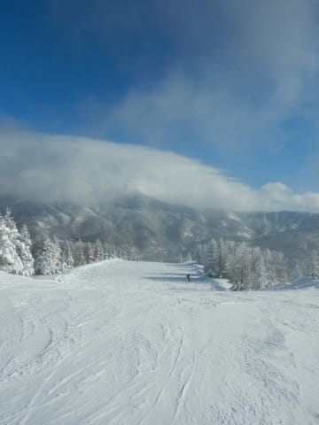
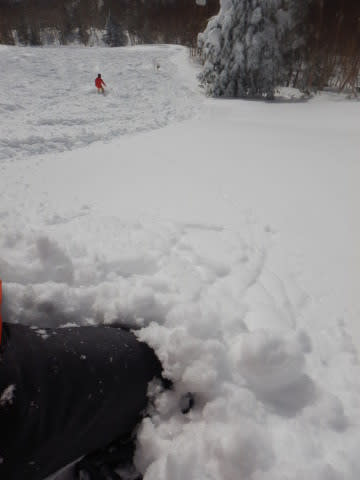
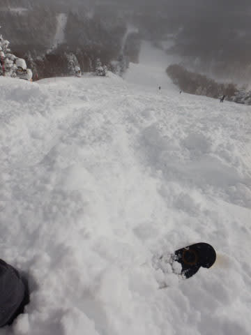

# 2021/12/28(火)の志賀高原焼額山スキー場レポート！…積雪50cm，太もも～腰パフパウダー！そして午後は晴れたよ！！

📅 投稿日時: 2021-12-29 02:34:33

ということで．

本日日帰り志賀高原へ行って

帰宅しました…

3時間睡眠で活動時間22時間を超えて

来るとさすがに辛い…

でも，本日の志賀高原レポートを書くのだ！

えらい！！

（誰かほめて）

えー．

まず．朝の上信越道は坂城からチェーン規制が

入るほどの積雪路となっていて…

志賀高原への登り坂も，そこそこの

積雪はありましたが．

路面の積雪は10～20cmほどしかなさそうで．

期待ほど積もってなさそう…

で．

いつも通り，8:30の営業開始を狙って

焼額第1ゴンドラに並ぶわけですが…

大雪によるコース整備のため営業開始が遅れ，

1ゴンが動き出したのは予定より20分遅れ，

8:50でした…

そんなに雪が積もったんだ…

そして．

風も強かったため．

朝は2ゴンが動いておらず．

奥志賀も第1ペア以外全て運休．

…これは，1ゴンに人が集中しそう…（いやな予感）

とりあえず，20分遅れの営業開始で

登った，あさイチの山頂の気温は…

-15℃と，冷え冷え！

さらに，コース上は…

圧雪コースも積雪20cm以上，

ブーツパフの新雪！！

うほーーーー！

圧雪コース全面がブーツパフ！

…これは，非圧雪コースはどのくらい

積もってるのか楽しみ…！！

…と，思っていたら．

あさイチはオリンピックコースも

SGSコースもクローズ（涙）

パトロールさんがロープを張ってます…

どうやら，ちょっと雪が重すぎて緩斜面で

スタックしかねないとのことで，安全確認の

ためオープンまでしばらくかかるようです…

ってなことで．

非圧雪コースがオープンするまで，

圧雪コースのGSコースを滑りますが…

朝のうちは雪がガンガン降ってます！

そのため，足元が見にくく，ブレーキが

かかる重めの新雪と，雪が踏まれて板が

走るところがまだらになってるので，

ちょっと手ごわい…

さらに，奥志賀も2ゴンも運休の影響で…

ちょっと1ゴンに待ち時間が出てきちゃい

ました（涙）

…だけど．

10時過ぎには雪も弱まり，

雲も薄くなってきたのか周りが

だんだん明るくなってきて…

ゲレンデが見やすくなってきました！

…そして．

コース整備が終わったのか…

10時過ぎに，オリンピックコースが

ようやくオープン！

オリンピックコースに入ってみると…

エントリー部分，太板を履いた状態で

太ももパフ！！

細い板だともう少し潜る感じで．

昨晩からの積雪は50cmくらい

あったようです…！

雪はそれほど軽くなく，ちょいと

重めでしたが…

それでも1本目は，斜面では完全な

腰パフ！

顔まで粉雪が舞い上がって前が見えない，

久しぶりのディープパウダーだぁああ！！

うおおおお！

昨シーズンは一度もパウダーに

当たらなかったし．

2シーズン前もここまで深いパウダーは

無かったので．

実に久しぶりの，腰パフパウダー！！

それも，うっすら明るくなってきて

コースが見える状態でのパウダーって…

そうそうないよ！！

最高…っ！！！！

…と．

数本滑っていたら，

あらかたパウダーは食われてしまい…

さらに，11時前にはゴンドラ待ち最高

10分以上（涙）

残念ながら，一旦リフトに逃げて，白樺コースや

イーストコースなどを滑ってみますが…

これらの圧雪コースでも，コース脇は

パフパフ！

ってな感じで，リフトで圧雪コース脇の

パフパフを楽しんでいると．

お昼の12時には天気も落ち着いてきて…

なんだか，晴れてきました！！！

　午前中はかなりの雪降りだけど，

　午後は雪の降りが弱まり，

　もしかしたら時折日も射すかも…

という誰かの予想は，ぴったり

当たってます！←自画自賛

天気が落ち着いてきたので，

第2ゴンドラも，奥志賀も営業を開始して．

…そのおかげで，1ゴンも待ち時間が

一気に短くなりました！！！

となれば．

1ゴンに乗って，非圧雪のスーパージャイアント

スラロームコースを攻めるのだ！

ここもコース脇はまだ太ももパフが

残っているのだ！

スーパージャイアントスラロームと

オリンピックコースを交互に攻めますが…

日が射した中，こんなパウダーを滑れる

チャンス，そうそうないよ！！！

シーズン1度あるかないかのグッドデー！

いや…良い．

今日はいい日だよ…（感動の涙）

とはいえ．

昼過ぎには新雪は大体食い散らかされ…

午後2時ごろには，もう単なる柔らかい

コブ斜面になっちゃったかな…

でも，天気はいい感じに晴れてきて．

これはこれで楽しい斜面です！！

そして．

新雪が楽しい時間は終わったけど．

圧雪斜面はいい感じのフラットバーンで，

まだまだ楽しめるのだ！

もう，晴天のもと，

トップシーズンの最高冷え冷え柔らか

圧雪をおなか一杯堪能できるのだ！！

午後になると，ゴンドラの待ち時間も

かなり短くなってきたし…

朝はブーツパフだった斜面．

コブコブになるかと思ったら，

綺麗に踏まれて，最後まで全く

荒れてない大回り可能フラットバーン

だったし…

今日は腰パフの新雪あり，

晴天冷え冷え最高雪質の

フラットバーンありで．

いやーーー．

恵まれた一日だったなぁ…

と．

今日から営業時間が15分延びた焼額の

営業時間を最大限活用するかの如く．

ゴンドラ最終15:45

リフト最終16:00

の，どちらもぴったりにギリギリ飛び乗って．

今日も昼休みをとらず，ひたすら営業

終了まで，グルグル滑り続けたのでした…

いやーーー．

良かった．

昨日の仕事が終わった段階では．

「志賀から舞い戻って翌日仕事して，

　その次の日に日帰り志賀はきつい…

　明日，行くのやめようかな？」

と思ったけど，

来て良かった…

行くのやめてたら，特派員からの今日の

ゲレンデ情報を見て，悶絶死するところだった…

## 💬 コメント一覧

### 💬 コメント by (かず)
**タイトル**: Unknown
**投稿日**: 2021-12-29 03:08:15

ホント来て良かったです！自分のパウダーで視界が悪くなりすぎでしたが 笑  オープン直後の奥志賀ダウンヒル 熊貸し切り 最高でした！！年末年始あと数回パウダー来そうですね？

### 💬 コメント by (まみこ)
**タイトル**: Unknown
**投稿日**: 2021-12-29 06:01:01

２8日、念願であった徒然様に会うことが出来て、涙しました。嬉しかったです。私は以前に比べ、足腰目が弱ってきていますが、トレーニングをして、ガンガンとは言えなくても、スキーを続けようと思います。

また、会えたらいいな。

### 💬 コメント by (真美子（まみこ）)
**タイトル**: Unknown
**投稿日**: 2021-12-29 06:51:33

１７日、web会議３つの参加の驚きと、🍙2個の感想をコメントしたのに、手際が悪くて、消えていました。

でもでも、２8日ご本人様に会えたので、良しとしようっと。

これからも、仕事に、スキーに、全力のブログを楽しみにしています。

### 💬 コメント by (大阪のK)
**タイトル**: Unknown
**投稿日**: 2021-12-29 08:45:29

えらい、えらいぞスキーヤーS！

あんたは、偉い‼️

我々電車通勤サラリーマンに、ひとときの潤いを与えてくれる。

すばらいし！

グレート！

天晴れ❗

### 💬 コメント by (新米パパ)
**タイトル**: Unknown
**投稿日**: 2021-12-29 11:39:54

神奈川から日帰り、すごいっす。

昨日はかたしな高原スキー場に浮気してまいました。

焼額山より1時間短いとこんなにも楽、、とは。

いかんいかん、頑張って、また、中野からの山道頑張るぞ　(中野有料道路の投げ銭をよく外す、100円余計に払う)

やまのうちの道の駅のりんご　はるか　が凄くおいしかったです、余談ですが。

### 💬 コメント by (Hide)
**タイトル**: Unknown
**投稿日**: 2021-12-29 17:04:06

S 様

やはりあの2本の板はSさんのでしたか（笑）

ブーツをトランクに置きっぱなしで向かってしまい、左のブーツになかなか足が入らず、車内の暖房で温めていたので出遅れました（泣）

山頂はちょっと重かったですね。

次回は3日の予定ですのでお見掛けしたらご挨拶させて頂きますね。

よろしくお願いします。

### 💬 コメント by (なるなる)
**タイトル**: Unknown
**投稿日**: 2021-12-29 19:39:24

今日の志賀高原、終日晴天で良かったです。

今シーズン、ほぼ吹雪いていて、寒い・視界悪いしかなかったので。

明日まで滞在でご挨拶したいのですが、あまり焼額いかないんですよね…

日曜日の最終ゴンドラくらいで焼額山頂の移動する所で追い抜かれた気がしています。

腰に、ブーツでアスファルトとか歩くためのヤツ?ぶら下げてられてました?

### 💬 コメント by (Skier_S)
**タイトル**: 明日からしばらく志賀高原に滞在します～！
**投稿日**: 2021-12-29 20:27:57

＞かずさま

年末年始も，31，1，3，4日はパウダーの可能性あり…

って，ほとんど毎日ですね．

超一級の寒気が居座るので，毎日パウダーで不思議じゃない感じの日が続きます…！

＞真美子さま

お会いできて良かったです～！

ようやくお会いできましたね．

それも，まさか私の車の同乗者とゴンドラが一緒になるとは

かなりの偶然でしたね…

また，週末焼額にいらっしゃればいつでもお会いできるので，

ぜひこれからもスキーを続けてください！

＞大阪のKさま

リクエストに応えて，ほめていただきありがとうございます…

他の誰も誉めてくれませんでした（涙）

＞新米パパさま

K奈川からの日帰りも，もう慣れました…

焼額に慣れすぎて，他のスキー場にもう行けませんから（笑）．

他のスキー場だと，すごいアウェー感があって寂しいので…

＞Hideさま

ブーツ冷えると足が入らないですよね…

私も3日は焼額滑っていると思いますので，またお会いしましょう！

＞なるなるさま

29日，予想通り晴れたんですね…

いや．29日も晴れて良さそうと思ってたんですが，

それと28日のパウダーだと，私はパウダーを選んじゃいました．

ちなみに，日曜は腰からブーツのソールプロテクターをぶら下げていたので，

おそらく目撃したのは私かと…

### 💬 コメント by (m&t)
**タイトル**: Unknown
**投稿日**: 2021-12-29 21:49:42

あす12/30参戦します

### 💬 コメント by (Skier_S)
**タイトル**: ＞m&tさま
**投稿日**: 2021-12-29 22:13:40

私も明日から志賀復活です．

焼額でお会いしましょう！

### 💬 コメント by (真美子)
**タイトル**: Unknown
**投稿日**: 2021-12-29 23:42:56

もしかしたら、写真。

とても嬉しいです。

### 💬 コメント by (Skier_S)
**タイトル**: ＞真美子さま
**投稿日**: 2021-12-30 23:29:18

そうです～！

そのためにしっかり写真とっておきました！！

