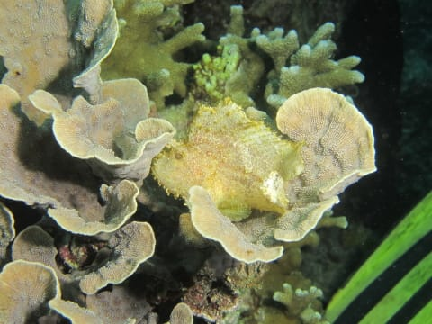
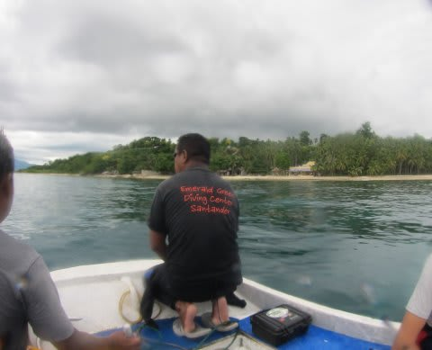
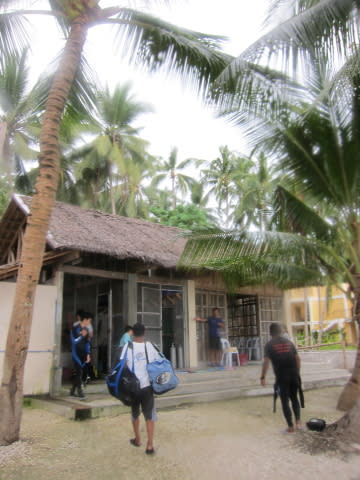

# 2013年11月　フィリピン・オスロブ　子連れでジンベエを見るぞっ！　その22

📅 投稿日時: 2014-08-05 00:50:35

8月っ！

8月だよ，もうっ！

スキーが終わって，1か月以上たつというのに！！

まだ潜りに行ってないよっ！！！！

再来週，ダイビング仮予約してあるんだけど．

…ご無体職場なので，まだ休みが確定して

いないんですけど…

ホントに潜りに行けるのかな…

＃もう，キャンセル料がかかる時期になっちゃった…

＃行けなくなったら，また台風を呼ぶしかないのか？

ってことで．

ダイビングに行きたーい！！！

と身もだえしつつ．

ダイビング日記，続きます…

----

んで．

このフィリピンでの最終ダイブへ，エントリーしますが…

…うむむむむむ～．

これは…

なんだか，あまり透明度が良くない，

ちょいと平凡な感じの海ですな～．

でも．

ハダカハオコゼちゃん登場．

魚影はそんなに濃くないけど…

ぼちぼち小物がいらっしゃいますな．

フィリピンの定番，ニチリンダテハゼ君登場．

って感じで漂っていると．

…え？終わり？

終わりですか…

エグジットですね…

ってわけで．

ダイブタイム45分．

これといった目玉もなく．

少しかなりちょっと残念な感じのラスト1本が終了．

うーむ．

昨日潜ったスミロンは結構良かったんだけど…

本日潜ったリロアンエリア．

ちょいと残念な感じ…

まぁ，次からはリロアンエリアは潜らなくても

いいかな．

で．

船に上がると，娘は起きて元気に遊んでましたね～．

ってことで．

ボートに乗って15分ほど．

リゾートに戻ってきました．

ボートに乗り移って…

ダイビングショップへ戻ります．

…この時は，まだ．

海も荒れておらず，平和なフィリピンなのでした．

## 💬 コメント一覧

### 💬 コメント by (マルハバ)
**タイトル**: ハダカハオコゼ・・・
**投稿日**: 2014-08-05 07:54:11

名前はやっぱりこちらが正しいんでしょうね。

「ハダハカ」って書いている方、結構多いですよね。

長年モルディブでガイドをされていた有名な方の

ブログにもこう書かれてあって

それ以来「どっち？」と混乱していたのですが・・・

リロアン・・

海は確かに昔もパッとしない感じでした・・

アポとスミロンの為の「ベースキャンプ」って感じでしたね。

### 💬 コメント by (Skier_S)
**タイトル**: マルハバさま
**投稿日**: 2014-08-06 02:59:54

和名：裸葉虎魚（はだかはおこぜ）

ってことで，やっぱり「ハダカハ」が正解だと

思います…（＾＾

しかし，リロアンは，近くにスミロンがあるのに

わざわざ潜らなくてもいいな～，って感じの

場所でした．

やっぱフィリピンは，アポかバリカサグ方面が

良いようで…

### 💬 コメント by (和名表記・・)
**タイトル**: マルハバ
**投稿日**: 2014-08-06 09:42:08

なるほど、

こう表記すればハッキリしますね♪

そういえば、

ギンガメ-アジ　なのか　ギンガ-メアジ

なのか迷った事もありましたよ・・（汗）

### 💬 コメント by (Skier_S)
**タイトル**: マルハバさま
**投稿日**: 2014-08-07 09:57:45

これも、正解はご存知と思いますが、

メアジの仲間の

銀河-目鯵

ですよね…

でも、みんな「ギンガメ」って

呼びますよね…

