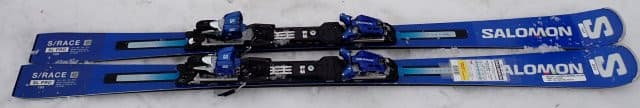
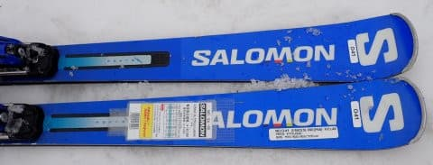
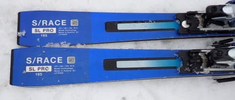
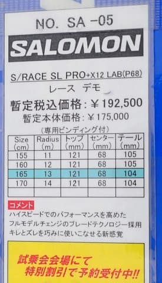
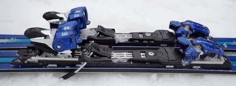

# 2024シーズンモデルのスキー板，試乗レポートその15…SALOMON S/RACE SL PRO + X12LAB

📅 投稿日時: 2023-06-19 04:01:22

🏷️ カテゴリ: [スキー板試乗](c0bd8048615710cee890e403a36cc9a2b.md)

うぎゃ〜！！

この記事、下書きのまま投稿忘れて

朝9時に投稿しました…

投稿遅れてすみません．

ってなことで．

この週末ですが.

土日どっちかの更新を休む，夏運用という

このBlogの中の人の勝手な都合により，

昨日は更新をお休みしたわけですが…

この土曜日は車を車検に出して，

それ以外は睡眠不足を解消するため

一日寝て過ごし．

夜10時まで寝ていたという，

「何時間寝とるんじゃ！？？」

状態で．

さらに日曜は車検の代車で500㎞走って，

某所まで行ってきたのですが…

代車がたまたま軽四のプレオプラス．

まさか代車が軽四とは…

しかし．高速の長距離走行でも問題なく

走れて，

最近の軽四，よくできてるな～．

と，感心しました…

…しかし．

せっかくBlog 更新を休んだのに，

土曜は寝て過ごし，日曜は出かけちゃったので，

本来この週末に終わらせようとしてた宿題が

終わらず（涙）

週末にいくつか仕事をやっつけて，今週は

ちょっと楽をしようと思ったのに…

…また，今週もいろいろクリティカルな

週になりそう…（涙）

ってなことで．

今日は中1日おいての更新となりますが．

本日は2024シーズンモデルのスキー板の

試乗レポート．

ただ．

前回までは，3月第1週の雪が良い焼額での

エキップさん試乗会で試した板のレポート

だったんですが…

今回からは，4月の一ノ瀬ファミリーで

行われた試乗会の試乗レポートになります．

土曜日はざぶざぶ雪→そのまま冷えて

すごい重い雪が積もって下地がガチガチに

固まったヘビーコンディション．

日曜は朝は冷えてしっかり締まった，

4月としては最高バーン→午後はちょっと

重めの荒れた雪に…

という状況で．

この時も，履いたブーツはHEADの

フレックス140のブーツです．

ブーツが強いので，結構強めの板の

評価が高くなってます…

ってなことで．

今回はサロモン編ですが．

これは土曜の朝，春雪ながらもまだ

バーンがフラット気味だった時に

試乗したレポートです．

では，どうぞ～！

〇SALOMON S/RACE SL PRO + X12LAB 165㎝

基礎小回り用

FISのガチレースモデルではないS/RACEの

小回り板は，トップにPRIMEがあり，

このSL PROが2番目のモデルになりますが…

今回試乗したのは，SL PROでも

強めのP68プレート＋X12LABビンディングが

ついたモデルになります．

基本的には昨年度の継続モデルで，

全く変わってないように見えますが…

うん．

重いX12LAB…アトミックでいうところの

VARビンディングがついているので，

かなりのずっしりとした重さを感じる板ですが．

滑ってみると，それほどまでの重さを感じない

ですね…

そして，上級者用の板にしては，意外と低速で

動かせる！

低速でずらしていくと，板が旋回力を受けて

旋回してくれます．

ずらしてもきれいに板がターン弧を作って

くれる，すごい扱いやすい板．

低速から安心して，丁寧に滑ることができます…

そして．スピードを上げていくと…

ぉお？？

これは…私の大好きなしっとり系の踏みごたえ！

谷回りでしなやかにたわんでいき，たわみに

沿ってしっかり回っていきます！

かなりがっつりしたグリップで，エッジに沿って

きれいに丸い弧を描いてくれます！

低速のずらしでもきれいに回頭するのに，

高速のカービングでもこんなにきれいに丸く

回ってくれるなんて…！

X12LABビンディング特有の，しっかり強い

圧のたまり感とテールの張りの強さがあって…

ターン後半でテールがたわみすぎずすっと

板が抜けていき，反対側に板が走って行って

くれて，そこから谷回りの踏み量で

好きな回転弧で次のターンに入れます．

ターンの抜けもいいし，操作性もかなり高いです！

谷回りですっとたわんでくれるくせに，

そこそこのスピードを出しても板がヘロヘロに

たわみ切ることはなく，ある段階から

張りが強くなって，たわみが止まっていく

ような感じもあり．

スピードに対する不安もありません．

強制的に回ってくるのではなく，乗り手の

操作性が高いので，結構大回り気味の

中回りから小回りまで行けますね～．

しっかりした張りがあるので，普通の人が

履くと，P68プレート＆X12LABのこの板は

ショートというよりミドル気味の板に

なるんじゃないかな？

かなりのハイスピードでの安定性もあり，

ターン弧の自由度もあれば，

ずらしていってもきれいに回頭する

オールラウンド性があるので…

コブに行っても全然大丈夫だと思います．

滑り出すと重さも感じないし．

操作性も高いし．

しっとり感と張りの強さのバランスもいいし．

この板，かなりの好感触．

いや…

BLADEテクノロジーのこのモデルになってから，

SALOMON，すごくよくなっている…

どんな滑りでも，どんなところでも滑れる

オールラウンド性はすごい高いので．

これ，ゲレンデの普段履きとしてはかなり

いい板だと思います…！！

## 💬 コメント一覧

### 💬 コメント by (harutomo)
**タイトル**: Unknown
**投稿日**: 2023-06-19 22:28:20

サロモン。その通りの板です。

しっとり感！と言う表現はぴったりだと思います。

人生で一番お気に入りの板なので、チューンアップもこだわりました。来シーズンの滑りが楽しみです。

### 💬 コメント by (Skier_S)
**タイトル**: ＞harutomoさま
**投稿日**: 2023-06-20 00:14:52

いや…昨シーズンからのSALOMONはかなりいいですよ！

今シーズンは継続で昨年から変わった感じはないので，値上がりする前の昨シーズンに買えたのなら

お買い得だったのかも…

しっかりチューンして，大事に使ってあげてください！

