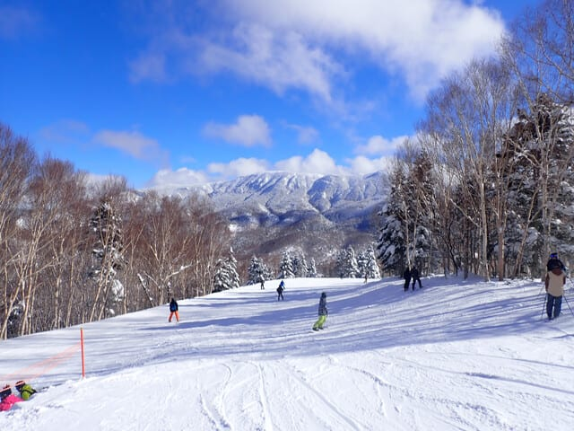
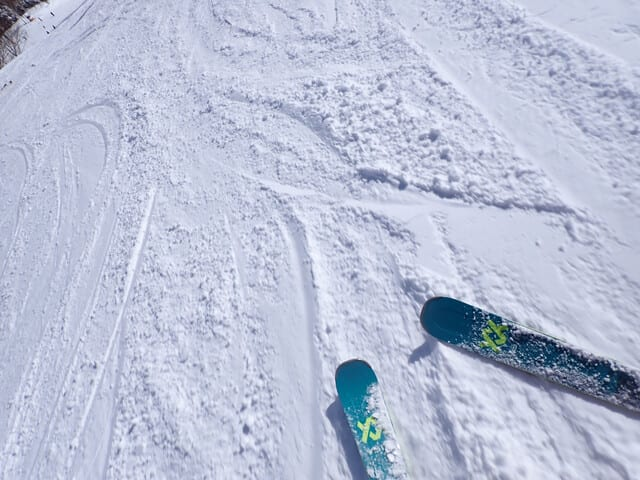
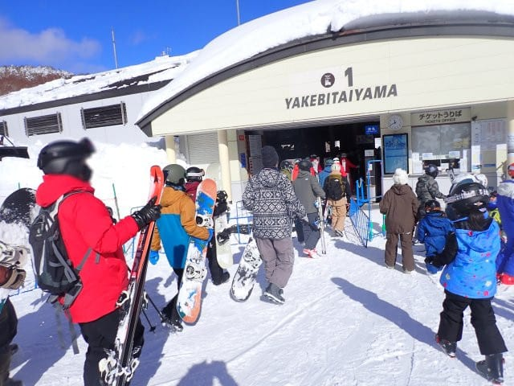
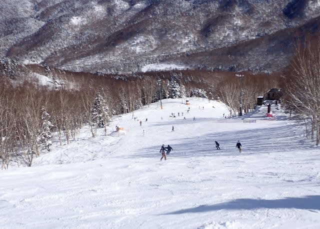
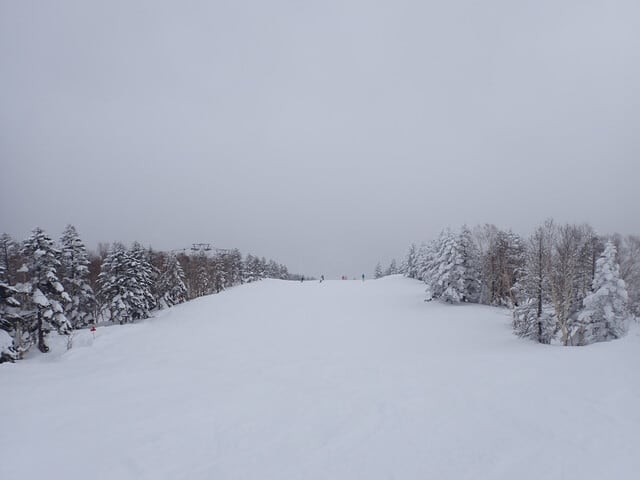
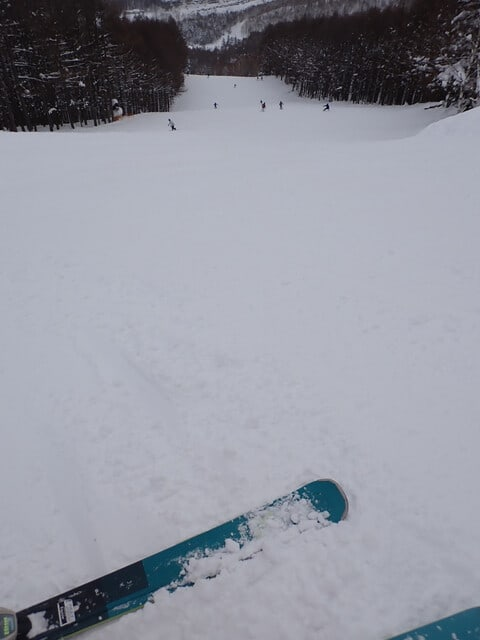

# 2025/1/3(金)の志賀高原焼額山スキー場，速報レポート！…昼過ぎまで晴れて午後は曇り空．雪は最高に良い感じ！

📅 投稿日時: 2025-01-04 01:42:25

ということで．

毎日毎日，同じようなレポートが続き．

一体この毎日続く志賀高原レポートは

いつになったら終わるんだろう…？

と思った方もすごく多く，

おそらく概算で2億3000万人くらいは

いるんじゃないかと推測してますが．←そんなに読者多くないから

ついにこのぶっ続け志賀高原滞在も

最終日を迎え．

帰って来たくないのに，先ほど自宅に

帰り着きました…（涙）

あぁ．

5泊6日って，短すぎる…っ！！←十分長いから

ということで．

今日も帰宅が遅かったので，

本日の志賀高原レポート．

帰宅日恒例の速報レポートにて

お送りします！！

…まず．

本日は，いろんな都合により

焼額山スキー場への参戦が午前11時近くに

なってしまったのですが…（激涙）

到着した11時ごろは，すっきり晴天！

どうやら，営業開始のころからちょうど

雲が切れて晴れ始めたようです…！

そして．

今日は晴天なだけではなく．

気温も低く，昨晩は少し積雪があった

にも関わらず，かなりいい感じに

締まった圧雪だったので…

昼頃になってもモサモサで荒れた

バーンにならず，かなり気持ちよく

かっ飛ばせる，最高のバーン状況！！

そして，

第1ゴンドラの待ちはせいぜいゲートの

外にちょっとはみ出すかどうかというのが

ゴンドラ待ちのピークで，

これでも相乗りレーンを使えば搬器

数台待ちで乗れるし．

11時半を過ぎるといつも通り待ち時間は

かなり短くなり．

晴天の割にはゴンドラやリフト待ちの

ストレスを感じずに済む一日でした…

でも．

やっぱり昨日までと同じく，リフト待ちは

短くてもゲレンデの人口密度はちょいと

高め（涙）

さらに，

すっきり晴天だったのも昼過ぎまでで．

午後2時ごろには完全に曇り空になって

しまいました…

さすがに午後2時を過ぎると，ところどころ

急斜面ではバーンが荒れ気味になってきた

ところもあったので，曇り空で凸凹が

見にくくて数回飛ばされたりしたけど．

でも，気温は低く，雪質は終日最高のまま

だったので，今日もしっかり楽しい一日

でした～！！

また明日，余裕があれば詳細レポートを

書きますが．

…5泊6日という長期のスキーを強行して

しまったので，いろいろ宿題が…

あぁ…

現実に引き戻される…

身体は自宅に帰ってきたけど．

心はまだ志賀高原にある，Skier_S

だったのでした…
