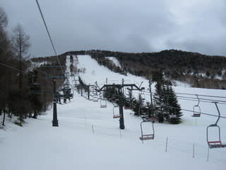
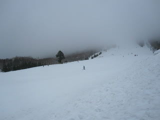
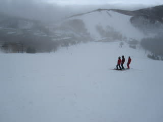
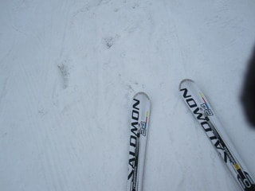
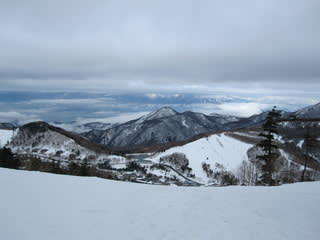

# 4月9日の志賀高原スキー場は

📅 投稿日時: 2011-04-09 21:14:52

🏷️ カテゴリ: [2011スキー滑走日記](ca488c98cfb9169941c3e73770dcefb56.md)

…

…雨ですね．

雨でした．

ほぼ終日．

朝のうちは比較的弱い雨で，

ほとんど降っているのが気にならない程度．

「お，意外とこれならいけるかも」

とおもったけど．

10時ごろには，ぽつぽつと来始めました

幸い，ざーーーーーっと降るようなことはありませんでしたが．

終日，時々思い出したようにぱらぱらと降り．

さらに，ガスが思い出したようにゲレンデを覆うことも

多く．

うーーーん…

楽しめる状況じゃないなぁ，

動いているリフトも，

ジャイアントトリプル

奥志賀

一の瀬ファミリーのクワッド＋ペア1本

一の瀬ダイヤモンドはトリプルのみ（クワッドとまってます）

高天ヶ原クワッド

くらいですね～．

人もいなくて，寂しいです…

人がいないからリフトを動かさない，

リフトが動いてないから人が来ない…

という悪循環になっている気がするなぁ．

とりあえず．

雪自体は，例年より多い感じです．

さらに，今日は雨が降ったので，雪の表面は

きれいに洗われてよくすべる雪でした．

雪自体は，「この時期にしては」という制限はつきますが．

そこそこ滑れるレベルです．

人が少ないので，ゲレンデも荒れませんし．

ホントに人が少ない…

まぁ，

明日は晴れるようですから．

ちょっと期待しましょう．

