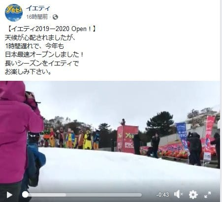
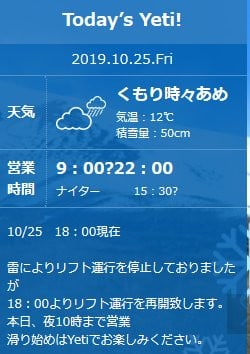

# Yeti，本日無事営業できたようですね…そして，志賀高原西館山中級コースの崩落状況がホテル銀嶺さんのBlogに掲載

📅 投稿日時: 2019-10-26 04:09:56

えー．

天候が心配された本日．

開始が1時間遅れたようですが，

無事，イエティがオープンしたようです！

（[Yeti公式Facebook](https://www.facebook.com/YetiSnowtown/posts/2513733558716005)より）

心配された雨による営業打ち切りは

無かったようですが．

午後5時ごろから6時ごろまで，

雷による営業中断があったようですね…

（[Yeti公式HP](https://www.yeti-resort.com/)より）

…とはいえ．

ナイターはちゃんと10時まで営業したようです！

…雨の中，10時まで滑る人がいたんだろうか…

そうそう．

昨シーズンは確か夜9時までと，例年より

1時間短くなったナイター営業．

今シーズンは，10時までに戻りましたね～！

とりあえず．

昨日も書いたように．

私は日曜にYetiへ繰り出して．

2020シーズン滑り初めの予定です！

で，もう一つ．

[以前記事にした](e7b2f576eb2bb05909894500aa60a1bcd.md)，西館山中級コース閉鎖のニュースですが．

ホテル銀嶺さんのBlogに，

西館山中級コースの崩落状況の写真が

載ってました…

[こちらのリンク](http://shigakogen-ginrei.com/blog-date-20191025.html)を見てもらうと．

結構広い範囲で崩落して，

土砂が人工降雪機用プールに

流れ込んでいる状況の写真が

あります．

うーん．

確かに，これだけの崩落だと．

雪が降るまでのあと1か月以内に

直すのは無理っぽい…

そして，人工降雪機用プールに土砂が

入り込んで，人工降雪機も動かせないから．

シーズンインも遅れそう…

人工降雪を載せられないと，3月下旬の

西館下部はヤバいかも…

うーん．

最近の志賀高原．

いいニュースが…

いいニュースが無い…（涙）

## 💬 コメント一覧

### 💬 コメント by (しんちゃん)
**タイトル**: マジやば
**投稿日**: 2019-10-26 10:58:59

リンク確認しました。

西舘、マジでやばいですね。

昨シーズン、ヤケビから遠足し、ここで滑走中の写真撮ったりしてたので、あのいい感じの斜面が崩れたのかと思うととても残念です。

いい復旧ができて、より良いスキー場になって、少しでもいいニュースになればと願います。

### 💬 コメント by (Skier_S)
**タイトル**: ＞しんちゃんさま
**投稿日**: 2019-10-26 19:47:46

いや…私も写真見てびっくりしました．

今シーズンは仕方ないですが，来シーズン修復してくれるのか，

ちょっと心配しています…

なんにしろ，このまま放置とならないことを祈るばかりです．

