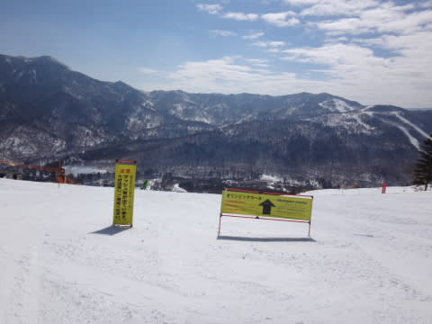
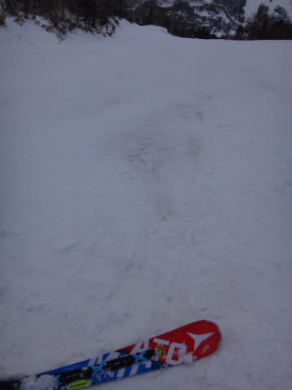

# 3月5日の志賀高原は…晴天ぴかぴか！でも，４月の雪（涙）

📅 投稿日時: 2016-03-05 23:44:20

えー．

本日．

ぴかぴか晴天だったのはうれしかったのですが．

3…月上旬としては．悲しいくらいの高温の一日でした…

…でも．

でも．

明日は，もっと気温が上がっちゃうんですね…（涙）．

ってことで．

本日のレポートですが．

…うーーーーーむ．

今朝，志賀高原に登ってくる道は，3月上旬と思えない

雪のなさ…（涙）

朝から，気温が高そうな気配を感じつつ．

第1ゴンドラへ行くと．

…え？

なにっ！！？？

第1ゴンドラ，故障で運休だとっ！！？？

…最近，ゴンドラ故障多くない…？？（泣）

ってことで．

やむなく第2ゴンドラでスタート…

…第1ゴンドラから人が流れたので，

混んでます…（涙）

第1ゴンドラ，なんでこんな最高ぴかぴかの日に

壊れるかなぁ…（残念）．

第2ゴンドラで山頂に出ると．

うぐぅ．

3月始まったばかりというのに．

朝からプラス気温？？？

…今日は，雪が悪くなる予感…

で．

ゲレンデに出ると

うはぁ．

ぴかぴか晴天っ！！

そして…

シマシマ！！！

ちょっと，ボロボロ崩れていくような感じの

雪質だけど…

結構気持ちいいよ！

第1ゴンドラが運休しているので，

GSコースはだーれも滑ってない，貸し切りバーンっ！！

いい感じっ！！

第1ゴンドラが動いてないので，

第3高速→第2ゴンドラというルートで，

人がいない第1ゴンドラ側，GSコースを回していると…

9時過ぎに，修理が終わった第1ゴンドラが動き出したので．

第1ゴンドラグルグル…！

と，数本滑ったところ…．

あうーーーん．

10時ごろには人が増えてきちゃったよ…

そして，雪も，強烈な日差しで…

ありゃ？？？？．

春の雪に…（涙）

1ゴン運休のニュースで，他に人が流れたのか．

運転開始後の第1ゴンドラは，待ちがそれほど

なかったんですけどね～．

で，オリンピックコースを見に行くと．

…あれ？？

今週は火曜にに50cm雪積もったというのに…

ブッシュがあるって看板が出てますが？？

…まさか？？

とりあえず，雪は強烈な日差しにやられてざぶざぶで…

うむ．

3月下旬の雪ですね（涙）

…で．

あら…？？

やっぱり，予告通り，ブッシュがあるのね…

だめだ．

オリンピックコース．

このままだと．じき終わっちゃいそうな感じ…（泣）

そして，昼頃には．

…焼額はところどころ，張り付く感じの重い雪になって来たので．

ちょっとだけ，一の瀬の様子を見に行きましょうか…

いや．

私の生息地は焼額なので．

ちょっとだけ…

とやってきた一の瀬．

おぅ！

昼というのに…

朝日が当たらない一の瀬，雪質いいよ！

13時までポールバーンでクローズだったパーフェクターコース，

とりつき部が結構土が出ているものの…

硫安がまいてあったのか，

かなり締まったフラットバーンっ！！

焼額はもうざぶざぶで，張り付く雪になっているというのに…

パーフェクターは，よく締まったフラットバーン！！

これは，いいっ！！

素晴らしぃっ！！

って感じで，

あと1本，

あと1本…

…と，滑っていると．

あーーー．

夕日が…

ってことで．

焼額が生息地の私が．

なぜだか．

ついつい．

夕日が暮れるまで，一の瀬で過ごしたのでした…

あ，さすがに夕方は．

パーフェクターは雪が薄くなった感じで，ちと残念でした…

正面バーンも午後遅くはざぶざぶ雪で．

下地にちょっとアイスバーンが出てました…

3月上旬と考えると，ちと残念なコンディションだけど．

まぁ．

パーフェクターコースが超絶によかったので，

良しとしておきましょう…

ってことで．

はい．

まだ，終わりませんよ～！！

そうです．

いつも通り．

ナイターです．

一の瀬ダイヤモンドのナイターです．

いや！

シマシマ！

また，シマシマを攻めるぞっ！

…と，シマシマバーンに飛び込んだら．

昼間にゆるんだ雪が固まって…

かなり硬いバーンなんですが（涙）

下地は固まり切っておらず，表面の硬い層がボロボロ崩れていくような，

ちょっと楽しくないバーン…（泣）

だもんで，

今日のナイターは，ガラガラでした…

ってことで．

パーフェクターは良かったけど．

それ以外は，ざぶざぶの春雪になってしまった今日．

…明日は，もっと気温が上がる予想なんだすが…（涙）

気温は，志賀でもプラス10度に行きかねません…（泣）．

3月上旬というのに…

これは一体，どうしたことだっ！！！？？？

…これは，たぶん．

神がおっしゃっているようです．

まだ，踊りが足りない，と…っ！！←いったい，どんだけ踊れば納得するんだ…？？？

## 💬 コメント一覧

### 💬 コメント by (aqura)
**タイトル**: Unknown
**投稿日**: 2016-03-06 07:07:41

いゃあ～、いい天気でしたねぇ(^^ゞ

土曜日は、高１の息子と二人で、一ノ瀬でプライベートレッスン受けていました。息子はレッスン前と後、ずいぶんよくなりました。私は(-。-;)。

日曜日はかなり高温になるようですね。どこ滑ろうかなぁ？

### 💬 コメント by (Goku)
**タイトル**: 挑戦！
**投稿日**: 2016-03-06 07:10:46

おはようございます。

昨日は一日お世話様でしたー。

いや～パーフェクター最高でしたね♪

今日もスッキリ晴れて、昨日と同じ感じになりそうですね。

午後は一の瀬が良さそうです。

私は今日お休みでーす。

### 💬 コメント by (Skier_S)
**タイトル**: aquraさま
**投稿日**: 2016-03-06 09:22:43

私は昨日の午後、ずっと一ノ瀬パーフェクター滑っていたので、

もしかしたらお見かけしてるかもしれませんね…(^^ )

今日もヤケビゴンドラ止まっているので、一ノ瀬滑ってますよ(笑)

### 💬 コメント by (Skier_S)
**タイトル**: Gokuさま
**投稿日**: 2016-03-06 09:29:40

今日は朝から強風でヤケビゴンドラ1ゴン、2ゴンともに運休です…(泣)

気温も上がってますし、昨日滑って大正解です(笑)

### 💬 コメント by (Goku)
**タイトル**: えー！
**投稿日**: 2016-03-06 10:49:13

まさかのゴンドラ運休ですか…

朝から一ノ瀬って事は、20000m クラブ勢揃いで記録に挑戦！ですね(笑)

### 💬 コメント by (はなげ親分)
**タイトル**: いい天気
**投稿日**: 2016-03-06 11:09:56

日差しが心地良い季節になりました(泣)

ゴンドラ運休なので混雑を避け熊の湯に来ています。

すいているんだど若干飽きてきました。

### 💬 コメント by (Skier_S)
**タイトル**: Gokuさま
**投稿日**: 2016-03-06 11:57:51

20000ｍクラブの方々はすごい勢いで正面バーン回してます…

私はゴンドラ運休で、しばらく混雑した

2高回してたら出遅れました…(泣)

普段ヤケビ滑っている時よりて標高差稼げてません(涙)

### 💬 コメント by (Skier_S)
**タイトル**: はなげ親分さま
**投稿日**: 2016-03-06 11:59:47

今日は熊ノ湯ですか！

一ノ瀬は人が多いですが、

けっこう楽しめますよ～！

