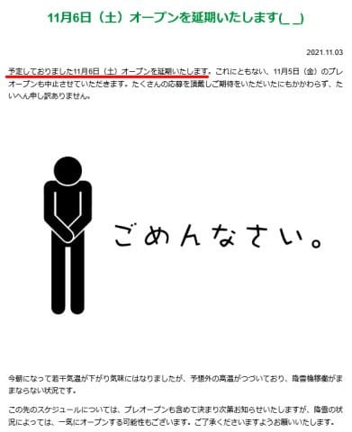
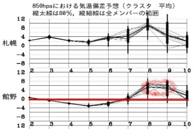
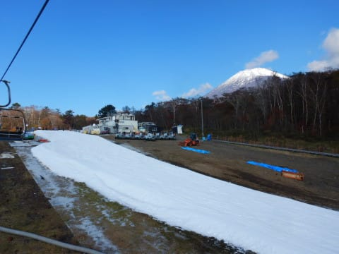
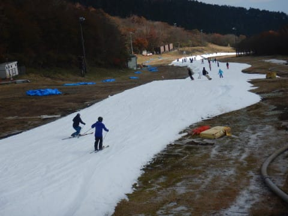
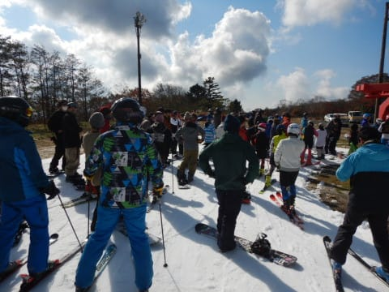
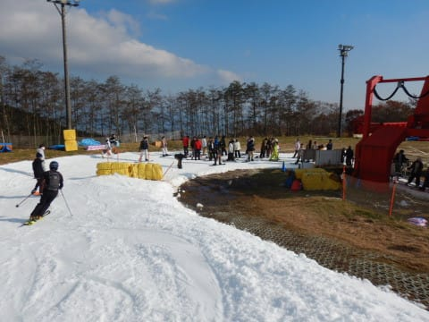
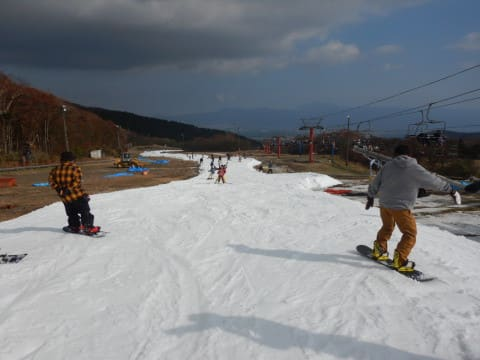
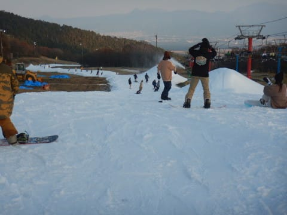

# 2021/11/3(水・祝)のイエティ滑走レポート速報モード＆2022シーズンオープン1週間ちょいのイエティのコース状況動画

📅 投稿日時: 2021-11-04 01:00:55

🏷️ カテゴリ: [2022スキー滑走日記](cc9cb73e4320f6a97af6fccc37587a61a.md)

えー．

どうやら，横手山．

残念なことに(というか，大方の予想通り）

11月6日のオープンを諦めたようです…（涙）

それに伴い，5日のプレオープンも中止が

決定です．

（[横手山ホームページ](https://yokoteyama2307.com/news/16426/)より）

残念ながら…

というか，やはり，というべきか．

横手山スタッフの執念と．

横手で滑りたい人の怨念による，

空間のねじれが生み出した奇跡

は起きませんでしたね（泣）

しかし．

今晩から冷え込み．

これから5日朝までは，横手山はギリギリ

人工降雪が打てそうな気温が続きそう

です…

少なくとも4日の早朝と5日の早朝は

人工雪が打てるんじゃないかな？

…もう少し冷え込みが早くて強ければ…

ちょっと惜しい．

でも．昨日の記事に書いたように，

それ以降は気温が上がる予想で．

昨日の予想では，7，8日が気温ピーク

でしたが．

本日の予想では，ちょっと遅れて8，9日が

気温ピークになりそうで．

赤く印したように，平年比+6℃くらいの

超高温になりそうです（涙）

そして．

この8，9日は雨になるので…

高温の激しい雨で，5日までに積もらせた

雪は，間違いなく全滅します（激涙）．

昨日も書いたように，翌週13日オープンも

厳しいです…（泣）

あぁ…

もうしばらくYeti通いが続きそうだな…（ちょい涙）

ってなことで．

週の途中の祭日だった本日も，

イエティで滑ってきたわけですが．

…本来，スキーに行くどころじゃない

ご無体状況で滑りに行ってしまったので．

これからまだ仕事をしなくてはならず(涙)．

さらに明日も早朝から会議のため，

今日のイエティレポートは，いつもの

帰宅日恒例の速報モードにてお送り

します…！

えー．

まず．

あさイチはすっきり富士山も見える晴天で，

人も少ない，いいコンディションでスタート

しました！！

天気は

　3日は軽井沢もYetiも，

　晴れ～曇り，といった天気．

という予想通り，晴れたり曇ったりを

繰り返す天気で，雪は柔らかかったものの．

太陽が結構隠れ気味だったので，

雪がドロドロに溶けたり，穴が開いたり

することは無くて，滑り良かったです！

　Yetiはもしかしたら，一瞬雨がパラパラっと

　落ちてくることもあるかもしれませんが…

と心配した「もしかしたら」は起きず．

終日雨にはなりませんでした…

ってな感じで．雪は柔らかいなりにまぁまぁで．

コース幅も，土曜より広がったんだけど…

午前10時ごろには

コース上の人口密度も上がっていき…

リフト待ちも，最大このくらいまで

行きましたね～…

とはいえ，最大でこのくらいなので．

やはり州の真ん中の祭日ってこともあり．

先週の土曜に比べたらリフト待ちは

短くて，平均2，3分ってところでした！

リフト待ちは波があり，少ないときはこの程度．

先週土曜より，ずっと快適でした…

で．

コース幅は，4日前の土曜に比べて

広がっているのが分かります…

大体，今日の平均的なコースの混み具合が

こんな感じかな．

オープンしてから，ほとんど雨が降って

いないので，雪が融けることなく

コース幅が順調に育ってる感じです…

16時のコース整備前クローズ直前の

状態がこんな感じなので．

コース上の人は多かったものの，

雪もそれほど荒れておらず，

穴も開くこともなく．

コースコンディションは良かったかな！

ってなことで．

今日もいつも通り，コース状況＆混雑状況が

分かる動画です…！

今回は，リフトを降りるところから．

この1本，一番人口密度高かったタイミングで

撮っちゃったので，すごい手に汗握るスリル感（？）

がありますが．

コース上の人出には波があって，

クリアラップに近い，人が少ないタイミングも

ありましたよ～！

ってなことで．

また明日，詳細レポートやります…
