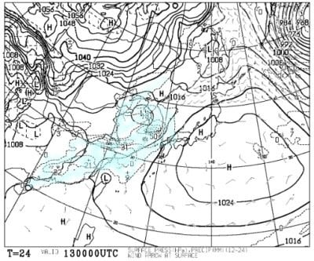
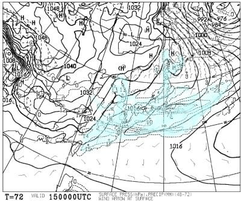

# 1月14，15日の週末の志賀高原スキー場の天気は…14日は気温がすごい上がるけど雨はほとんど降らず！15日は曇り時々雪

📅 投稿日時: 2023-01-13 04:15:21

🏷️ カテゴリ: [スキー天気予想](c6554f5c3c106093b511a8daae23757e8.md)

昨日は夜中死んだように寝ちゃい

ましたけど．

今日ももうこんな時間になっちゃったし．

Blogを書いている時間があるなら

寝たいんだけど…(涙)

それでもBlogを書く自分．

偉い！！

ってなことで．

今日は，昨日寝ちゃったので書きそびれた

今週末の志賀高原の天気予想です…

えー．

まず．

13日の金曜日の朝9時の850hpa図を見ると．

うーん…

赤い0℃線が志賀高原にかかっていて．

このあと，グングン気温が上がっていきそうで．

朝はマイナスかもしれないけど，昼間は

間違いなくプラス気温まで上がりますね(涙)

そして，金曜の地上天気図は…

志賀には降水域がまだかかっておらず．

この日は気温が上がるけど，降らずに

済みそうです…

で．

次は気になる14日の土曜の850hpa図ですが．

…なんじゃこりゃーーーーーっ！！！！

赤い0℃線は北海道まで北上しちゃって，

それどころか水色の+6℃線が志賀より

北にあるんですけど？？

これ，ホントに1月か？？？

昼間は志賀高原でも最高気温が

+10℃近くまで行きかねない勢い

です（激涙）

そして．

この日の地上天気図は…

うぎゃーーー！

降水域が日本中を覆ってるよ！！

降れば確実に液体なんですけど…！

…ただ．

この図を拡大すると…

なんだか，見事に志賀高原の当たりから

関東にかけて，降水域がすっぽり抜けて

ます…

これ，志賀高原は降らなさそうですよ！？？

14日は気温が上がるけど，雨にならずに

済むのか？？

で．日曜15日ですが…

850hpa図を見ると．

この日は赤い0℃線がギリギリ志賀まで

下がってきてくれているので．

これなら志賀高原は降っても雪です！

そして．この日の地上天気図は…

…この日も一見，日本全土が降水域に

覆われてるように見えますが．

拡大すると…

志賀高原近辺を含む岐阜～南東北にかけての

エリア，降水域からすっぽり抜けてます！！

これ．

15日は冷えて，降れば雪だけど．

雪は降らなさそう…

ってなことで．

まとめると．

13日(金)：朝は晴れ！朝は放射冷却で

　冷え込み-5℃程度かな．

　あさイチはまだいいコンディション．

　だけど昼間はグングン気温が上がり，

　+5℃を超えそうなので…日当たりが

　いい斜面の雪はしっとりと重い雪に．

　午後は雲が増えて曇り空に．

　でも気温は気持ち悪いくらい高く，

　夕方になっても雪は緩んだまま

14日(土)：朝は曇り．終日曇り．

　朝から気温は+3℃程度．

　気温は午後に向けて下がっていくが，

　基本昼間はプラス気温のまま．

　運が悪ければ，時折液体が

　ぽつぽつと落ちてくる．

　全体的に雪はしっとりして，

　重い雪になっていく．

　志賀でも標高が低いところは

　春の雪に．

15日(日)：終日曇り．時折雪が

　ぱらつく．

　あさイチの気温は-3℃程度．

　昨晩からの積雪は無いので，

　昨日まで緩んでいた雪が固まって

　硬めのバーン．

　標高が低くて前日に雪が融けた

　ところはアイスバーン気味．

　前日雨が降ってかなり湿った雪に

　なっちゃってたら，全面アイス

　バーンになるかも…

　積もるほど積雪は無いので，

　バーンはカリカリした感じに．

　昼間も気温はマイナスキープなので，

　雪は硬めのまま緩まず．

　

って感じで．

14日，15日2日連続で雨

という最悪の事態は避けられ．

それどころか，14日もおそらくほとんど

雨は降らなさそう…

という，この天気図としては被害が

最小限に済みそうな感じでおさまった

感じですね…

どしゃ降り予想から考えれば，

100倍マシです．

ちょっと救われた感じ…

ただ．

ここ数日，雪不足も解消されつつあり．

せっかく雪質もいい状態が続いていたのに…

それはもう終わりそう．

残念ながら，14日の高温で春雪になり，

15日はカリカリした感じのバーンに

なります…多分（涙）

積雪があれば，また雪質はリセット

されるんだけど．

今のままだと，次に雪が降るのは18日か…

それもそんなに積もらなさそう．

来週までに，雪質がリセットされることを

祈ろう…

## 💬 コメント一覧

### 💬 コメント by (レインボー75)
**タイトル**: Unknown
**投稿日**: 2023-01-13 11:21:54

金曜日の志賀高原情報その1

朝の上林0℃　蓮池-3℃。晴れている。

ニゴンから白樺ファースト。唐松も最高。

落とし穴はこの後。

二高から三高速に向かう分岐は勢いをつける所。あっと思う間にネットが目の前に。前を行く仲間が転倒。ネットのない右端を通り抜けるもターンが間に合わず私も転倒。立ってる係員に「危ないからネットを外せ」と何度も言ったのに、連絡がないからとの一点張り。そうこうするうちに第三の犠牲者が。こともあろうにやっと起きた仲間に激突。幸い怪我なく済んだからよかったけど。

そのあと怒ってネットを外してもらいました。昨年も知り合いの女性がネットに気づかす骨折した所です。もっと早く発見できる場所に張ってほしい。

### 💬 コメント by (レインボー75)
**タイトル**: Unknown
**投稿日**: 2023-01-13 15:58:01

金曜日の志賀高原情報その2

唐松の下にキッズパークがあるのですが、今シーズンから全て無料に！

ただと聞けば黙っておれない性分の我らは、早速スクーターを借りて試乗。怖いのなんの冷や汗びっしょり。

そのあと中華獅子の地下のラーメンで休憩。麺も汁も合格点。私には湯田中の仲良し食堂の次に美味しい。だけど信州プレミアム食事券に対応不可が残念。

午後は空いてる一ゴン回し。と～～っても快適です。

おかげで門限の２時(レインボー)に遅刻。獄門打ち首です。

帰路の高天+7℃。こんなに状態がいいのに、心配です。

### 💬 コメント by (a-island4138　ゆうさん)
**タイトル**: Unknown
**投稿日**: 2023-01-13 20:12:41

いつも情報有り難いです。　ありがとうございます。　お疲れさまでした。　江田島ではバンバン液体降ってますよ南国〜🤣

### 💬 コメント by (Skier_S)
**タイトル**: 今週末はスキーに行けず
**投稿日**: 2023-01-14 05:22:02

＞レインボー75さま

意外と今日はコンディション良かったみたいですね…

午後は気温が上がって雪がダメになるかと思ったのですが．

土曜はすごい重い雪になっちゃってると思うので，気を付けて滑ってください…

＞ゆうさんさま

志賀高原でも，深夜に雨が降っていたようです…（涙）

あぁ．ただでさえ少ない雪が解けてしまう（泣）

