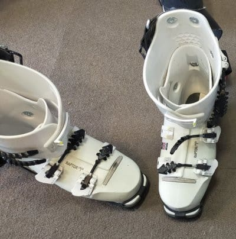
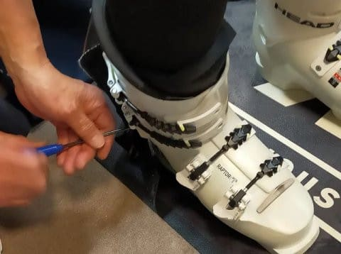
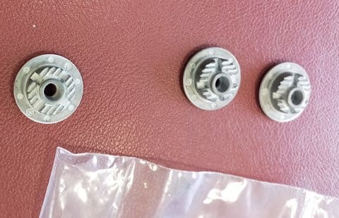
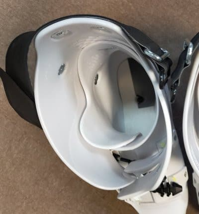
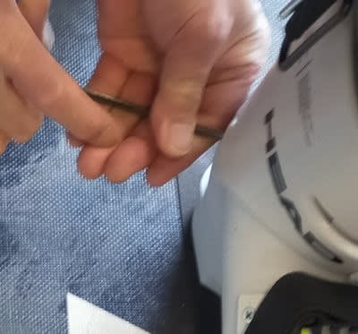
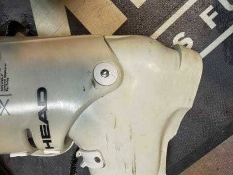

# エキップさんでHEAD Raptorブーツを再調整してもらった

📅 投稿日時: 2023-06-16 03:34:26

🏷️ カテゴリ: [スキー雑談](c1f9d2cb7478308da16419928ea3945e9.md)

えー．

シーズンも終盤のとある日．

長岡のエキップさんに寄って，

[板をチューンに出したり](e5e31b6da851f9a792f47dc985a2f4199.md)してきた際に．

私のメインブーツであるHEADの

Raptor WCR3．

こいつも購入から2シーズン経ったので，

カント調整やら何やらを見てもらいました…

購入した昨シーズンは，Skier_Sスペシャル型

を使って当たり出しをしてもらうなどの

調整をしてもらったおかげで，かなり

快適なブーツになり，メインとなった

このブーツ．

メイン機ではあるものの，昨シーズンは

半分ほどはREXXAMブーツを履いていたし，

今シーズンも時折REXXAMと履き替えて

いたので…

2シーズンとはいえ，これまでトータル60日

くらいしか履いてないでしょうか．

とはいえ，

さすがに2シーズン経ったので，カントとか

狂ってきてないか，いつものエキップさんで

見てもらうことにしました～！！

ってなことで，

2シーズン履いてかなり気合が入ってきた

私のHEADブーツ．

しばらくこのシェルをしげしげと眺めていた，

エキップの鈴木社長が，ぼそりと一言．

「シェル…歪んできてるね」

え！！？

シェルがひずむ？？

「それもソールがねじれてきてる…」

えええ！！

シェルも，一番頑丈でゆがまなさそうな

ソールがねじれる！！？？

「ねじれてるし，膨らんできてる…」

ネジてるし，膨らんできてる…！？？

ブーツシェルって，そんなに変形

するもんなんですか！？？

「滑りの癖で，シェルもゆがむよ」

へえぇぇ…

そうなんですか…

「2シーズンも履いてるからねぇ…」

いや…普通の人，ブーツは少なくとも

3シーズンとか4シーズンくらい履くもんだと

おもってましたが…！？？

わずか2シーズンでゆがむものなんですね…！？

「これ…右内足ターンの方が，右ひざの

　返しが強いね．

　そういうゆがみ方してる」

…いや…

ご名答．

右内足の時の方が両ひざが平行に入って，

左足が内足の時はちょっとX脚気味に

なるんですが…

ブーツ見ただけでそれが分かるのか…（汗）

恐るべし．

「とりあえず，カント調整するんで

　履いてみて下さい」

…ってな感じで．

ブーツを履いてみて，いつも通りメジャーで

測った腸骨の幅にスタンスを合わせて

立ってみると…

「あぁ～．全然狂ってる」

え？

…このブーツを履いている人間がわずかに

ちょっとだけいろんな意味で狂ってるのは

多少は認めますが…

そうじゃなくてブーツのカントが狂ってるって

ことですよね？？

「右膝がかなり内側に入るようになってる．

　これは全然ダメ．

　左もちょっと狂ってる」

…そうなんですよ．

ここ2シーズン，エキップさんのブーツを

履くようになってから，滑りのポジションが

結構変わってきたんですよね…

「確かにポジションが結構変わってるから，

　全面的に調整しないといけないね…」

ってなことで．

くるぶし部分のカント調整パーツを

外して．

HEADのRaptorブーツでは，

この写真右側のように，中心のネジ穴の

位置がずれたパーツに交換することで

カントとヒンジの位置を調整するわけですが…

いくつかとっかえひっかえ付け替えて

みたけど．

「まだ右膝が内側に入るな…」

ということで．

どうやら，かかとの骨がちょっと

内側に倒れてるということで，

これを倒れないようにするため，

右足フットベッドの内側に，

薄いシートを貼りつけました…

この状態で改めてブーツを履き直し，

カントを調整してもらうと…

両ひざともまっすぐに膝が入るように

なりました…！

「これでOK！」

と，無事ブーツ調整が終了しましたが…

いや…

これまで毎回履いていたブーツだけど．

全然感覚がかわった…！！

特に右足．

イン・アウトと，もわずかな動きで小指側，

親指側の角を立てやすくなり…

反応が速くなった感じ！

うーん．

カントやフットベッドを調整してもらっただけで，

かなり感覚が変わった…！！！

これは…

滑ってみるのが楽しみ！

（ぼろいブーツでカント調整パーツだけ新しい…）

…ってなことで．

購入時に完璧に調整してもらったブーツでも，

2シーズン，60日程度履くと完全に調整が

狂ってしまうことを体感し，驚いた

わけですが．

「シーズン初めに造ったブーツも，

　そのシーズン途中にはもう調整が

　ずれてくる．

　できればこまめに調整するべき」

ということで．

最低でもシーズンごと，

出来ればシーズン中に見てもらうのが

理想みたいです…

板はチューンナップに出すけど．

買ったブーツを「当たりだし」以外で

調整することはほとんどなかったのですが．

ブーツもこまめにチューンナップが

必要だということを改めて知った，

Skier_Sだったのでした…

## 💬 コメント一覧

### 💬 コメント by (愛読者)
**タイトル**: Unknown
**投稿日**: 2023-06-16 12:16:20

レクザムが100日でへたったのだから、このブーツも来シーズン途中でへたる可能性大、実は、ここから物欲選手権が始まって、ラプターのスペアも用意されたのではないでしょうか？

### 💬 コメント by (Skier_S)
**タイトル**: ＞愛読者さま
**投稿日**: 2023-06-17 00:41:54

そうなんですよ…

来シーズンはこのHEADのRaptor，ヘタる可能性があるんですよね…

まだ2シーズンしか履いてないんですが…（涙）

### 💬 コメント by (炎の北海道民)
**タイトル**: Unknown
**投稿日**: 2023-06-17 02:40:07

んー自分はレグザムのブーツを8年間履いてます。

しかも、新品のインナーをヤフオクで仕入れてあと5年くらい履こうかと目論んでいる。最近のブーツの値段を見るとちょっと買えないかなぁ。

### 💬 コメント by (＞炎の北海道民さま)
**タイトル**: Skier_S
**投稿日**: 2023-06-17 03:23:32

8年は長いですね…！

私は最高6年だった気が…

最近は，インナーが頑張っても2年，シェルが3年でダメになるようになってきました…（涙）

ブーツも板もすごい値上がりしているので，なかなか買えなくなりますよね…（泣）

でも，あと5年って…13年ですか！！！

