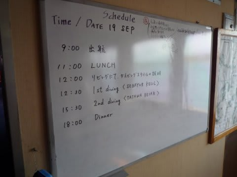
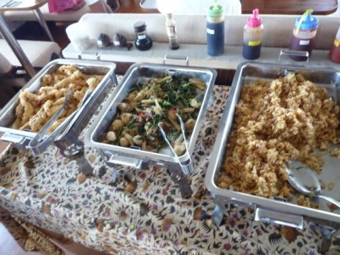
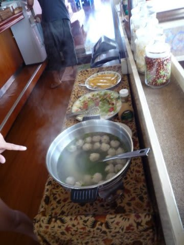
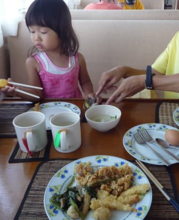
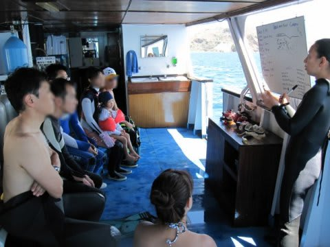
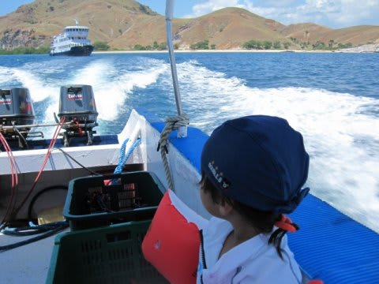
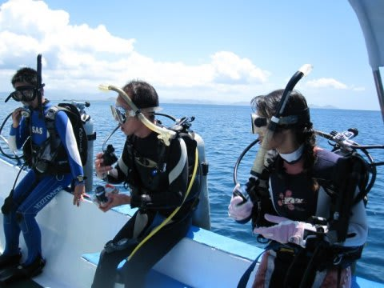
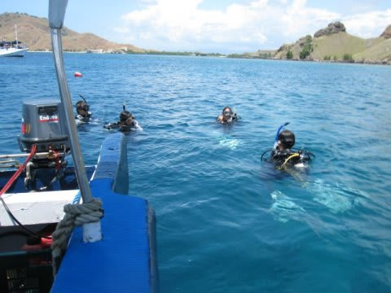

# コドモとコモド！子連れダイブクルーズ7　とってもゼイタク海水浴

📅 投稿日時: 2011-07-10 01:09:56

🏷️ カテゴリ: [ダイビング日記](ce3a7a8d424d112fce83ee85c81a0e344.md)

というわけで．

感動の6号室に荷物を運び込み，

ダイビング器材やらカメラのくみたてやら，準備を

していると，早くも11時．

今日は，12時からダイビングの説明，

12時半からゲストのスキルチェックのためのチェックダイブ，

という予定なので，早めに11時から昼食です．

以前までの，昼前にラブハンバジョー空港到着の

パターンだと，乗船後直ちに昼ごはんと説明，

立て続けにチェックダイブ…とあわただしく，

カメラを組み立てる暇もない感じでしたが，

朝早くの飛行機になったおかげで，時間的余裕がありますね～．

…ただ，乗船の日は早朝たたき起こされるという問題はありますが…

昼食は…

鳥のから揚げ，ナシゴレン，カンクン炒め，

フルーツ．

食事も子供が食べられるものばかり．

これも一安心．

んで．

乗船後の始めての食事のあとは，一息つくまもなく

チェックダイブ．

…さすがにいきなり子供を置いて妻と私の二人ともが

潜りに行くわけにいかないので，私か妻かどちらかが

子供の世話，どちらかが潜りに行く事になります．

で，1本目のチェックダイブは．

この船で一度も潜ったことが無い妻が潜ることに．

…つーことは，私が子供の面倒を見てお留守番ね…

しかし．なんと．

1本目のチェックダイブ．

娘も一緒にダイビングボートに乗せて行ってくれて，

ダイビング中はボートの周りを好き勝手に泳いでいていいですよ～

とのこと！

K村さん「好きなところに泳いでいっていいですよ～，

ボートに手を振ってくれたら，ボートがすぐに拾いに行きますから～」

ええええ～！

そこまでやってくれるんですかっ！

これまた感動．

で，娘は母親と一緒に神妙な面持ちでダイビング前の

ブリーフィングを聞き…

ダイビングボートへ乗り込み．

しまじを後にします

ポイントは「SEBAYUR KECIL」

島のビーチ前に広がるポイントです．

バックロールでエントリーしていく妻を見送ります…

娘「ママ，ダイビングに行ったの？潜ってるの？」

で，妻を見送ったあとは．

娘を船からドボン． 

我が娘，当時まだ2歳でしたが．

腕にヘルパー（オレンジの浮き）さえつけておけば．

底が見えない海だろうが，平気で泳ぎます．

しかし…こんなきれいな海で泳げるとは…

贅沢よのお…
