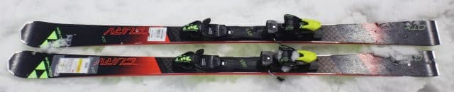
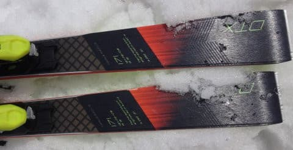
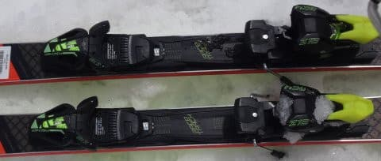

# 2018シーズンモデル，スキー試乗レポート第17回…FISCHER編その2

📅 投稿日時: 2017-06-11 00:26:22

えー．

やはり．

私が行かなかったので，悪天候になった月山…←違うから

今日の月山はかなり悲惨な天気

だったようですね…

朝イチからかなりの雨で．

さらに11時ごろ雷のためにリフトが運休になり．

一旦再開したものの，すぐに今度は

強風でリフトが運休になったようで…

やはり．

今日はスキーに行くべき天気ではなかった

ようですね．

うん．

だから．

今週末，月山に行けなかったけど．

悔しくなんかないですね．

ええ．

ちっとも，悔しくなんかないですね…！←一生懸命自分に言い聞かせている

ということで．

月山に行っておらず．

スキー場レポートができないので．

今回は，まだまだ続くスキー試乗レポート．

…カスタムフェアに行った人も多いだろうし．

そろそろ気の早い人は，来シーズンモデルを

注文しちゃってるころなんじゃないでしょうか…

だもんで．

「まだ続くの？」

って言われそうですが．

はい．

まだ続きます．

本日はフィッシャー編ですが．

今回のあと，

FISCHER WC-SC

FISCHER RC4 SC

ATOMIC S9 (FISじゃないやつ)

ATOMIC G9 RS

SALOMON X-Race SC

HART Infinity S WC

VOLKL Racetiger SL R WC

と続く予定です…

では，どうぞ～！

---

FISCHER RC4 The CURV DTX　171cm

基礎オールラウンド

昨年から続く，The CURVシリーズ．

強いBoosterプレートが入ったBoosterと，

Boosterプレートの無いDTXがありますが．

こちらはBoosterプレートがない，

優し目の方．

滑ってみたところ…

かなり素直な感じの板で．

Boosterプレートがないけど，張りが強く感じ，

スピード耐性は結構あります．

粘るフレックスで，しっかりたわんでグリップします．

荷重ポイントはセンター．心持ちトップより．

しっかりたわんでグリップするので，

エッジに乗って小さめの半径で良く曲がる．

かなり谷回りが作りやすい印象．

すっと谷回りに入っていくので，

足が外に出ていく．

反発は早くないけど，板がたわんで小さな半径で

旋回するので，板が体の下をくぐって回り込み，

すっと次のターンに入っていく感じ．

171cmだけど，ミドル～ゆっくり目のカービングショートが

気持ちいい感じ．

ロングも行けますが，フレックスが柔らかめなので

スピードを出すとミドルっぽくなっていきます．

そこそこのスピードでエッジに乗って滑っていくには，

結構気持ちいい板だと思いました．
