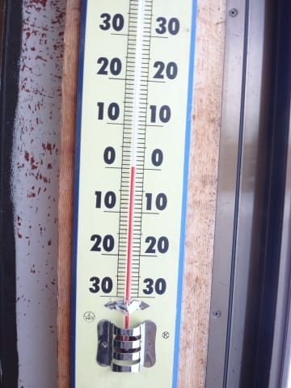

# 2月13日，土曜日の志賀高原は…何とか雨は降らずにもったけど…4月の雪だよ（泣）

📅 投稿日時: 2016-02-13 23:41:54

えー．

今シーズン．

1月下旬になるまで．

「あー，いつもの12月くらいの雪の量しかないっ！

　いつになったらトップシーズンになるのか？？」

…と，待ちくたびれたところ．

ようやっとまとまった積雪になって．

「1か月以上遅れてトップシーズンだ！！」

…と，思ったばかりというのに．

そのトップシーズンは，わずか2週間ちょいで終わったようです（涙）

本日．

どうしたことか．

超絶な高温のため．

すでにゲレンデは4月になってしまいました…（泣）

気分的には，12月からわずか2週間で4月になった

感じです（止まらない涙）

とりあえず．

本日のゲレンデ状況は…

朝．

すでに路面に雪がない時点で．

…とても，2月の志賀高原の路面と思えないんですが…！？？

＃トンネルの中は凍っていて事故ってましたが…

で．

ゲレンデに出ると…

朝の山頂ですでにプラス気温ですか（涙）

山頂のゲレンデは曇り空．

まぁ，朝イチはちょっと重めだけど…

しっかりエッジが食い込む，快適シマシマバーン！！

いや，

シマシマなうちは楽しめるっ！

今のうちに思いっきり楽しむのだ！！！

…と，思ったら．

その思いが通じたのか…

え？日差しが！！？？

…

これは，かなり好コンディションでは？？

いや！

シマシマ最高！

シマシマ最高！

…

と．

1時間ほどは快適に滑っていたところ．

…今日は予想通り，ぐんぐん気温は上がっていき…

そして，

「午前は日が差すかも？」

と予想したけど．

予想を超える日差しの強さで…

1時間を過ぎたあたりから…

あら．

雪が…雪が…重いんですが？？

そして，10時過ぎには…

雪が…

雪が，板に張り付くんですが！！？？

4月レベルの雪なんですが！！？

ちょ，ちょっと待ってクダサーイ！！？？

まだ2月上旬ですよねっ！！？？

な，なんてこった…（泣・泣・泣）

せめてもの救いは．

ゲレンデの混雑は，2月の週末としてはマシなレベルで…

ゴンドラ待ちも最長で2分程度と，少なかったこと．

天気は，曇ったり…

晴れたりを繰り返す天気だけど．

午前中は晴れの時間が長く．

そのおかげで，雪は強烈なスピードで

劣化していきます…

…板が張り付く雪って，2月では普通

ありえないだろ～っ！！！（やり場のない怒り）

…だもんで．

午前中太陽が当たりにくい一の瀬の方が雪質がいいだろう…

と，今日も昼前には，焼額を脱出して．

一の瀬ファミリーへやってきました．

パーフェクターコースは，昨日からの高温の影響か．

取りつき部分にかなり土が出てきちゃってます…

でも．

雪質自体は，午前中の太陽が直撃する焼額より，

激烈にいいっ！！

人が少なく，雪もフラットで…

板が張り付かないよっ！！

いやーーー！

いい！（対焼額比）

昼ごはん食べる時間がもったいないくらい，

いい！（対焼額比）

＃「お昼抜いて滑っちゃえ」という，某氏＠20000mクラブな方の

＃悪魔のささやきに魂を売りそうになったけど…ちゃんと

＃ご飯は食べました（笑）

しかし，やっぱりここも午後3時近くには…

あぁ…

ダメか…

じっとりと湿って重い，

4月の雪になっちゃいました…（涙）

ってことで．

耐え難いほど残念なことではありますが．

…志賀全域，4月の湿った重い雪になってしまいました（泣）．

ただ．今日の救いは．

午後は今にも降りだしそうな天気が続いたものの．

（ぽつ，ぽつと雨っぽくなった瞬間も）

でも，雨が降らずに，最後まで持ってくれたことです…

…雪は悪くなったけど．

土砂降りにならなかっただけ，まだマシか…（慰め）

で．

はい．

そうです．

今日もナイターです．

今日は，ヤケビナイターに繰り出しました！

重くて残念な雪とはいえ，圧雪かけたての

バーンは楽しいっ！！！

ビバ，圧雪バーンっ！！

…って感じで．

重い雪ながらも，滑っている人がほとんどいない

ガラガラバーンだったので，最後までシマシマが

残っていて．

結構気持ちよく滑れたのでした…

…しかし．

ナイターが終わってから，帰る途中．

高天ヶ原スキー場前の道路看板で…

…何だこりゃ？

2月の志賀の夜で，プラス9℃！！？？

…

終わってます．

この週末，いろいろ終わってます（涙）

…そして．

今，雨がぽつぽつ降ってます．

で．ナイター終了時，山頂はかなり

風が強まり始めていたので．

明日の朝は，やっぱり激烈高温雨＆強風で始まりそうです（涙）．

ああ．

ダメだ．

休むことなく踊った，

気温冷え冷え，雨じゃなく雪になって，風よ収まれ踊り

は，無駄だったか…（涙・涙・涙）

## 💬 コメント一覧

### 💬 コメント by (いか)
**タイトル**: Unknown
**投稿日**: 2016-02-14 00:02:05

うーん、やっぱり今週末はダメですね… 東京でも外に出た瞬間にあったかかったです…

でもナイターは気持ちよさそうでなによりです！

ちなみに私はSXを確保してまいりました(笑)

この時期に3★%オフだったので満足です(^^)

### 💬 コメント by (デーコン)
**タイトル**: Unknown
**投稿日**: 2016-02-14 06:40:17

シマシマバーンみたら

ワクワクします。

岐阜は暖かい雨が降ってます。

もっと冷えろ！

仕事しながらそんなこと願ってます。

### 💬 コメント by (はなげ親分)
**タイトル**: 業務連絡
**投稿日**: 2016-02-14 06:59:34

現在、一の瀬はかなりの降りです!!

残念ながら奇跡は起きなかった様です(泣)

### 💬 コメント by (Skier_S)
**タイトル**: 業務連絡返信
**投稿日**: 2016-02-14 09:08:06

ヤケビ第2ゴンドラ、減速ながら動いてます。

１ゴンはまだ動きません。

でも、かなり本格的な雨です(泣)

### 💬 コメント by (Skier_S)
**タイトル**: 業務連絡以外の返信を…
**投稿日**: 2016-02-14 23:32:11

＞いかさま

この土日は…死にました．

ええ．悲しさで悶絶死です…（昇天）．

朝イチとナイターがまだマシでしたが…

で．

SX確保ですかっ！！

今シーズンモデルですよね？

ビンディングはどうしました？

旧SXから移植？

それとも新品VARビンディング付きですか？？

＞デーコンさま

今日は志賀高原も暖かい雨が降ってました…（涙）．

冷え冷え踊り，効かなかったようです（泣）

あぁ…この雪はまともな雪に戻るのか…

### 💬 コメント by (いか)
**タイトル**: Unknown
**投稿日**: 2016-02-15 07:15:18

まだまだ14SXには曲がってもらうので今回はビンディング付きにしました。16SXは本格投入は来期の本格シーズンインからの予定です(^^)

### 💬 コメント by (Skier_S)
**タイトル**: いかさま
**投稿日**: 2016-02-16 00:50:40

ビン付きですか…当然VARビンディングですよね（＾＾

