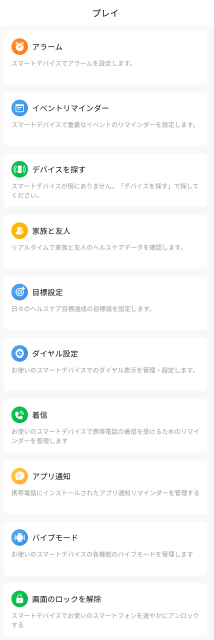

# スマートウォッチ，Amazfit PACEを買ってみた　その8…スマホアプリを使ってみる

📅 投稿日時: 2020-05-21 08:17:06

🏷️ カテゴリ: [PC,カメラ&小物](c0d8caed13e597efe97b661a8ae56bed0.md)

さすがにそろそろ，志賀高原の特派員が

いなくなってきた今日この頃．

雨にも負けず，何とかまだ横手山第2ゲレンデが

滑れるようですね…

なんとか今週末まで，横手山が滑れるのかな？

5月20日を過ぎて横手山が滑れたら，

かなり恵まれた状況ですね…

ってなことで．

昨日はBlogを更新せずに倒れたように

寝てしまったので，朝更新となりましたが．

今回もスマートウォッチ，Amazfit PACEの

レポートです．

[前回](ea509a7c711b06640acb6477bdc2890df.md)は，時計本体の機能を説明しましたが．

今回は，スマホとの連携機能を紹介です！

…ってか．

基本的に使うアプリは，[すでにレポートしている
Amazfit GTRのアプリ](ecf2d1a51d5012b9edf9fbf5307e586db.md)と同じものなので，

今さらあんまりレポートすることは無いのですが…

ただ，Amazfit GTRのレポートをしたころから，

ちょっとアプリもアップデートしたので，

そのあたりも追加で書いて行きます…

まず，スマホのAmazfitアプリですが．

最新バージョンでは，こんなトップ画面に

なってます．

一番上，真ん中に歩数＆消費カロリー＆睡眠時間が表示されて…

その下は今日一日の心拍グラフ＆現在の心拍数（72bpm）

続いて下は，PAIのグラフ＆今日のPAI値（20）…運動量の目安，100を超えるように運動推奨）

さらに下は，今日一日の睡眠パターン＆睡眠スコア（72）

ってのが，At a granceで見れるようになってます…

歩数部分をタップすると，歩数の詳細が見れます．

何時にどのくらい歩いたかのグラフが出て，

これを左右にフリックすれば，過去の歩数

グラフも確認できます…

トップ画面のカロリーをタップすれば，

一日のどの時間にどれだけカロリーを

消費したかが確認できるし…

トップ画面の睡眠をタップすれば，

睡眠記録が確認できます．

濃い青が深い睡眠の時間，薄い青が浅い睡眠の

時間ですね…

これも左右にフリックすれば，過去の

データに遡れます．

そして，トップ画面の心拍数をタップすれば，

同じく一日の心拍数グラフが確認できます…

このあたりの詳細画面は，

Amazfit GTRの時に説明した時から変化なしです．

次に，トップ画面のここ．

「プレイ」を選ぶと…

このような，時計の設定メニューが

出てきます．

この画面から，

・時計のアラームの時間

・イベントリマインダー（特定の時間に時計にメッセージを通知）

・ダイヤル設定（時計画面のデザインの入れ替え）

・着信設定（どのアプリの通知を時計に転送するか…）

などの設定ができます．

そして．

トップ画面の右上のここをタップすると…

今度は，こんな画面になり．

時計が収集したデータを見ることが

できます…

歩数，カロリー，PAI，睡眠，心拍は

トップ画面からも見れますが，

時計のスキーモードなどの運動記録モードの

ログは，この画面の「運動記録」から

選びます…

「運動記録」をタップすると，

こんな感じで過去の運動記録の

一覧が出てくるので．

（2/29は，一日でスキーの記録が4個あるけど，

　Amazfit GTRとAmazfit PACEの2台分の記録が，

　昼間とナイターの二つずつあるので計4個）

このうちどれかを選べば，詳細を見ることができます…

…このスキーログの詳細は，次回に譲るとして．

次は，トップ画面の右下，

プロフィール画面を選ぶと…

ここは設定メニューで，

スマホとペアリングする時計の切り替えや，

自分の睡眠時間や歩数の目標値を設定，

（目標に達したら時計に通知が表示される）

アカウントの設定とかができます．

（運動記録などは，スマホ本体じゃなくクラウドの

　自分のアカウントに記録される…スマホを取り換えても

　データが消えないし，データ移動の必要なし！）

このプロフィール画面．

Amazfit GTRと，Amazfit Watch(Amazfit PACEがこう

表示されてます…)の2台が登録されてますが，

この場合は，Amazfit GTRがペアリングされていて，

Amazfit PACEとの接続は切れてます．

前にも書きましたが，スマホと同時に

接続できるスマートウォッチは1台のみ．

Amazfit PACEをアクティブにしようとした

場合は，この画面のAmazfit Watchを

タップすると，まずAmazfit GTRが

切断されて…

それに続いて，Amazfit PACEが

アクティブ化されます．

で．

Amazfit PACEの各種設定ができるように

なるわけですが…

この設定画面の矢印で示す，アクティビティの

ボタンを押すと．

こんな感じで，Amazfit PACEで

記録できる運動モードの一覧が出てくるので．

例えば，スキーを選べば…

こんな感じで，スキーモード時に時計画面に

表示される項目を選ぶことができます…

また，並び替えて画面の表示位置を

変えることもできます！

これがスキーモードの標準の画面ですが…

自分の好きな項目を好きな順で，

時計に表示させることができます．

…運動記録モード時の時計の表示を変える機能は，

Amazfit GTRではない機能ですね…

ってな感じで．

スマホアプリの機能を長々と説明してきましたが．

次回からが山場．

スマホアプリのスキーモードの詳細と，

Amazfit GTRとAmazfit PACEのGPS精度比較です！
