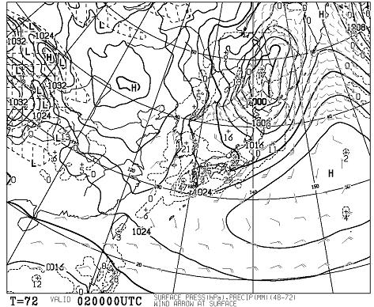

# 今週末のスキー場の天気は…土曜は壊滅的な雨（涙）

📅 投稿日時: 2013-01-31 00:08:26

🏷️ カテゴリ: [スキー天気予想](c6554f5c3c106093b511a8daae23757e8.md)

な，なんだ～っ！

これは～っ！

あーーー．

このBlogを良く読んでいる人ならわかると思いますが．

2月2日，土曜日の朝9時の850hpa気温なんですけど…

どうしたことだ．

赤くマークした0度線が，日本のずっと北にまで上がってます．

…これは，標高2000mクラスでも，降れば雨．

絶対，何があっても，どんな奇跡が起きようとも．

雪にはならないレベル（涙）．

ぜったーーーーーい，降れば雨です．

そして，2日の地上天気図は…

こんな感じで，信州をはじめとする日本全域が降水域．

…雨だよ．雨．

2月上旬の週末というのに…（泣）．

どうしたというのだっ！

この12月～1月，異常に冷えたかと思えば，思い出したかのように

雨に襲われるという…

FXXN519も…

こんな感じで．5400mラインはあり得ないほど北に上がっちゃいます．

北緯50度より上にまで上がっちゃうって，冬にはあり得ないレベル…

…だめだ．こりゃ．

とりあえず．

こんな感じで．

2月2日の夜9時には何とか850hpaの0度線は信州より南，

2月3日には，なんとか日本の南に戻ってくれるらしいので．

2月2日の日が暮れたころからは，雪になってくれますか…

2月2，3日の地上天気図を見てみると…

こんな感じで，2日～3日にかけては，冬型の天気図になるので．

2日夜から3日朝にかけては，雪が積もってくれそう．

ということで．

まとめると，ですね．

2日は朝から壊滅的な雨（劇泣）．

夜から冷え込んで雪に変わり，朝にかけてそこそこ積もりそうなので…

3日の朝は，アイスバーンの上にぼちぼちの新雪かな．

志賀高原では，午前には雪は弱まり，昼には日がさすかも．

＃新潟は雪が降り続くかな．

ってことで．

昼ごろには，急斜面は表面の雪がはがれて，アイスバーンと

もさもさ雪が交互に現れるような，快適度が低いコンディションと

なるでしょう…

…

…

…

ダメじゃん(涙）．

なんだか．今週末は祈ってもダメかも…

だ，誰だ！日頃の行いが悪いのはっ！

＃それは自分だと思わないのか？という突っ込み不可
