# 2024年8月，今年も座間味で親子ダイビング！その19…座間味ラストナイト！

📅 投稿日時: 2024-09-19 04:55:41

🏷️ カテゴリ: [ダイビング日記](ce3a7a8d424d112fce83ee85c81a0e344.md)

いかん．

精神的に追い詰められているときに，

沖縄の記事を書いていると，

仕事をすべて放り投げてまた座間味に

行きたくなってくる…

あぁ…

夏にちゃんと休めるようになったら．

またモルジブにも行きたいし，

コモドもまた行けたら行きたいなぁ…

しかし．

円安の今，家族3人全員ダイバーになったので

3人分の旅行費＋ダイビングフィーがいる

ことを考えると…

うん．

忙しくても，働かないといけませんね（涙）

でも，今の状況だと．

働いて稼いでも，モルジブやらコモドやらに

行ってる休みは取れなさそう…（泣）

ホントはスイスとかイタリアとかに

スキーにも行きたいけど，今の円安と

リフト券1日2-3万するヨーロッパの

狂乱物価を考えると，余裕で一人100万近く

かかるので，とてもとても…

まぁ，志賀高原に雪が積もっている限り，

志賀高原以外に行こうとは思わないように

なってきましたが…

ってなことで．

今日も睡眠時間が短いけど．

座間味旅行記です！！

ーーー

（[前回はこちら](e83e7a035b5792332e3954b15ec8a361a.md)）

という感じで．

座間味の高月山展望台からの

美しい景色を堪能したら…

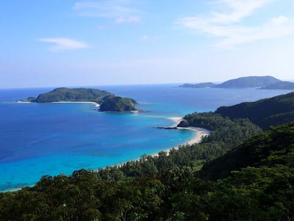

そろそろ第2展望台を後にして，

下山しましょうね．

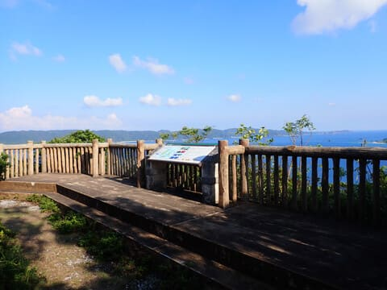

第2展望台の周りは，こんな感じの

うっそうと茂った森の中に通る

遊歩道みたいな感じの道ですが…

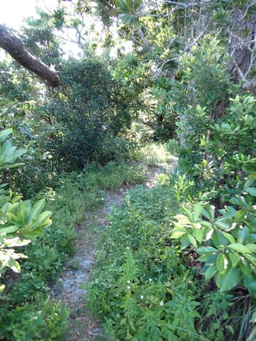

駐車場まで戻るとアスファルト道．

実は今回，高月山に登ったのは．

ここ数日，ダイビングしかしておらず．

1日3本潜っただけじゃ運動した感じが

なく．

運動不足で体を動かしたかった…

という目的もあるので．

ハイペースで走る！

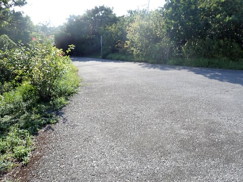

…ただ．

履いているのはいつものトレランシューズ

ではなく，ワークマンで買った，

2000円程度の安い靴．

もともと走るために作られてない靴なので，

ソールのクッションもないし，

インソールもしっかりしてないし，

ソールのグリップも弱いし．

アッパーのホールドも甘くて，

スピードを乗せると怖い…

ということがよくわかって．

心拍数も150まで上げられなかったけど．

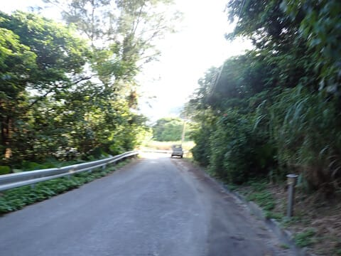

それでも第2展望台から9分ほどで

町まで降りてきて．展望台から12分ほどで

宿まで戻れました…

ちょっとは運動不足感が解消したかな．

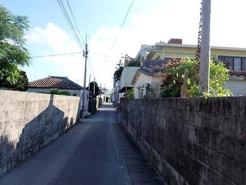

ってなことで．

ざっくり1時間ほど高月山を巡って，

宿に戻ったら5時半ごろ．

それから1時間ほど，今日のダイビングの

ログ付けをしたら…

6時半の夕食タイム！

今日の夕食のお店へ向かいます…

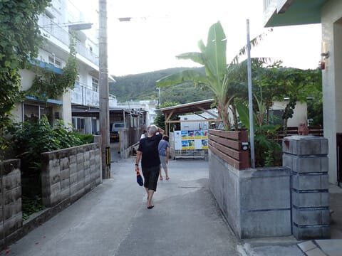

今日の夕食は，宿の星砂さんからすぐ．

座間味のメインストリートにある民宿

みやむらの2階にある，

「ラ・トゥーク」さん．

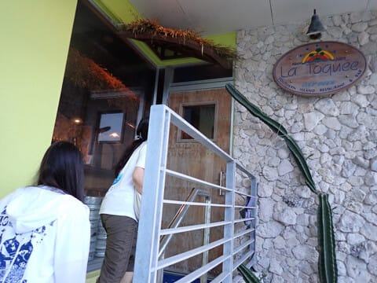

このアングルで見るとそう見えませんが…

結構こじゃれた内装のきれいなお店で．

人気店らしく，我々が入った直後から

次々お客さんが入って，あっという間に

満席になってました…

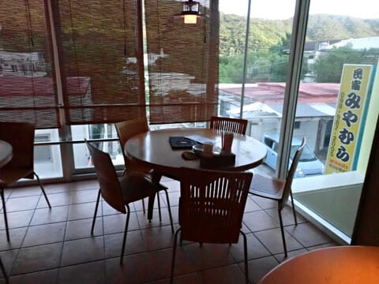

ここでは，カツオのたたきやら…

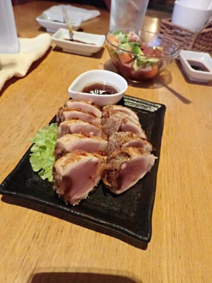

マグロのポキ，

モズクの天ぷら．

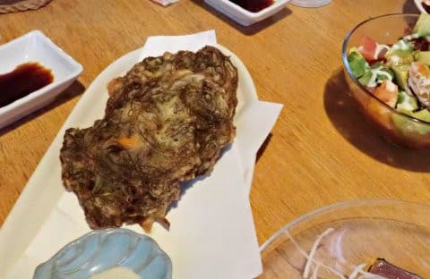

ラフテーやら鴨ロースみたいな，

いかにもお酒が進みそうなメニューが

いっぱいそろっていて．

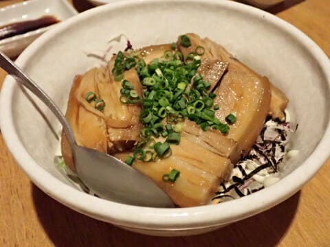

今日もたっぷり満足！！

ってなことで．

夜ご飯を食べた後は…

また，宿に帰るまでにいたネコさんに

ちょっかいを出す娘．

…ホントに座間味って，ネコの島だな…

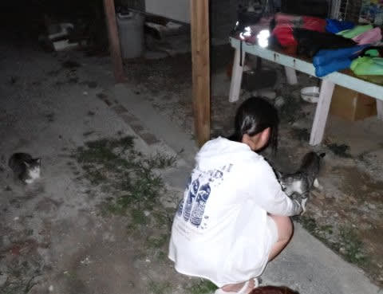

あとは宿に帰って．

明日はもう帰る日なので，

水中カメラをばらしたり，帰り荷物を

作って，ちょっと寂しさを感じつつ

眠りについたのでした…

（[続く](ea36b22791d8ce38fa90e1a9cb8e57a9b.md)）
