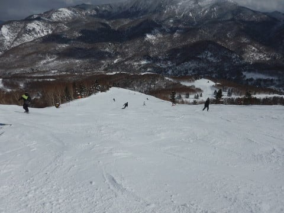

# 2月4日，日曜日の志賀高原詳細モード…冷え冷え晴天！時々曇ったけど，固めの雪で午後までフラットバーン！

📅 投稿日時: 2018-02-06 02:35:26

えー．

月曜朝は，久しぶりに30～50cmの積雪が

あったようですが．

これから数日は，志賀高原ではあんまり

積もらなさそうな西風が続きそうな

天気図なのを見て．

ちょっとがっくりしているSkier_Sです．

ってなわけで．

本日は，日曜の志賀高原．

詳細レポートです…

まずは，朝．

うーむ．

昨晩からの積雪はこの程度で．

…わずか2cmくらいかな（涙）．

そろそろ大量に積雪が欲しいところ…

で．

いつも通りの朝イチの焼額第1ゴンドラの

オープンに並んで…

山頂に出ると．

そこは天気予想通り，すっきり晴天の

ゲレンデがお出迎えっ！！

そして，朝イチの山頂の気温は-12℃と…

ここも水曜の予想ドンピシャの気温っ！！

ふはははは！

見よ！わが予想の正確さを…

当然ゲレンデは…

そう，冷え冷えシマシマ！！

積雪がほとんどなかったので，かなりしっかりと

締まった，激烈ハイクオリティシマシマバーンっ！！

朝イチのガラガラバーンを，太陽のもと

ピカピカシマシマバーンをエッジで切り裂きながら，

ガッツリ傾いて行けるこの幸せ…っ！！！！！

最高だよ…

あぁ…

最高…（恍惚）

そして．

シマシマ，ガラガラのGSコースを何本か滑ったあと．

オリンピックコースへ行ってみると…

うををををを！

フラットの貸し切りバーンっ！！

雪質は，これ以上固いとアイスバーンになって

手ごわいかな…と感じる，エッジがちょうど

引っかかってくれるキワキワの固さで．

しっかり締まっていて，ものすごいスピードが出るけど，

エッジがかかってくれる超絶ハイスピードバーン！！

固めでスピードが乗って，難しく感じる

バーンだったからか．

なぜか人があまりやってこず…

こんな超絶にいい，ハイスピードバーンを

クリアラップでひたすら滑り続けられる，

シーズンそうそうない激烈大当たりデー！！

ハイスピードバーンが好きな人は，

毎回昇天できそうな，クリアラップ自由落下を

ひたすら満喫！！

あぁ…なんて恵まれてるんでしょう…

午前10時過ぎには，ちょいとゴンドラも混み始め，

ゲートの外まで人がならぶ，3分待ち程度にまで

列が伸びたものの…

11時にはゴンドラ待ちも0になり．

ゲレンデ上の人はそれほど多くもなく．

ピークでも人口密度はこの程度．

昼になると，コース上は人が減っていき…

すっきり晴天が続くのに．

また，ガラガラなゲレンデを飛ばし放題の

状態にっ！！

そして．

昼になってもゲレンデの雪質は最高！！

で…

第3高速沿いイーストコース，

HEADレーシングキャンプの貸し切り

バーンが昼に解放されて，

昼間なのにまたガラガラバーンの

最高冷え冷えシマシマバーンが

味わるという，嬉しいボーナスもあり…

ダメです．

最高すぎます．

今日は良すぎるっ！！

雪が結構締まっているし．

人も少なめなので，午後になっても

雪はそれほど荒れず，コースはフラットなまま！

ここも見事に水曜の予想通り…

一番荒れる，GSコースの落ち込み部分も

この程度しか荒れてませんね…

午後2時ごろから1時間ほど．

雪雲が飛んできて，太陽が隠されて．

ここも見事に水曜の予想通り，

時折雪がちらついたりもしたけど…

でも．

この日は私はひたすら焼額を滑り続けたので．

奥志賀に行った時のように，焼額の呪いで

いきなりガスって吹雪いたりするような

天気にもならず．←それ，関係ないから．あなたが焼額を離れたら雪が降るわけじゃないから

午後3時ごろにはまた晴れ始め…

終了間際の夕方になっても．

オリンピックコースはフラットな

ハイスピードバーンのまま！

そして，気持ちよく飛ばせる貸し切りバーン！

あぁ…

シアワセ…

今日はシアワセすぎる…

ってな感じで．

今日も晴天で15分の延長営業となり．

ゴンドラ16:15，リフト16:30までに

延びるという，嬉しいサービスもあり…

最後の一本でもこんなにフラット無人の

シアワセ状態のバーンを満喫して…

日が暮れ行くラストリフトまで，

ひたすら楽しみ続けたのでした…

いやーーー．

満足．

雪よし，天気よし，貸し切りバーン状態を

堪能できるという，

今日は満足な一日だった…

スキーの神様，ありがとう～！！！

こんな日がずっと続くといいなぁ…

PS.

本日の段階での，10日の850hpa予想は．

こんな感じで0℃線は志賀の南に下がりましたが…

でも．

スプレッドは0.62と大きな値で，

水色で囲った5400mの特定高度線の

予想間ばらつきが大きい状態なので．

現段階での10日の予想精度が低いことを

表しています…

まだ，10日の天気．どうなるか予断を許しません．

…だもんで．

とりあえず，信心深い皆様におかれましては．

止まらず休まず，冷え冷え踊りを踊り続けて

くださいますよう，お願い申し上げます…

## 💬 コメント一覧

### 💬 コメント by (ほっぽ)
**タイトル**: 2/5　志賀高原
**投稿日**: 2018-02-06 06:43:42

Ｓさん

昨日から志賀入りしています。

昨日は膝上パウダー満喫、平日なので人も少なく午前中はパウダー滑走が楽しめました。

様子はＨＰにアップしておきました。

個人的なことですが、2/6以降の天気が気になります。

多分、2/9まで大雪は降らない感じですかね。

http://www2.tokai.or.jp/nana_hoppo/

### 💬 コメント by (olaf2125)
**タイトル**: ホント最高でした！
**投稿日**: 2018-02-06 23:40:13

日曜は前日のＳさんをまねて奥志賀8:00スタートにしましたが、あまりのコンディションの良さに奥志賀から抜けられず、やっとの思いでヤケビに移動したら、奥志賀の休憩所にスペアのメガネを忘れる始末。

取りに戻る時にＳさんにお会いした次第です。

また月末に参上します！

### 💬 コメント by (ほっぽ)
**タイトル**: Unknown
**投稿日**: 2018-02-06 23:43:04

Ｓさん

今日もほぼ１日晴れた志賀高原、サンバレーまで旅に出てきました。

夕方に雪が降ってきて、夜降って昼間晴れるパターンだと良いのですが。

2/6の滑走記録もアップしておきました。

### 💬 コメント by (Skier_S)
**タイトル**: 志賀は降ってない…
**投稿日**: 2018-02-07 02:13:11

＞ほっぽさま

北陸は大雪ニュースにも関わらず，

志賀は晴天で楽しめたようですね…

今晩もそんなに積もらなさそうです．

降るとしたら，7日夜から8日朝にかけて．

…その次は．また10日がヤバそうです…

＞olaf2125さま

日曜は奥志賀良かったんですね～！

ヤケビのオリンピックコースも超絶良かった

ですよ！

もう，オリンピックコースから動けず…

また月末にお会いしましょう！

