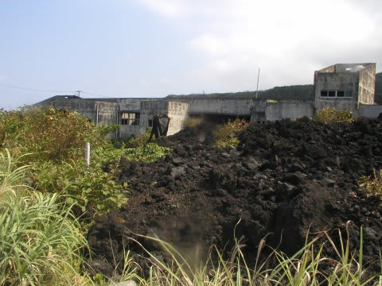
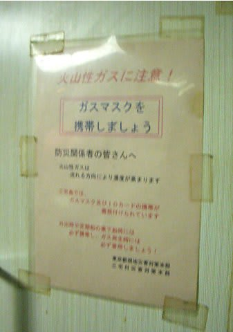
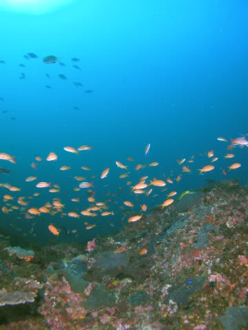

# 次のダイビングまでちょっと日があるので，昔のドルフィンスイム＆ダイビングの旅行記でも…

📅 投稿日時: 2013-09-04 01:40:56

ってことで．

9月のダイビング遠征まで，もう少し日があるので．

またしばらく，昔の旅行記でも引っ張り出しますか…

2007年8月．

まだ子供が生まれる前に，一人で行った三宅島ダイビング＆

ドルフィンスイムの記録です…

2000年に三宅島が噴火し，全島民避難の後．

2005年から，島民の復帰が始まったばかりで．

(溶岩に飲み込まれた建物跡)

まだ，三宅島空港もオープンしておらず，

入島時にはガスマスクが求められていたような，

観光客がまだほとんどいなかった2007年に．

いきなり思い立って行った旅行の記録．

ってことで．

2007年8月，三宅島ドルフィンスイム＆ダイビング旅行記．

明日からスタートします！

