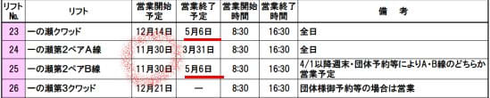

# 志賀高原スキー場，中央エリアのリフト営業予定が出たよ！…昨年とほぼ同じ営業予定．

📅 投稿日時: 2024-11-12 04:24:21

🏷️ カテゴリ: [日記](cc4b5682fb7b8b144980957a978653fb0.md)

今日もヤバい時間に更新してますが．

ちょっとヤバい…

相変わらず仕事のクリティカル状態が

終わらない（泣）

睡眠時間が激しく削られているので．

今日も更新するパワーがない中，

何とか更新！！

…でも，もう朝4時半だよ（泣）

これからお風呂にも入らなくちゃならないのに…

もし明日，更新が無かったらごめんなさい…

ちょっとヤバい．

そんな中でも今日は記事を書く！！

ってなことで．

果たして今シーズン，無事予定通り

志賀高原がオープンしてくれるのか

心配なほど，天気がヤバい感じの予想に

なっていますが…

そんな中，志賀高原中央エリアの

2025シーズンのリフト営業予定が発表に

なりました～！！

（[志賀高原中央エリアホームページ，リフト営業予定ページ](https://shigakogen.co.jp/winter/wp-content/uploads/2024/11/2024-25%E3%83%AA%E3%83%95%E3%83%88%E5%96%B6%E6%A5%AD%E4%BA%88%E5%AE%9A%E8%A1%A8.pdf)より，以下同じ）

詳細を見てみると…

え？一ノ瀬のペアリフト，11/30オープン？？

11月30日の土曜はシーズン券が使えないけど，

それでも焼額より1週間早い週を狙って

オープンするのか…

…ってか，この状況で本当にオープン

できるかどうか微妙ですが．

あと，一ノ瀬は基本的にGWの5/6までの営業で，

これはいつも通り．

…でも，一ノ瀬第3クワッドは今シーズンも

団体さんがいないと営業しないんだな…（激泣）

で，

タンネの森の第8クワッドは12/14オープンの

3/31まで，

ダイヤモンドは12/14オープンでGWの5/6までと

アナウンスされてますが．

4月に入ってからは第1週とGWのみの営業で，

第2，3週の週末は営業しないのが昨シーズンと

変わったのかな…？

あとは，山の神の営業終了がアナウンスされない

のも，昨シーズンと同じですが．

どうせダイヤが4月第1週に実質営業終了なので，

GWに山の神を動かすとは思えず．

4月第1週で焼額・奥志賀と行き来できないように

なっちゃいますね…（泣）

そして，高天ヶ原方面を見ると…

高天ヶ原クワッドは，一ノ瀬クワッドより

1週間早い，12/7オープン．

そして，高天ヶ原トリプルは一ノ瀬ファミリー

ペアと同じ11/30オープン．

…どちらも普段の年ならオープンできそう

だけど…今シーズンは予定通りオープンできるか

ちょい心配な感じ…

ちなみに高天ヶ原は，4月以降は週末とGWの

営業となり，これも昨シーズン同様ですね．

そして，一ノ瀬・高天ヶ原以外のエリアは．

赤く囲った寺子屋がGWまで（4月は週末・GWのみ）

なのを除くと，全て12/14-3/31の営業ですね．

で．

ナイター営業の案内も出てましたが…

ファミリーのナイター，12/21から早くも

営業開始するみたいです…！

昨シーズンは12/23オープンだったけど，

今シーズンは曜日の都合上2日早くオープン

になるようです…

終了の3/16は昨シーズンとほぼ同様ですね．

あとは，ダイヤ・サンバレー・高天ヶ原の

ナイターは昨シーズン同様，年末年始のみ（泣）

あぁ…

ダイヤモンドやサンバレーのナイター，

結構好きだったのに…

今シーズンもこれらのナイターを

滑ることなく終わりそうです（涙）

ってな感じで．

まぁ，昨年通りの営業予定であまり驚く

ことがなかった，今回の営業案内ですが．

山の神がGWまで動いてくれるとか，

一ノ瀬第3クワッドがせめて週末だけでも

動いてくれるとか，何かいいニュースが

欲しかった…（残念）

とりあえず．

今はこの予定通り，一ノ瀬・高天の下のリフトが

11月30日に動いて，

高天ヶ原クワッドが12月7日，

一ノ瀬ファミリーやダイヤが12月14日に，

予定通りに動くよう祈りましょう…

（すでに予定より遅れるのが既定路線と思っている）

## 💬 コメント一覧

### 💬 コメント by (かえる)
**タイトル**: Unknown
**投稿日**: 2024-11-12 06:36:19

12月の揺り戻しを信じましょう

### 💬 コメント by (tomorrow)
**タイトル**: Unknown
**投稿日**: 2024-11-12 16:08:48

こんにちは、いつも楽しく拝見しています。

降雪とシーズンインが待ち遠しい今日この頃です。

日経新聞の11月８日に「白樺荘」が海外資本に買収され、会員制になるようです。

盛んになればいいのですが、これ以上の高騰は恐ろしいです。

https://www.nikkei.com/article/DGXZQOCC0822S0Y4A101C2000000/

### 💬 コメント by (Skier_S)
**タイトル**: 12月は冷えてほしい…
**投稿日**: 2024-11-13 01:44:14

＞かえるさま

ホントに12月は奇跡の冷え込みが来てほしいです…！！

＞tomorrowさま

私もこのニュース見ましたが，インバウンド向けを狙うようですね…

志賀高原の宿は簡単には買収できない仕掛けになっているので，海外資本による

買収はこのあとそんなに続かないとは思いますが，一ノ瀬付近の宿が次々つぶれて

行くのを見ると，それが良いのか悪いのか…

いろいろ考えさせられるところもあります．

