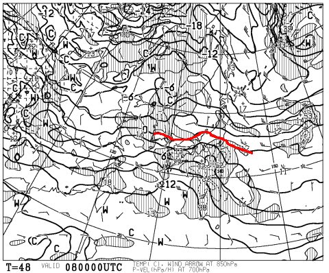
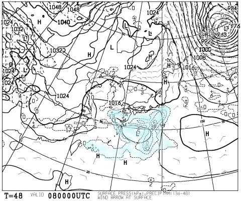
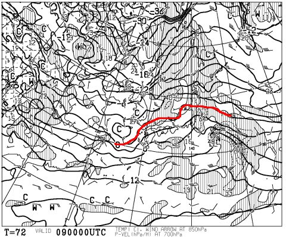
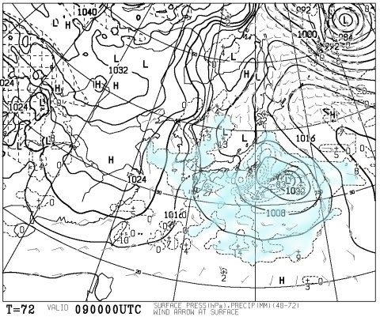
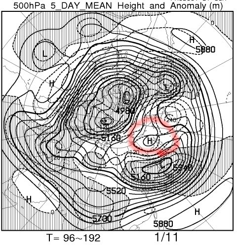
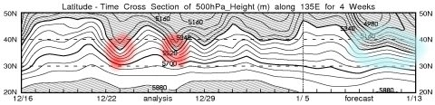
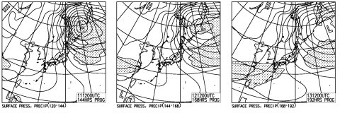

# 3連休の志賀高原スキー場の天気，1月7日は晴れ！8日は曇りで気温が上がり，9日は湿ったミゾレ→雪かな…

📅 投稿日時: 2017-01-06 23:46:33

ということで．

正月休みが終わったばかりというのに．

2日間仕事に行っただけで．

明日からまた3連休で志賀高原に舞い戻る

Skier_Sです．

…気のせいでなければ．

12月23日からの18日間で13日間志賀高原に滞在し．

自宅⇔志賀を5往復している気がするのだが．

…何かの勘違いかな？？

えー．

とりあえず．

この3連休の天気予想，

最新版をお送りします．

初日の7日は，一昨日の予想通り．

晴れ間が多く，朝は冷え冷えGoodな一日になりそう！

この日は一日コンディションはいいでしょうねぇ…

で．中日の8日ですが．

うううううーーーむ．

赤くマークした850hpaの0℃線が…

志賀高原より北に行っちゃってるか？？

でも．

地上天気図では，水色で塗った降水域は志賀に掛かっておらず．

本州より南にとどまりそうなので．

まぁ，この日は．

私の祈りのおかげで，雨は降らずに済み．

気温は上がるものの，曇り空の一日かな～．

そして．

3日目の9日．

850hpa図は…

うむ！？？

0℃線，志賀より思いっきり北ですよ！？？？？

そして，地上天気図は…

び，微妙…

水色の降水域は，ギリギリ志賀に掛かっている気が…

これは，9日の早朝あたり，標高の低いところでは

ぽつぽつ雨，標高の高いところではみぞれっぽい感じかも…？？

ただ，ほとんど降らずに済み．

昼には雪に変わるかな…．

ってことで．

最新版の予想．

7日：朝は晴れ！山頂は-5℃くらい．前日からの積雪なし．

　冷えたピカピカ，しっかり締まった圧雪でスタート．

　終日晴れ，気温は午前中はしっかり低いままキープ．

　時折雲が流れて太陽が隠れるかもしれないけど，

　概ね日が射し，雪質もそこそこ良く楽しめる一日．

　太陽が照るので，南斜面は昼間ちょっと雪が

　緩んで，握ると固まる感じの雪になるかも．

　急斜面は午後は下地の固いのが出てくるかも…

8日：終日曇りの一日．比較的気温は高め．

　朝イチはそこそこの圧雪バーンで楽しめるか．

　昼に向け気温が上がり，雪は緩む．

　志賀は，午前中は時折日が射す

　タイミングもあるかも．

9日:微妙…リフト営業前の早朝，麓はぽつぽつと雨かも…

　山頂はみぞれっぽいか．

　朝は重めの圧雪．

　午後は気温が下がり，雪がちらつきだす．

　雨が降った場所は，午後は固まったアイスバーン化しそう…

　志賀は雨にならないことを祈る！！！

　全力で祈る！！

という感じでしょうか．

…しかし．

3連休後…

うむ？

これは…

また，ブロッキングH復活？

そのせいで，11日以降は寒気が下がってきそう…

この図で赤くマークした12月の24日，27日あたり．

そこそこのパウダーデーだったのを覚えている

かと思いますが…

なんと．

3連休が終わった，1月10日以降．

ブロッキングHの効果で．

水色でマークしたように，この24，27日レベルの寒気の

南下が持続しそう…！！！

だもんで．

11，12，13日の地上天気図．

見事な冬型をキープし続けてるよ…

この3日間，パウダーデーが続きそう．

なぜ，3連休が終わってから…（涙）．

でも．

来週は冷え冷えどか雪が続くので．

14日の週末は，日本中のスキー場が

かなりいいコンディションで滑れるように

なるんじゃないかな～．

では，この3連休も志賀高原で滑ってます～！

＃あと3時間半後に出発
