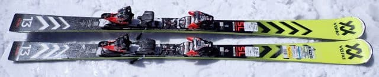
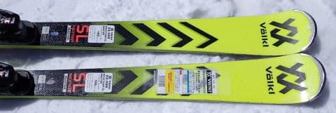
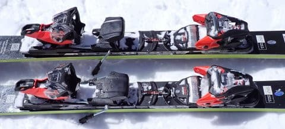
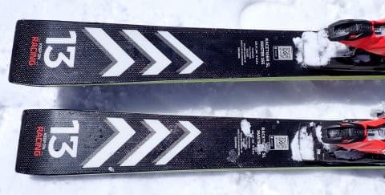
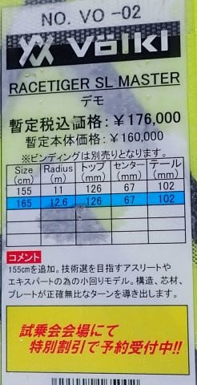

# 2024シーズンモデルのスキー板，試乗レポートその25…VOLKL RACETIGER SL MASTER

📅 投稿日時: 2023-07-10 04:07:41

🏷️ カテゴリ: [スキー板試乗](c0bd8048615710cee890e403a36cc9a2b.md)

この土日も，やらねばならない仕事を

抱えていたのですが…

スキーシーズンも終わってしまった今，

何もせずじっと家にいて体を動かさないと

腐る！！

ということで．

家からそんなに遠くないところで，

3時間半だけちょろっと今シーズン初の

山歩きをしてきました…

それ以外は仕事もあり，じっと家で過ごし

ましたが（涙）

それでも，お出かけは土曜の午前中だけに

とどめるべく，睡眠時間2時間で朝4時に

山に出かけ．朝10時過ぎには帰宅して，

それから仕事をするという…

えらいんだかなんなんだか，よくわからん

週末を過ごしました…

ってなことで，本題へ．

本日も2024シーズンモデルのスキー板の試乗レポート．

今回はVOLKL編です．

では，どうぞ～！

〇VOLKL RACETIGER SL MASTER　165㎝

基礎小回り

昨年度からの継続モデルで，基本的にモデル

チェンジしてないようですね…

で．

フォルクルの基礎小回り用の板は3種類あって，

結構ややこしいのですが．

競技モデルのプレートを抜いた

Racetiger SL WC D，

そして競技用モデルの技術そのままに，

WCプレートとかも載せながらもサイドカーブを

ちょいと緩めに，センターもちょいと広めに

したこの板，

Racetiger SL Master，

そしてサイドカーブはSL Masterと同じながら，

コア材も柔らかめにし，プレートも抜いた

Racetiger SL

という3種類．

この，Racetiger SL Masterは，基礎向け

小回り用としては，お値段も最高額で

トップモデルになります．

滑ってみると…

SL競技用の板ほどではないにしろ，

SLモデルに近い感じの張りの強さ，

グリップの強さを感じます．

そして返りも結構早く，強めの返りが

あります．

SLモデルに近いグリップと張りの強さ

がありながら，非常に軽く，振りやすい！

これだけの板の軽さでは想像できない

グリップ力！

板の軽さから想像するグリップ力と，

実際のがっつりしたグリップ力の

違いに驚かされます．

で，かなりのスピードを出しても板が全く

負けることなく，ハイスピードで強いたわみが

出た中でもがっちりグリップし続けるので…

大きなたわみに沿って，強い横Gを食らう

深い小回りができます．

そして，返りがそこそこ早いので…

結構な小回りスペシャルの板です．

スピードを出していくと，大回りは厳しい．

何とか中回りまでは行けるけど…

この板が楽しいのは，ハイスピードでの

強いグリップを生かした，ギュインギュインな

小回りですね～！！

グリップが強いけど，板が軽くて振り回せる

ので，いろいろな小技が使えるし．

軽さと動かしやすさで，コブとかでも

行けるんじゃない？

と思わせる軽快さ．

この板は，ガッツリ深いターンができる，

そこそこ攻めた小回りスペシャルながらも，

荒れた斜面とかで軽快に板を動かしながら

滑っていける，結構つぶしが効く板ですね…

うん．

この板も結構私のお気に入りです．

## 💬 コメント一覧

### 💬 コメント by (harutomo)
**タイトル**: Unknown
**投稿日**: 2023-07-10 09:42:22

こんにちは。

私もこの板は好みです。

好みの板が似ているかもしれません。

### 💬 コメント by (Skier_S)
**タイトル**: ＞harutomoさま
**投稿日**: 2023-07-11 03:27:20

おっと！気に入る板の傾向が同じですか…！

滑りが似ているのかも…（笑）

