# 2023シーズンモデルのスキー板に試乗してきたよ！どんな板に乗ったのか＆クイックレポートその１

📅 投稿日時: 2022-03-11 01:27:08

🏷️ カテゴリ: [スキー板試乗](c0bd8048615710cee890e403a36cc9a2b.md)

えー．

焼額山の早朝営業の案内がホームページで

公開されました！

4月2日から，土日＆GW期間営業で．

朝6:30から第1ゴンドラが動きます！！！

すばらしい！

第1ゴンドラでの早朝営業復活です！！

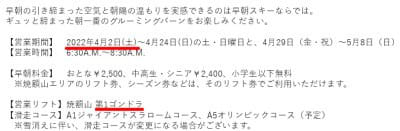

（[焼額山スキー場ホームページ](https://www.princehotels.co.jp/ski/shiga/informations/early_morning_skiing/)より）

第1ゴンドラなら，GSコースとオリンピックコースの

2コースが滑れるので，第1ゴンドラの早朝

復活してほしいなぁ…と思っていたけど．

すばらしい…第1ゴンドラ早朝復活，

素晴らしいっ！！

そして．2ndシーズン券を買った私は，

早朝営業滑りたい放題！！！

ふははは．

早朝の第1ゴンドラ，滑りたい放題なのだ！！！

すばらしい！[焼額2ndシーズン券](https://www.princehotels.co.jp/file.jsp?id=367843)！

…ってなことで．

本日も志賀高原特派員から焼額の

あさイチ写真が送られてきましたが…

今日も志賀高原は晴天だったようで．

平日仕事をしている私には

目の毒な写真だぁ…っ！！

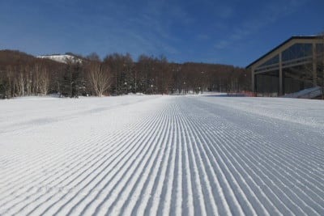

うがーーー！

うらやましいぞ！！

シマシマうらやましい！

朝は-6℃程度とそこそこ冷えて，

結構固めのシマシマだったようですが．

今日は一日それほど緩まず，昼間も

いい感じに締まったバーンだった

ようです…

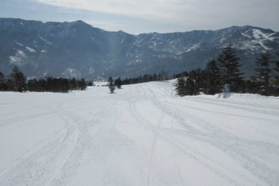

しかし，残念なことに．

冷えたいいコンディションは明日の

朝までの命なのだ．

予告した通り，明日の昼間からは

かなり気温が上がるのだ(涙)

明日11日の昼にかなり雪が緩んで，

12日土曜は，この緩んだ雪が凍って

朝は硬め．昼間はずっしり重い春の雪．

13日の日曜の朝は，土曜に緩んだ雪が固まった

かなり固め＆コロコロバーン．気温が予想より

ちょっとでも上がったら，朝イチから

緩んだ雪かも…？？

ガチガチ＆コロコロ，またはズッシリ重い雪の

どっちかという，究極の選択状態です（涙）

あぁ…今週，今日までの雪がいいうちに

滑っておきたかった…

なぜ，週末を狙ったように高温になるのか…（泣）

とりあえず，そのあとは．

15日ごろまで気温が高く，

+3℃線が志賀に近づくレベルが続き…

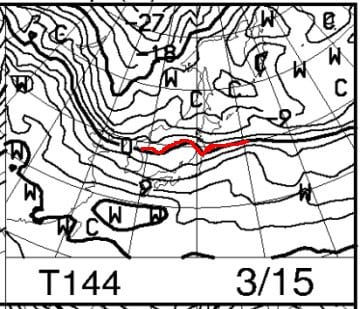

そして，この日は志賀高原は降水域に

覆われているので…

うむ．

850hpaが+3℃で，空から何か降ってくるとなると…

15日に降るのは，液体ですね（激涙）

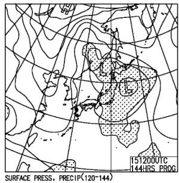

ただ…

下の図の赤矢印で示した高温期間，

この15日で終わりそうです！！！

そのあとの16，17日は，また平年並みの

冷え込みに戻りそうです！

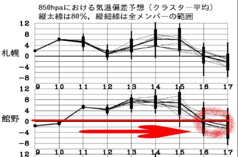

16，17日の850hpa図を見ても，

0℃線は志賀の南に下がり，

3月中旬にしてはそこそこの冷え込みに

なりそうですし…

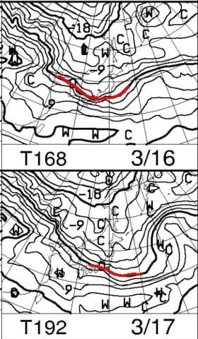

そして，16，17日の地上天気図は，

西高東低の冬型っぽい気圧配置ですよ！

そんなドサドサは積もらないけど，

また雪が降ってくれる可能性が高いですよ！

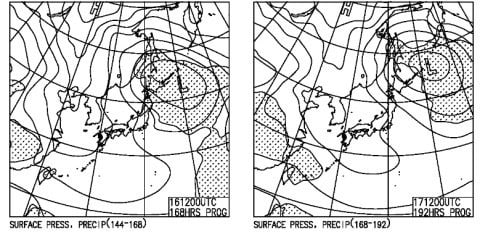

これなら，来週末3連休，ちょっと期待

できるかも…！！

…っていう，普通のBlogならこれで1本の

記事にするくらいの長い前フリでしたが，

ここからは本題へ．←ここまで前フリだったのか…

えー．

先週末．

長岡のエキップさん主催の試乗会が

志賀高原の焼額山で開催されたので，

来シーズンモデル…

2022/2023シーズンモデルのスキー板に

乗りまくってきたわけですが．

そこで試乗した板の紹介＆簡単な

インプレッションです！

それぞれの板の詳細試乗レポートは

また後日，いつもの濃厚なやつを

書きますのでお待ちください…

数が多いので3回に分けます．

まずは1回目．

こんな感じの板に乗ってきました～！

○HEAD e-RACE PRO 170cm

170cmでもR14.4という，どちらかというと

小回りベースのオールラウンド板．

フレックスとトーションが結構強めで，

ガッツリカービングして板なりにクルクル

回っていく板．

角づけをちょっとでもすると回っちゃうので，

縦目に落とすのは辛いけど，逆に言うと

簡単に板がカービングして行ってくれる．

スピード耐性も十分！

でも，ズラシのコントロール性はちょっと…

○HEAD e-SL RD 165cm

SL競技用板．

エッジグリップかなり強めだけど，

SL競技用とすればフレックスも強すぎず

扱いやすい．

それでも競技用だけあって，かなりスピードを

出しても板がたわみすぎて小回り強制

マシンになることは無く，

中回りから小回りまでのゲレンデ用として

十分行けそう！

○VOLKL RACETIGER SL 165cm

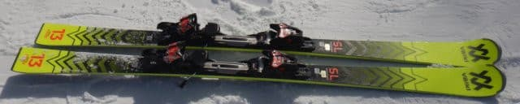

基礎用小回り板．

UVOは無くなったみたい．

むちゃくちゃ軽く，スピードを出すと

すごくたわんで小回り強制マシンと化す．

でも，軽快で反応も返りも早く，

捉えもしっかりしているので

そこそこの足前の人が小回り専用機とするには

おススメ！

○VOLKL RACETIGER RC 170cm 

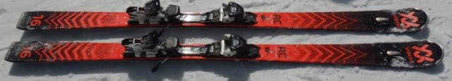

来シーズンから登場の新しいモデル．

170cmでR15.6mと，ロング・ショートの中間と

いったオールラウンド板．

これは…履いてみたら面白い！

楽にエッジに乗っているだけで簡単に曲がる！

角づけを弱くすれば大きく回るし，

強くすれば小さく回る．

頑張って板を踏んだり抑えたりする必要はなし．

板の上に乗って傾くだけで，ハイスピードで

ギュンギュン切れていくむちゃくちゃ楽な板．

結構おススメ．

○VOLKL DEACON 72 173cm

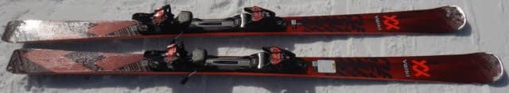

昨シーズンまであったRACETIGER SXの後継機．

センター72mmと太めでR=15.4とオールラウンドな

プロファイル．

乗ってみても癖がなく，軽快で大回りから小回り，

高速から低速のズラシまで何でも行ける．

切っていけば高速までグリップするのに，

ずらそうと思えば楽に板を動かせる，

低速でも取り扱いやすい，まさに万能板．

## 💬 コメント一覧

### 💬 コメント by (スシネコ)
**タイトル**: Unknown
**投稿日**: 2022-03-11 03:40:51

試乗会レポート、ありがとうございます。いつも分かりやすくて実際に乗ってる感じがヒシヒシ伝わってきます。

今回は試乗会に行けませんでしたが、次回は色々な板に乗ってみたいと思ってます。

（次はショートの板が欲しい‥）

それでは行ってきます。w

### 💬 コメント by (西舘)
**タイトル**: Unknown
**投稿日**: 2022-03-11 07:29:50

スシネコさま、行ってらっしゃい！

Sさまってば！

前半の記事で満足したのにそこから試乗レポート!!

しかも、たった3回で書き上げるとは、

1回あたりのボリュームがかなりのものに。

出し惜しみせず、そしてちょーぜつ多忙なのに

死力を尽くすその姿に脱帽です。

### 💬 コメント by (ikkun)
**タイトル**: Unknown
**投稿日**: 2022-03-11 11:02:24

おはよう👋😃☀️ラストのは欲しいmodelです…雪でお金掛かりましたがスキー欲しいなんて 不況？大の付くなか怒られるなあ(泣)

### 💬 コメント by (レインボー74)
**タイトル**: Unknown
**投稿日**: 2022-03-11 12:26:47

金曜日の志賀高原情報

朝の上林-1℃　蓮池-2℃。暖かい晴れた日。

ニゴンスタート。かなりの人だ。白樺はやっぱりいい。ニ高は8時15分から稼働していた。

オリンピックもGSも硬めの滑りやすい雪。

奥志賀も圧雪良好。

昼前に終了したけど、昼の高天が+7℃　蓮池+10℃　上林+11℃。

恐ろしい春はもうすぐここまで迫ってきてます。春なんて嫌いだ！

ちなみに二番目の板は、私がお買い上げでした。

### 💬 コメント by (Skier_S)
**タイトル**: 2時間しか寝られない（涙）
**投稿日**: 2022-03-12 00:28:08

＞スシネコさま

今日の志賀高原，楽しそうでしたね…

うらやましい…

＞西舘さま

今日も11時過ぎまで仕事して，今こんな時間にBlog書いてます…

明日朝3時過ぎに出発なのに．

これからシャワー浴びて寝るので，2時間寝られるかどうかです（涙）

＞ikkunさま

DEACON，いい板でしたよ！！

これはおススメです！

＞レインボー74さま

うげげ．

蓮池10℃まで上がりましたか！！

ホントに，春は嫌いです…

花粉も飛び始めて，辛いです（涙）

### 💬 コメント by (takaaturyou)
**タイトル**: Unknown
**投稿日**: 2022-03-12 00:28:50

S様へ

日曜に焼額山に行くつもりです。

お見掛けしたら、お声掛けします！

### 💬 コメント by (Skier_S)
**タイトル**: ＞takaaturyouさま
**投稿日**: 2022-03-12 23:53:53

日曜も，イチゴンがすごい混まない限り焼額滑ってます～！！

見つけたら声をかけてやってください！！

リクエストあれば，20000mシルバーステッカーもお渡しします．

