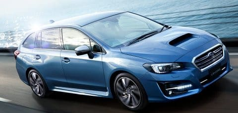
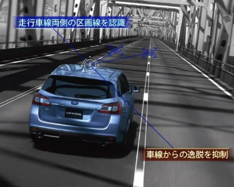
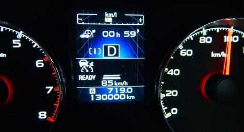
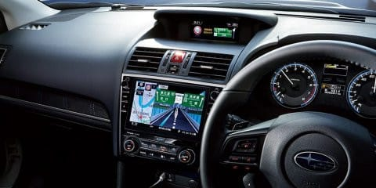

# LEVORG D型の情報が出てきたなぁ…そして，わがBRレガシィ13万km突破！

📅 投稿日時: 2017-07-06 04:05:15

えー．

スバルの公式サイトで

[D型LEVORGの情報](https://www.subaru.jp/levorg/levorg/safety/safety2_1.html)が公開されましたね～！

この，LEVORG D型の目玉は，

雑誌やらWebやらでいろいろ出ていた通り．

新しい，アイサイト周りの機能追加が

大きいようで…

新しくなったアイサイトのオートクルーズ．

これまで114kmだった設定速度の上限が，

時速135kmまで上がるようですし．

さらに，アイサイトツーリングアシストでは，

時速0kmからレーンキープが使えるようになりました！

…それも，白線が消えていても，時速0km～60kmまでは

先行車追随でステアリング操作されて．

白線が見えれば白線優先，白線が見えない場合は

前の車が蛇行したり曲がったりした通りについていく…

という操作になるようで．

（スバル公式サイトより）

これ，郊外の道路とか，渋滞した高速とかだと

ほぼ自動運転ですね…

オプションとなるアイサイト「セーフティープラス」を着けると，

ルームミラーがカメラ画像が写るモニタになるようで．

荷室いっぱいに荷物があっても，荷物に妨害されず

後ろが見えるとか，

その他のレーンチェンジ時の斜め後ろから接近する

車を警告するリアビークルディテクション，

ハイビーム自動切り替えやらサイド・フロントモニタなど．

いろいろてんこ盛りの安全装備がつくようで．

とりあえず，D型は安全装備周りがかなり

強化されるようですね…

まぁ，それ以外は，

D型になって，足回りのチューニング変更，

ガラスやピラーの静音性向上など，

見えない部分の細かな変更がされるようですが．

…一番大きな変化は，リヤシートが

6:4分つから，4:2:4の3分割になったことかな？？

あとは，本革シートじゃなくても

フロントシートヒーターが着けられるように

なったとか．

寒冷地で走ることが多い私には，嬉しいかも…

とりあえず．

新しいLEVORGはこんな感じなわけですが．

…これに対する，我が愛者のBRレガシィ君．

この週末の月山往復で，走行距離13万kmを

突破してしまいました…

新車購入から4年と1か月で13万kmですか…

まぁ，順調に過走行してるわけですが．

このペースだと，

来年の5年目の車検時は16万kmを超えるわけで．

…さすがに来年の5年目の車検を通すのは

厳しいか…

でも，

次はLEVORGのB型あたりの中古を狙っていたけど…

…年間の高速道路の走行距離が半端ない私にとって．

かねてからの願いだった「ステアリング操作もほぼ自動」になる

アイサイトツーリングアシスト．

すごく欲しい．

欲しいぞ！！

うーむ．

でも，来年の車検までに，

D型の中古は出回らないだろうし…

D型の中古が出回るまで，BRレガシィ君の延命を

図らないといけないのか…！？？？

## 💬 コメント一覧

### 💬 コメント by (マルハバ)
**タイトル**: アイサイトの・・
**投稿日**: 2017-07-06 10:01:04

プログラムだけアップデートしてもらう・・

ってな訳にはいかないものでしょうかね～？

### 💬 コメント by (いー)
**タイトル**: プロジェクトX
**投稿日**: 2017-07-06 13:55:43

第2章開幕ですか？

何と対決か 楽しみです！

リヤシートの３分割ちょっと便利の様な気がします…

アイサイトの進化も凄いですね！

### 💬 コメント by (まいる)
**タイトル**: 次の車は
**投稿日**: 2017-07-06 18:18:13

Sさん、お疲れさまです。

BRレガシィ、もうそんなに走ったんですねー

私は今年初車検ですが、私の2倍くらいの距離

レヴォーグのＤ型よいかんじですね！

そろそろ乗り入れの作戦を練るところでしょうか？

私はアウトバックのＤ型を見て今後の検討に入ります。

### 💬 コメント by (まいる)
**タイトル**: 書き間違えて
**投稿日**: 2017-07-06 18:19:59

乗り入れでなく、乗り換えですね。

### 💬 コメント by (しんちゃん)
**タイトル**: 次の車検討
**投稿日**: 2017-07-06 22:26:56

13万kmも走行しているのですね。

私の車はというと、もうすぐ人生初の10万kmを迎えます。

9年目の車検を終えたばかりですが、次の車を検討し始めています。

またいい車情報がアップされることを期待しています。

### 💬 コメント by (michi)
**タイトル**: Unknown
**投稿日**: 2017-07-06 22:50:38

レヴォーグ、楽しいですよ。

D型は更に進化してますね。

私も実は中古を狙ってたんですが程度がいいとなかなか高くて新車とほとんど値段が変わらなかったので頑張って新車にしました。

もしこれから買うならやっぱり頑張ってD型かな(^^;)

### 💬 コメント by (Skier_S)
**タイトル**: スキーブログなのに，なぜか自動車記事が人気…
**投稿日**: 2017-07-07 01:59:03

＞マルハバさま

テスラならやるでしょうが…

普通の自動車メーカーだったら，

新車が売れなくならないから

やらないかと（笑）．

＞いーさま

いや，やりませんよ！

プロジェクトX2は，まだ当分やりませんよっ！！

お金がないですから～！！

でも，来年の車検までには買い替えようと思うので，

次のスキーシーズン後，16万km走行のあかつきには

プロジェクトX2を実施するかと…

＞まいるさま

わがBRレガシィ君，過走行まっしぐらです．

前のオデッセイの時もそうでしたが，

ディーラーでも有名な過走行車でした．

アウトバックD型にもツーリングアシスト

着きますかね～．

私は次はお金がないので中古車になりそうな気配…

＞しんちゃんさま

人生初の10万km越えですか！

それは逆にすごいかも…

我が車，これまで10万kmを超えなかったものは無いですから…

ってか，3年乗ると10万km超えるので（笑）．

でも，9年目でまだ10万km行ってないのですね…

遠くからスキーに通ってたら，あっという間に

超えそうですが．

＞michiさま

あーーー．

乗りたいっ！

Levorgに，乗りたいんです！

D型がどんなになるか楽しみですが…

試乗車が出るのは8月くらいになるのかな～．

ツーリングアシストが良すぎて，

B型中古を買うつもりが，予算を積み上げないと

ならなくなりそうで…

厳しいなぁ…

