# 2020/12/5(土)の志賀高原焼額山は…朝から晴天！リフトガラガラ！雪は意外と良くてコースいっぱい滑れたよ！

📅 投稿日時: 2020-12-05 22:27:31

ということで．

やってきました，我がホームゲレンデのオープン日…

当然のごとく，本日は志賀高原は焼額，

わがホームゲレンデで滑ってきました！！

えー．

まず．

本日朝

志賀高原に登ってくる道は，しっかり雪道で…

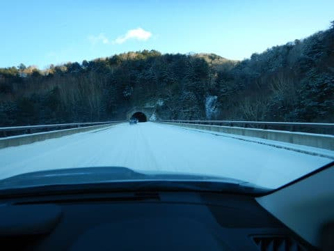

意外と，昨晩から2-3cmとはいえ，積雪が

あったようです…！

一応，高天ヶ原も…

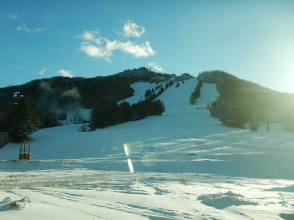

一の瀬も，天然雪のおかげで，全面真っ白に

染まっていますが．

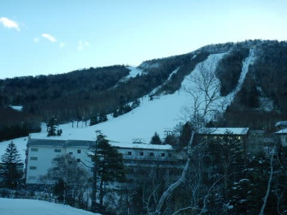

天然雪は薄く，滑れるのは人工雪があるコースのみ．

ホームゲレンデの焼額がオープンとなれば，

私は迷わず焼額へ，Go!

8:30オープンの焼額．

オープン1本目は，5分少々の待ち時間くらいの

列がつきましたが…

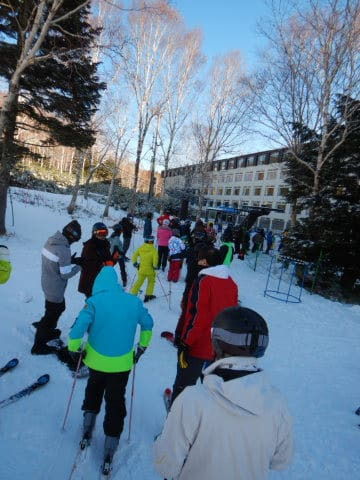

でも．

リフトに乗って，コースを見てみると．

コース幅10～30cmという，芸術的コース幅

には見えず，

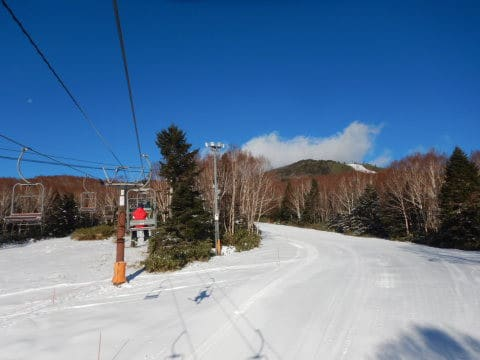

なんだか，コース幅いっぱいに雪が

着いているよに見えますよ！？？

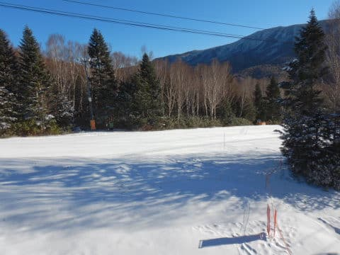

晴天ピカピカの中，すごいいいゲレンデ

コンディションに見えますよ！？？

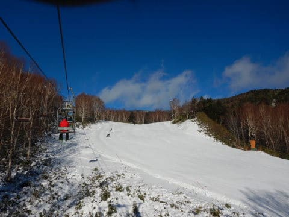

コース幅いっぱいのシアワセシマシマバーンに

見えますけど！？？？

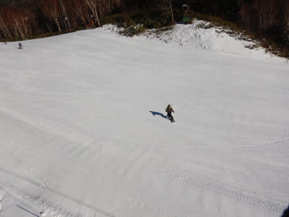

ってなことで．

リフトを降りてみると…

うはーーーー！！

コース幅いっぱいのシマシマっ！！

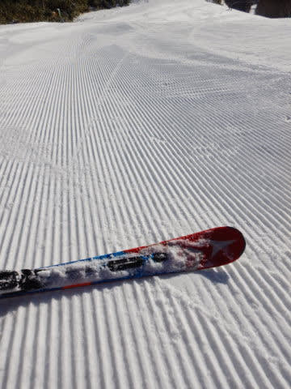

それも，降雪機の雪が適度に冷えて

圧雪された，かなりエッジが食い込む感じの

シアワセシマシマっ！！

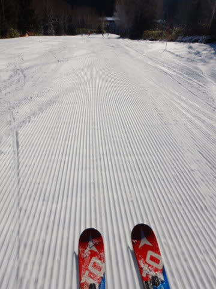

…間違いなく，今シーズンイチのシアワセ

バーンだぁ！！！

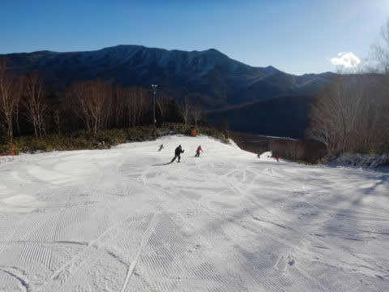

ってなことで，いただきまーーーす！！

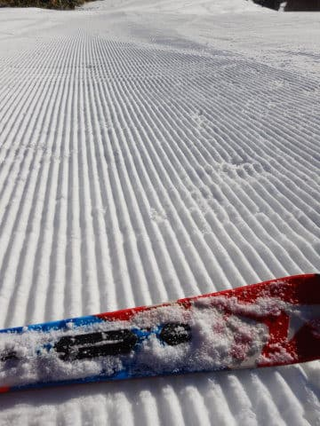

ぐほう…最高っ…美味っ！！

そうだ…これが，これが雪だよ！

そして，斜度もこのくらいないと！１

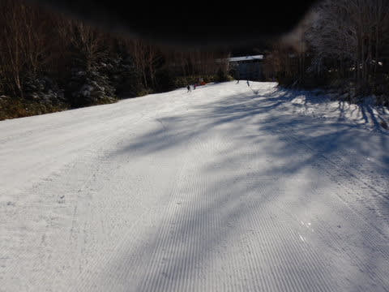

という感じで．

やっと今シーズンが始まった

という感じの，本格シマシマエッジ食い込み

シアワセバーンを何本か．

朝イチはリフト待ちもこの程度だったし…

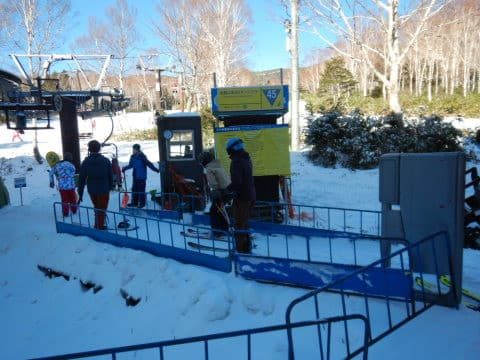

ほぼ飛び乗りシアワセ状態で，

気温マイナスのいい感じの雪を

かっ飛ばせました！！

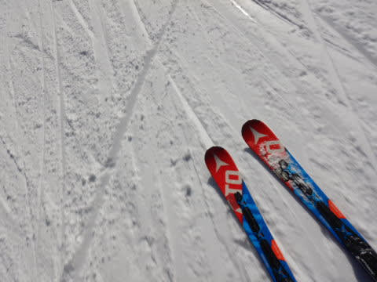

いやー．

これまでのYetiや，熊の湯はあくまで

足慣らしだったな…

今日，初めてシーズンインした感じ！！

だって，こんな誰もいないバーンを

朝のうちは好き放題飛ばせて．

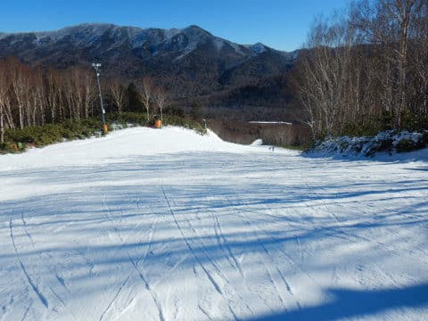

リフト待ちも今日一日の平均はこのくらいで，

ほぼ飛び乗り状態！

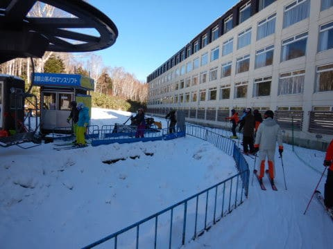

…そして，雪は，午前中までは

ちょいと緩んだものの，それほどひどく荒れず．

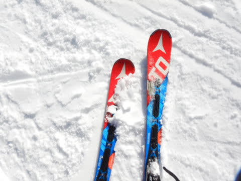

横手山や熊の湯が5-10分待ちという情報をしり目に，

いい感じの締まったガラガラバーンを，

好きなだけかっ飛ばす！！

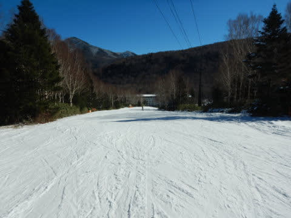

横手や熊は混んだらしいけど．

ホントに今日の焼額は，ガラガラ

でした…

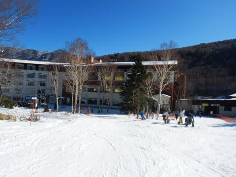

ただ．

午前中は雪も締まってフラットで，

いい感じで飛ばせましたが．

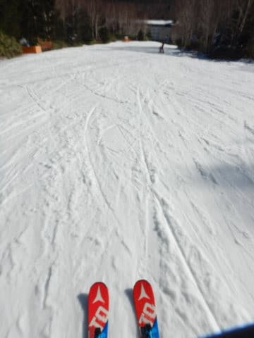

予想通り，昼頃にはわずかにプラス気温に

ずれて．

ちょいと雪が緩み始め…

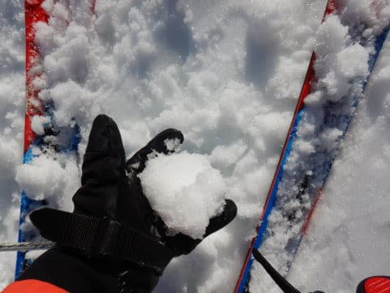

午後にはちょっと斜度がある部分は

荒れ気味のバーンコンディションに

なって来たものの．

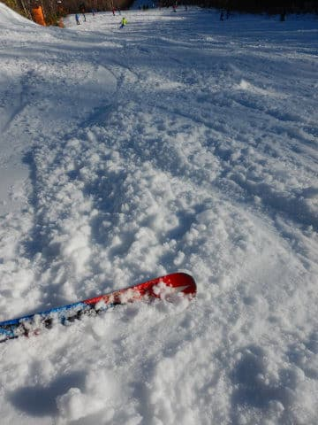

斜度がある部分以外は，それほどひどく

荒れることもなく．

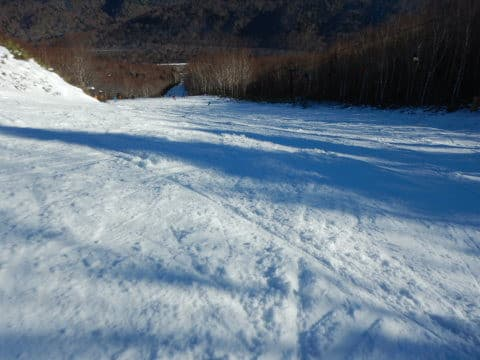

リフト待ちも最後までほぼなく，

コースもガラガラのままで．

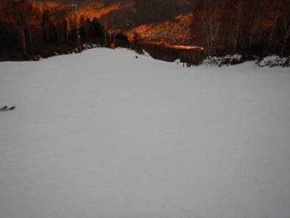

おそらく，私がこれまで滑った中で，

今シーズン一番のコンディションだった

焼額を，リフトストップの4時まで堪能

したのでした…

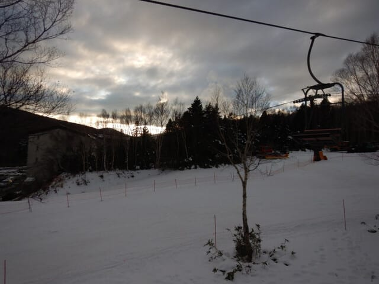

いやー．

良かった．

やっと，今シーズン本格的に滑った

気になりました．

明日も天気は良く，残念ながら天然雪の

積み増しはなさそうだけど，今晩も人工雪は

ガンガン打てそうだから，明日もコンディションは

結構いいんじゃないかな？？

## 💬 コメント一覧

### 💬 コメント by (アリス)
**タイトル**: 焼額山初滑走おめでとうございます
**投稿日**: 2020-12-06 13:32:44

Skier_S様

お世話になっております。

滑走途中ではございますが、ご挨拶ができて幸いです。

前日のコース幅の情報私も見ていましたが、1,000mを片足で滑るのってかなりきついかなって考えていました。

随分空いていましたが、もしかしてプリンスホテルの宿泊営業まで初めてないのではないですか？

オープン初日はサウスコース8本滑って退散しましたが、次回は是非ご一緒させてください。

アマズフィットですが、スキーで初使用しました。滑走後見て驚きです。データーがたくさんで、楽しみが増えました。

ありがとうございました。

### 💬 コメント by (西舘)
**タイトル**: Unknown
**投稿日**: 2020-12-07 06:42:02

Sさん、おかえりー

### 💬 コメント by (Skier_S)
**タイトル**: コメント回答死ぬほど遅れてゴメンナサイ
**投稿日**: 2020-12-10 02:33:01

＞アリスさま

コメント回答むちゃくちゃ遅くなりました…すみません．

土曜はお会いできてよかったです～！

いろいろありが等ございました．

プリンスのホテル営業は今週末からです．

しかし，片足で滑らなくて大丈夫な幅で良かったです～！

また志賀高原でお会いしましょう！

＞西舘さま

ただいま～！！

