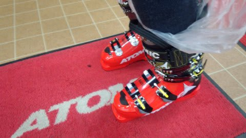

# ニューブーツのインプレッションその１…なんでATOMIC Redster PRO 130を選んだのか？

📅 投稿日時: 2014-04-09 01:51:39

…これまで，幅広な足で苦労してきた私．

以前は，ブーツの幅を広げて，当たり出しをして

シェルがまともに使えるようになるまで，数か月．

何度もスキー屋さんに通ってはシェルを広げ，

通っては削り…

という苦労をして，ブーツを作り上げていたわけですが．

加熱したシェルを履いて足型に合わせる，

「熱成型シェル」のSALOMONのX3-RCを履いてみて．

いやー，これはぴったり履ける！

一発でシェルが決まるとは！

…と，感動して．

超お気に入りで，愛用すること3シーズン．

さすがにまるまる３シーズン，200日程度履いて．

インナーブーツはかなりヘタってきた感じがあり．

うーむ．

そろそろ買い替え時であるな…

…でも，かかと軸で板を抑えて滑る設計の，

ATOMICの板を履いている今．

かかと側を強化して，この軸をしっかり押せる

設計になっているらしい，ATOMICのブーツを

履いてみたいんだけど．

…でも，足幅が広い私は，やっぱり熱成型の

SALOMONかFISCHERしか履けないよね…．

ってことで．

また，SALOMONブーツを買おうかなぁ…

と，思っていたところ．

なんと．

来シーズンは，ATOMICのブーツも熱成型になる！

というニュースを聞き．

…これは．

来シーズンまで我慢して．

来シーズンモデルのATOMICブーツを買おう！

と，心の中で決めていたわけなんですが．

実は．

ATOMICブーツ．

ATOMICは公式に公表していないけど．

今シーズンモデルから，熱成型に対応している

らしいじゃないですか！！！

…ってことで．

今シーズンモデルのRedster PRO 130を[想定外に買ってしまった](e4eb8b62d644e240a6080cac72ad69416.md)んですね～．

とりあえず．

Redsterには，ラスト幅95mmのWCシリーズと，

98mmのPROシリーズがあるけれども．

私としては．当然，

幅広のPROシリーズを選ぶしかないわけで．

そして，これまで履いていたX3-RCは，フレックスが130クラスで，

ちょうどいい感じだったので．

…結果的に，Redster PRO 130という選択に

なったわけですね～．

とりあえず．

加熱したこのブーツを履いて…

冷やすこと10分ほど．

自分の足型にあったシェルができたので．

さっそく，このブーツを履いて滑ってみますか～．

と，2週間ほど前にデビューさせてみたわけですね．

…ここまでで，なんだかすごく長くなったので…

滑ってみたインプレッションは，その2へ続く…
