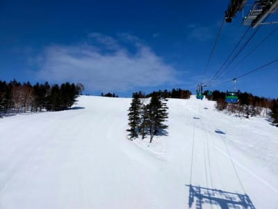
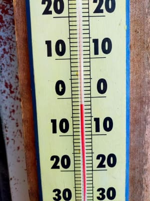
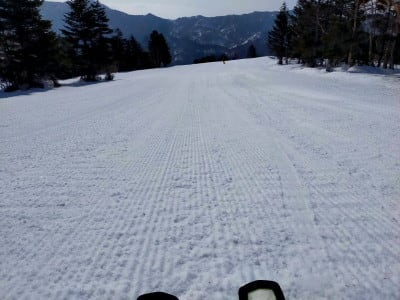
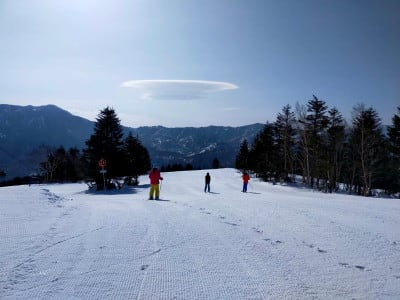
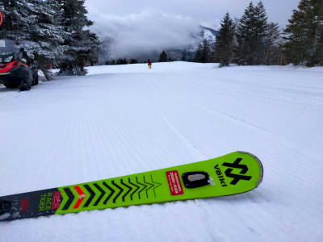
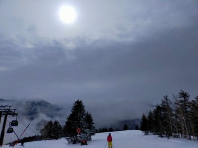

# 昨日は死んでた…いろいろクリティカル

📅 投稿日時: 2022-03-18 10:33:52

🏷️ カテゴリ: [日記](cc4b5682fb7b8b144980957a978653fb0.md)

ってなことで．

今週末は3連休なのですが．

3連休にスキーに行けるよう，仕事を何とか

必死に終わらせようとしていたところ．

…昨日はその途中で明け方に床で寝転がって

死んでました．

というわけで，昨日の夜更新できませんでしたが，

今クイックに更新！

コメント回答はしばらくお待ち下さい…

まず，昨日の特派員からの写真ですが，

昨日，木曜の志賀高原はすっきり晴れ！

あさイチの気温はなんとかマイナスで，

マイナス2度！

あさイチはいい感じのシマシマで．

昼間はプラス3℃くらいまで気温が

上がったものの，昨日よりは涼しく，

雪は板に貼りついたりしなかったようです…

夕方はちょっと雲が増えてきたみたいで，

　たぶん朝から晴れ．時折日が陰るかも．

　午後は完全曇りになるかな？

　水曜より気温は上がらず，最高気温+3℃くらい．

　あさイチは硬め，昼には緩んだ春雪に．

という，予想通りの天気だったようですね…

そして．

本日も特派員から写真が送られてきてます～！

今日の金曜は朝イチからプラス気温（涙）

そして，営業開始時には止んでいたようですが…

明け方まで雨，山頂付近でかろうじて雪

だったようです(泣)

今日も大体，

　ヤバい．朝から降る．

　…おそらく朝は雪がパラパラと

　降ったり止んだり．

　昼間に液体っぽい感じになりそう…

　標高が高いところはギリギリ

　雪かな？

　雪だとしても，かなり湿った雪が

　パラパラと降ったり止んだりの天気．

って予想通りの天気になりそうですね…

で．

明日の土曜ですが…

今日の午後から明日の朝にかけて，

雨が降ります(涙)

それも，時折強く降ります．

先日の予想では，土曜は午前雨，

午後から雪と予想でしたが．

朝早くのどこかの段階で雨は雪に

変わりそう．

…でも，どさどさ積もるような雪には

ならないかな．

残念ながら，土曜は，

前日からのかなりの雨でしっとり融けた

雪が，だんだん冷えて固まってガチガチに

なっていく，ちょっと残念なコンディションに

なりそうです…

## 💬 コメント一覧

### 💬 コメント by (だい)
**タイトル**: 先日はお世話になりました
**投稿日**: 2022-03-18 14:12:23

2月末は焼額山でお世話になりました。

一足先に志賀入りしましたが、魔の液体でなく雪が降ってきました！焼額山山頂は0℃です。

しかし、一ゴンは強風で止まってしまいました。。。南風のときは仕方ないですね。

### 💬 コメント by (レインボー74)
**タイトル**: Unknown
**投稿日**: 2022-03-18 21:45:01

金曜日の志賀高原情報

遅くなりました。、霧に囲まれてどうしようとおもっていましたが、サンバレーからは雲海の上。ありがとう。

視界も悪く、白樺回しをしてたんですが、かなり荒れてからオリンピックをちょっかったら、やっぱり荒れてて怖かった。

強風でニゴンが止まったら、イチゴンが混んだので、一ノ瀬へワープ。

パーフェクタはコロコロもあって、気持ちよくない。

寺子屋はまずまずだけど、斜面が見にくい。

ファミリーはあんまりとの情報かあったので、慣れないパノラマを高速で降りたら、見にくくてコースアウトしそうに。怖かった。

そのあと、シーズン93日目で初めて昼のビール。幸せでした。

### 💬 コメント by (Skier_S)
**タイトル**: 明日はリフト営業中は雨にはならなさそう
**投稿日**: 2022-03-19 00:07:55

＞だいさま

今日は志賀は雨にならずに済んだようですね…

でも，強風でゴンドラが止まっちゃったようで残念…

明日は風は強くないはず！

＞レインボー74さま

今日はバーンは荒れたんですか…

明日は昼は冷えてガチガチバーンになっていきそうです…

