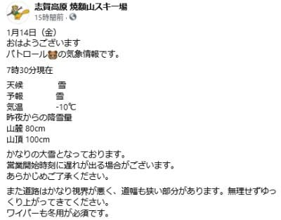
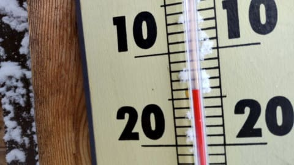
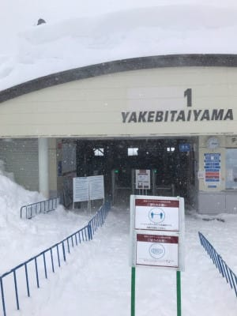
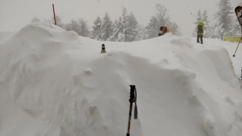
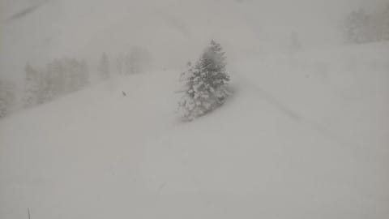
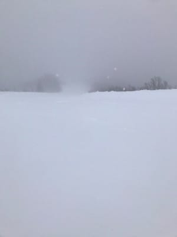

# なんと！本日1月14日（金）の志賀高原は一晩の積雪1m！？？…でも，明日の土曜は晴れて絶好のスキー日和になりそう

📅 投稿日時: 2022-01-15 00:11:29

🏷️ カテゴリ: [日記](cc4b5682fb7b8b144980957a978653fb0.md)

本日の志賀高原ですが，

なかなかすごい一日だったようです…

まず，焼額のFacebook．

「昨晩からの降雪量，山頂100cm」

って…

一晩で1m積もったってこと！？？？

（[焼額山スキー場Facebook](https://www.facebook.com/yakebitaiyama/)より）

そして，特派員から次々入ってくる，

「一の瀬から先除雪が間に合ってない」

「車が進まない」

といった恐ろしい情報…

1車線分しか除雪されてなくて，これは

車が行き違えませんね…（恐怖）

それでも焼額山スキー場に向かう，

命を懸けた特派員たち！！

結局本日，

奥志賀全面運休

高天ヶ原クワッド，寺子屋運休

東館ゴンドラ，西舘フーディー運休

横手山第2，第3，渋峠運休

熊の湯第2，第3運休

という状況にも関わらず．

なぜか焼額はゴンドラが2本とも営業

という根性を見せたようですが…

でも，気温は-15℃の吹雪で．

さすがに滑る人もおらず．

ゴンドラはガラガラだったようです…

そして…

分かる人は分かる．

第1ゴンドラ降り場横が，こんな

積雪量になってるという…

…一晩で100cm，半端ない…っ！！

…これも，焼額を良く知っている人なら

ちょっとびっくり．

この木がこんなに埋まるほどの

積雪とは…っ！！

おそらく，史上最高クラスの積雪．

これはすごい…

でも，新雪は結構重めのゴキブリホイホイ状態

でかなり手ごわく，パウダーを楽しむとか

いう感じじゃなかったとの報告も…

いや．

ホントにすごい一日だったようです…！

で．

明日の土曜はうって変わって．

　朝の気温は-10℃ちょい下回るくらいかな？

　ちょっと雲が残るかもしれないけど，

　午前早いうちから晴れの天気になりそう！

　あさイチはトップシーズンの柔らか

　シマシマバーン！

　気温はそんなに冷えすぎず，

　それでいて雪が融けない絶妙な気温の

　絶好のスキー日和！！

　昨日リフトが動かずクローズだった

　奥志賀や横手のコースは新雪パフパフ

　だろうから，それも楽しめそう！！

　ただ，ちょっと雪が柔らかいので，

　午後は多少凸凹した斜面になるかも…

そして，日曜は…ちょい微妙．

　日本海に低気圧が発生するので

　志賀は雲が多め．日が射したり

　時折雲に隠れたり，という天気かな．

　この日もあさイチはいい感じの

　シマシマバーン！

　気温は昼間は0℃近くまで上がりそう

　とりあえず，日曜も穏やかなスキー日和！　

ってな感じで．

今週末もたっぷりの冷え冷え雪が

供給されたあとの晴れ間という，

恵まれた週末になりそうです～！

で．いつも通り，あと3時間半後に

出発です…

## 💬 コメント一覧

### 💬 コメント by (副院長)
**タイトル**: Unknown
**投稿日**: 2022-01-15 13:00:26

S様、ご無沙汰いたしております。

いよいよ明日から、今シーズン開始させていただきます。足慣らしにタラタラ滑りますので、よろしくお願いします。

### 💬 コメント by (レインボー74)
**タイトル**: Unknown
**投稿日**: 2022-01-15 13:43:37

土曜日の志賀高原情報

朝の上林-3℃　蓮池-8℃。曇り空。

野沢の予定を急きょ変更してヤケビヘ。昨日運休の野沢は、案の定パウダー狙いの劇混みとの情報が。よかった！

まずはニゴンからスーパーへ。昨日のどか雪がしまって快適そのもの。ごちそうさまでした。

GSサイドは20cm位で感動無し。

オリンピックはFTで踏み荒らされていて、単なる非圧雪と化していました。

ミドルに入ると、エキスパを凄いのがかっ飛ばしている。見とれていたら仲間でした。

ミドルの上部はふかふかの踏まずが沢山あったけれど、緩斜面では止まらないように滑るだけ。

白樺は柔らか目の快適バーン。

パノラマの壁もグー！

カラマツは修旅生でぐちゃぐちゃ。タイミングが悪かったみたい。

エキスパ以外をぐるっと回って11時終了。昨日の妙高の疲れをとらなくっちや、

### 💬 コメント by (Skier_S)
**タイトル**: 今日は予想外した…（涙）
**投稿日**: 2022-01-16 00:00:27

＞副院長様

スキー復活おめでとうございます！！

体調は万全になったのでしょうか…

また焼額でお会いできたらよろしくお願いします．

＞レインボー74さま

今日はお疲れさまでした．

今日は意外と新雪コースは少なかったですが，圧雪バーンは

予想以上に良かったです…

晴れなかったのが残念ですが（涙）

