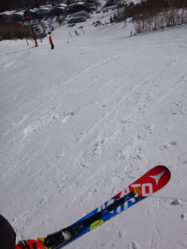

# ということで．メイン板のSXをチューンナップに出すことにしたよ

📅 投稿日時: 2016-07-19 01:45:49

えー．

また，ダイビング日記が続きすぎると．

「徒然スキーヤー日記」

としてのアイディンティティが問われるところなので．

また，今日もスキーネタをいくわけですが．

…とりあえず，昨シーズン購入した私のメインマシン，

ATOMIC Bluester SXですね．

[数日前に書いた](efc076e96958f0ec29e458af8d3fc5461.md)ように．

この板は，実質2，3月の2か月間しか履いておらず．

私がメインとして履いていたメインマシンとしては，

極めて，極めて，きわーーーめて珍しいことに．

来シーズンもメインマシンとして活躍してもらうことを

決めたわけですが．

…ということで．

来シーズンは，メインの板を購入せず．

この板を来シーズンも履くことに強く決心したので．

…今シーズンは．この板をチューンナップに

出すことに決めました．

…普段，板のエッジは自分で手入れしている私．

そもそも，メインマシンに至っては2シーズンもつことも

少ないので．

スキー板のチューンナップなんて，長いこと

出したことが無いんですね～．

うーむ．

5～6シーズンくらい前に，SALOMONの24hours LMを

出して以来かな？？

んで．

この板をチューンナップに出す目的は，

もう一つ．

…それは．

物欲に負けないようにするためなのだ．

…そう．

チューンナップに板を出してしまえば．

「1万円近い大枚を払って，板をリフレッシュしたんだし…」

という思いから，新しい板を買おうとは思わなくなるはず…っ！

…そうなるはずなのだっ！！

という考えもあって．

実に久しぶりに，スキー板をチューンナップに出すことに

決めました～！

ってことで．

近いうちに．

スキー板を持って．

チューンナップに出すために．

いつものお店に行ってきます～！←これは…なにか，危険じゃないか？？

## 💬 コメント一覧

### 💬 コメント by (komu)
**タイトル**: 長い板は？
**投稿日**: 2016-07-19 18:29:47

お暑うございます。

短い板はわかりましたが、長い板がありませんでしたな。

去年モデルのいいところがお安く売ってましたよ〜

### 💬 コメント by (はなげ親分)
**タイトル**: ふむふむ
**投稿日**: 2016-07-19 23:41:30

例の選手権の前フリですね～

楽しみに待ってます。

シーズンインまであと三月。

この暑さを乗り切って、またゲレンデでお会いしましょう！

### 💬 コメント by (Skier_S)
**タイトル**: 物欲に負けないぞー（棒読みで）
**投稿日**: 2016-07-20 01:10:43

＞komuさま

お久しぶりです～．

暑い中，スノーバに通ってらっしゃるん

でしょうか…

…

…

…長い板，ですか…（遠くを見る目で）

おそらく．

今シーズン，X-RACE 165cmとSX165cmで

乗り切ったから，来シーズンも長い板が無くても

大丈夫なはず…

＞はなげ親分さま

うーむ．

今週末か来週末，どちらかに神田に行こうかな，

と思っているのですが…

自分でもいろいろ危険を感じています（笑）

この夏，ダイビングにあまりイケなさそうなので，

一体何でストレス解消しようかと…

買い物でストレス解消…ってならないよう，

注意しないと（＾＾：

