# 3月7日は…白馬五竜なんですね～…朝は晴れたんだけど…午後は雨（涙）

📅 投稿日時: 2015-03-07 22:17:18

ということで．

今日も志賀高原だとお思いでしょうが．

…今日は，白馬五竜なんですね～．

予想通り，雲が多目の天気で始まった朝．

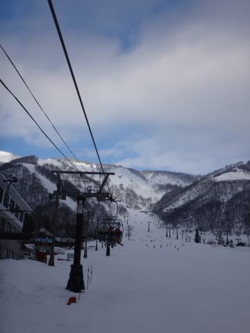

ゴンドラで山頂へあがると…

うは．

ぴかぴか晴天っ！！

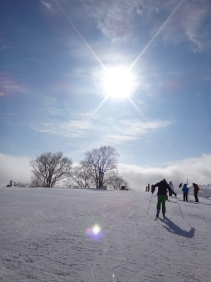

そしてゲレンデは，シマシマ圧雪！！

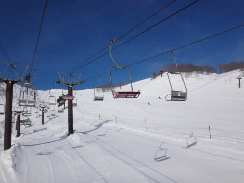

アルプス平ゲレンデは，朝は人も少なく，最高っ！

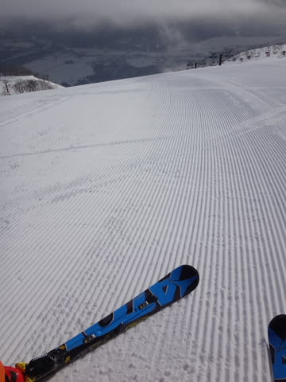

景色も良くて，いいなぁ…

と，思っていたけど．

山麓に降りてくると…

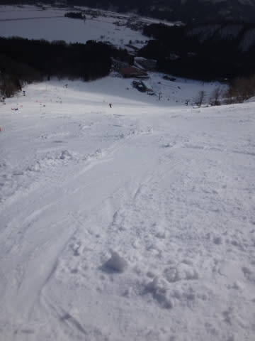

うむ．

これは．

志賀高原なら，4月の雪だな…（涙）

いいもりゲレンデはどぼどぼで，下地はアイスバーンという，

これは…かなり厳しい状況なんですが…（涙）

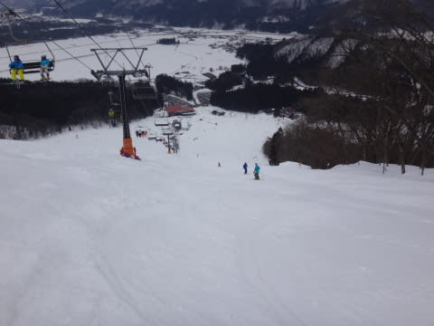

ここしばらく，気温が高めで．

雪が降ってないから…（悲）．

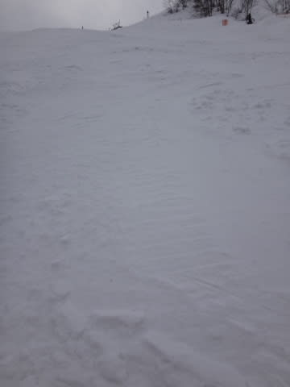

（アイスバーンさんコンニチハ）

で，朝のうちはすっきり晴れていた天気も…

うむ．

昼ごろには，曇ってきてしまったぞよ．

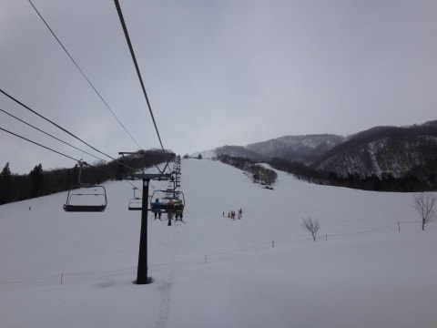

そして，気温は0度を上回り．

雪は…悲惨な状況に．

3月でこの雪ですか…（かなり残念）

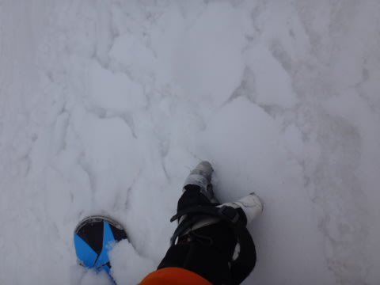

さらに．

午後には雪もちらちら降り始めたなぁ，と，思ったら…

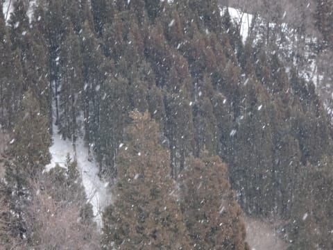

なんだか．

2時過ぎには，雨ですかっ！？？

なに？これ？

何の仕打ち？？？？

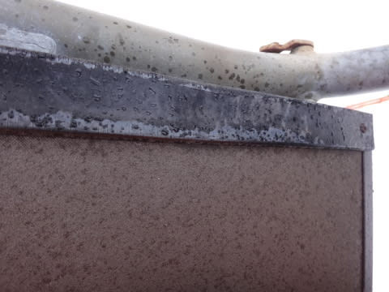

まぁ，ぽつぽつ程度だったのが救いだけど…

視界も悪くなり…

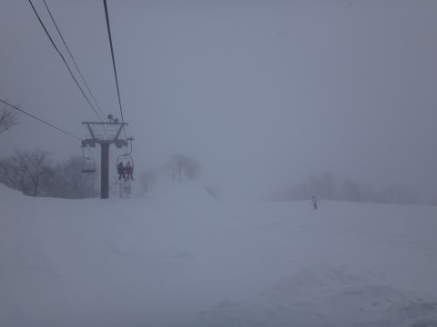

雪質は…雨を吸ってしまった雪は．

もう，これはどうしようもない壊滅的状況に（激涙）

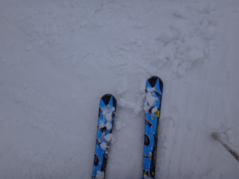

そして．

リフト待ちはなかったけど．

ゲレンデもすごい混雑で…

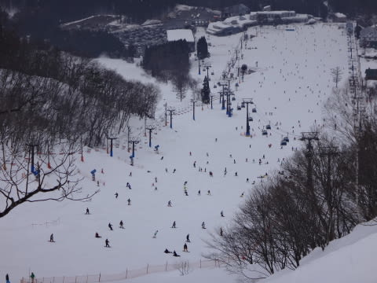

うーーーーーむ．

今日はちょっと一日，なんだか．

かなり強烈に残念な感じだったぞよ…（こぼれ出る涙）

ってことで．

4時ごろまで滑って切り上げたわけですが．

…で．

なんで，今日は志賀高原じゃないのか．

…そうです．

皆さん，お気づきと思いますが…

そう，いつものやつです．

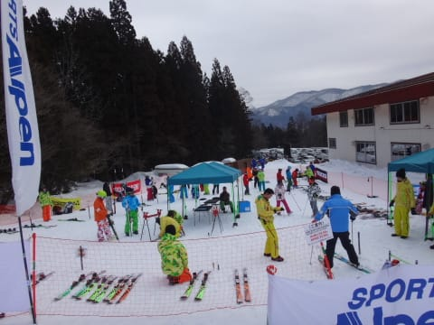

これからのレポート，お楽しみに！！

…で，まだ終わらない．

今日は午後4時まで，五竜で滑っていたというのに．

…あれ？？

なぜ？？

なぜ，一の瀬ダイヤモンドのナイターに？？

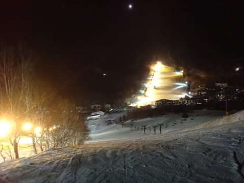

これは，きっと時空を超越してしまったか…？？

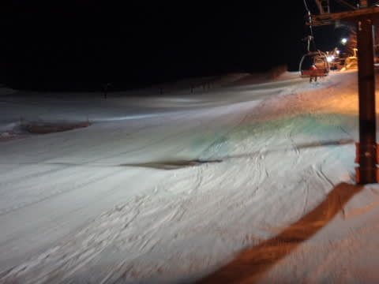

ってことで．

志賀高原のナイターを満喫だっ！

と，思ったら…

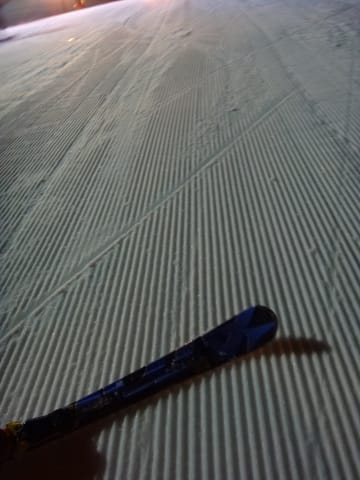

一見シマシマきれいなバーンですが．

この形のまま，固まってます…（涙）

硬い…かたいよ（あふれ出る涙）

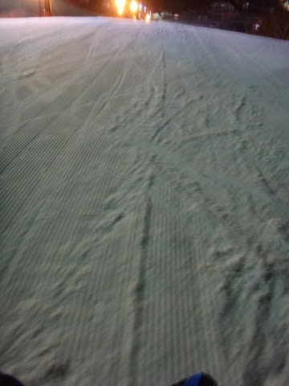

ということで，雪質が悪かった五竜のフラストレーションを

志賀ナイターではらすのだっ！！

…と，思った願いもむなしく．

カリカリびりびりバーンを，ナイターストップまで

滑ったのでした…←やっぱり最後まで滑るのね

うーん．

明日は，降らないでくれそうかな～

明日は，ヤケビぐるぐるするのだ！

## 💬 コメント一覧

### 💬 コメント by (いか)
**タイトル**: Unknown
**投稿日**: 2015-03-08 19:18:28

だろうと思いました！

私の知り合いも先頭で、狙っていた板をまず乗っていたそうです、笑

八方も昨日は天気がもちましたねー。

今日は八方、五龍ともに「呪い」が(・_・;

### 💬 コメント by (Skier_S)
**タイトル**: いかさま
**投稿日**: 2015-03-09 00:43:11

あら．

お知り合いの方も試乗会参加されてたんですか…

とりあえず．

今週は，志賀も雪がイマイチでした…（涙）

そして，天気も…

もう，春ですね～（涙）．

