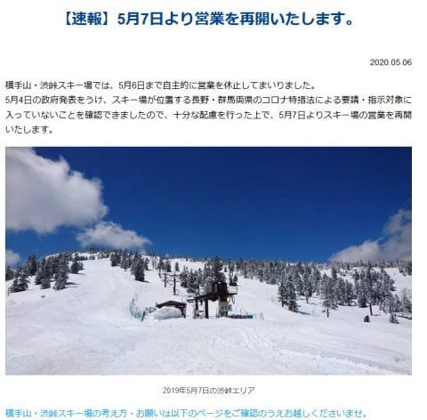

# 私のGW8連休終了…そして明日から横手・渋再開！

📅 投稿日時: 2020-05-07 01:37:58

🏷️ カテゴリ: [日記](cc4b5682fb7b8b144980957a978653fb0.md)

ってなことで．

本日，おそらく人生初めてレベルの，

どこにも出かけない8連休が終わったわけですが．

普段の休みは，必ずどこかに出かけないと

落ち着かず，自分の家にまる2日間を超えて

滞在するという経験がなかった私．

休みが始まる前には，これだけ長い間

どこにも出かけないと，

「これは，精神的にまいっちゃうんじゃないか…」

と，心配してましたが．

溜まっていた仕事を家でこなしてたり，

買い物やら[タイヤ交換＆下回り磨き](ec93897ef6cf7eeb86337bc866039674b.md)やらで，

あっという間に4日間終わっちゃったし…

その後も，娘と一緒に，

家族の板7セット！！←うち5セットは自分の板でしょ

の板のワクシング＆エッジ研ぎ＆

シーズン終了の手入れをやったら

一日終わっちゃったし…

さらに，一昨日の記事に書いたように，

車のルーフボックスを外して，

ルーフボックス自体を磨いたり．

普段はきれいに洗えない，ルーフボックスの

下になる屋根部分までしっかり洗車したり，

冬の間の汚れを徹底的に落として…

そして，洗い終わった後は，

車のコート剤を塗りまくって…

さらに，車内も徹底的に掃除したりしてると，

これもまた，あっという間に丸一日終わっちゃうし．

そして，塩漬けにしていたバイク復活のため，

冬の間外しっぱなしだったバッテリーを

フル充電して…

そして，スキーシーズン終了後の

いつもの儀式である，

バイクのカバーを6か月ぶりに外し，

また，こいつもピカピカに磨き上げて，

エンジンに火を入れて，メンテして…

とかやってると，意外とあっという間に

日々が過ぎ去ってしまい．

そして，そのほかにも．

年間数えるほどしか，家でのんびり

夕食を食べる機会が無い私が，

毎日家で娘とのんびり夕食も食べることができたし．

さらに，普段はそんな暇がないので，

家で見ることがなかった映画のDVDなどと

いうものを，夕食後にゆっくりと娘と見るという，

すごい贅沢な時間の使い方をできて…（5-6本くらい見たかな？）

「あれ？8連休，あと2日で終わり？

　もっと休んでてもいいんだけど…」

って感じで．

なんだかあっという間に終わっちゃいました

普段がバタバタしすぎている分，

たまには家でゆっくり過ごすのも

いいかも…？？

と思った，8連休でした…

明日から仕事か…やる気が起きない…

ってことで．

昨日，ちょっと話題にしましたが．

どうやら，志賀高原の横手・渋峠．

5月7日から，営業再開

するようですね…！！

（[横手山スキー場ホームページ](https://yokoteyama2307.com/news/8742/)より）

[考え方・お願い文書](https://drive.google.com/file/d/1RUt6HY5c10_z4fVMerRPs9xbzFRFTAaN/view)を読むと，基本的に

長野・群馬県在住者を対象にしているようで．

遠出を控えなくてはならない関東在住の私は，

当然のごとく行けませんが（激涙）

とりあえず，今の横手山．

まだ例年並みかそれ以上に雪があるようなので，

また長野在住の特派員の皆さん，

滑った方がいらっしゃればレポートを

お願いします～！

月山は今のところ，5月10日までは閉鎖という

案内が出てますが，11日以降に再開するかどうかの

アナウンスはまだ出てませんね…

あぁ…

緊急事態宣言が終わる予定の6月以降まで，

月山の雪がもってくれるといいなぁ…←それ以前に，ホントに5月いっぱいで感染拡大が収まることを祈らないと…！

## 💬 コメント一覧

### 💬 コメント by (横須賀のウルトラセブン)
**タイトル**: ＣＢＲ400ＲＲ
**投稿日**: 2020-05-07 13:00:53

お久しぶりです！緊急事態宣言以降スキーは断念しましたが、Ｓさんの楽しいブログでバーチャルスキー

を楽しんでます。5/7付ブログの写真を見て驚きまし

た～写真のバイクはホンダＣＢＲ400ＲＲかと・・僕の

20～30代の愛車で日本全国走り回ってました。青春

時代の分身にこんな所で出会えるなんて、それもまだ現役ですよね！

僕は結婚後手放しましたが、昔の思い出がよみがえり

感動しました～

（僕が乗っていた時代は30年前です(;^ω^)

### 💬 コメント by (Northfox)
**タイトル**: Unknown
**投稿日**: 2020-05-07 21:59:45

お～懐かしいバイクですね！

私もバイク乗ってまして（26年物！）、このGWはタイヤやチェーンの交換等メンテしてました。

バイクは調子を見に近場をチョロっと走ったくらいです。早くスキーもバイクも思う存分に走りたいものです。

### 💬 コメント by (Skier_S)
**タイトル**: 28年もののCBRです
**投稿日**: 2020-05-08 02:15:53

＞横須賀のウルトラセブンさま

あら！ライダーだったんですね！

スキーヤーのライダー率は高いですね…

で，お察しの通り，バイクはCBRです．

ただ，400RRじゃなく250RRで，うちの嫁さんのバイクです（笑）．

子供が生まれた時に私のバイクは売り払っちゃいましたが，

このバイクと2台連ねて北は稚内から南は鹿児島まで走り倒した，

思い出のバイクです…

しっかりメンテしているので，未だに元気に走ります．

2年前にフロントフォークシールやらホイールベアリング類を交換し，

ブレーキシリンダーやキャリパーのフルメンテかけてます．

奇跡的にまだキャブのばらつきも少なく，エンジン音もいいですよ～！

＞Northfoxさま

あら～！！

ライダー多いですね～！！

26年モノですか…

うちもそのくらいの骨董品なので，メンテに手間暇かかりますよね．

でも，私がバイクで走り始めた頃からずっと一緒に走っている

思い出のバイクなので，手放せません（笑）．

### 💬 コメント by (ほっぽ)
**タイトル**: CBR250RR
**投稿日**: 2020-05-08 07:07:36

Ｓさん

バイクは250RRですか。ということは今では貴重な４気筒ですか？

私が学生の頃、バイクブーム、レーサーレプリカブームの中で、車検の無い250ccも人気がありました。

GSX250FWから始まって、FZ250で4サイクル250ccマルチで45psと2スト並みのパワーと17000rpmまで回る超高回転ユニットのうたい文句、懐かしいです。

CBR250RRだと私が下りてしまったあとに発売されたモデルなので詳細スペックは知らないのです。

私もRZ50（規制前の90km/hモデル）から始まって、AR125、Z400FX、VT250と若い頃は乗ってました。年齢がバレますね(^^;

今は手元に2スト100ccのスクーターが1台眠っています。

確かに、スキーヤーでライダー、スキーヤーで車好きは多い気がします。

### 💬 コメント by (Skier_S)
**タイトル**: ＞ほっぽさま
**投稿日**: 2020-05-09 05:13:33

そうです．貴重な250ccインライン4です…

しかし，かなり古くからのライダーだったのですね（笑）．

私が免許を取った時は，すでにCBR250RRが販売されていたので…

私は中免しか持ってないので，

TLM50（中古，これで徹底的にバイクの練習したなぁ…），

CBR250R（中古），CRM250，CB400…ときて，

子供が生まれて私はバイクを手放しました（涙）

娘もバイクに乗るのが好きなようなので，将来ライダーになるかも…

### 💬 コメント by (ほっぽ)
**タイトル**: Unknown
**投稿日**: 2020-05-09 10:39:45

Ｓさん

私も中免です。今では教習所で解除も出来ますけど、

解除しても乗らないので中免のままです。

昭和50年代デビューのライダーなので、古い人です(^^;

車歴を拝見したところ、ホンダ車が好きなのですね。

私は主流じゃないカワサキが好きでした。

脱線しますが、昨年の鈴鹿８耐でカワサキが優勝した時は感動しました。

それまで強かったTECH21カラーのヤマハも

昭和のライダーには懐かしかったですけどね。

ＲＲはインライン４ですか。

250ccマルチって、絶滅してますから貴重なバイクだと思います。

あの当時、私も車検の無い250ccのインライン４、欲しかったですね。

ＦＸは車検があったので車とバイクの２台維持は難しく、

またスキーにはまったこともあってお金がスキーにかかるようになり、

手放してＶＴにしたのに殆ど乗らず、下りてしまいました。

風を感じて走るのは好きですが、今ではスクーターで十分かなと思っています。

100ccくらいのスクーターだと70km/hくらいでも

限界ギリギリで走っている感じが強くて、緊張感があります。(^^;

娘さんが免許取得できたら、親子３人でバイクツーリング、なんてもいいですね。

### 💬 コメント by (Skier_S)
**タイトル**: ＞ほっぽさま
**投稿日**: 2020-05-10 06:15:54

そうなんです…ホンダのバイクは耐久性もあるし，

ツーリング先での故障などでもすぐ部品が手に入れられるので，

ホンダを愛用しています…

そして，家族でバイクツーリングは憧れますが，

バイク3台維持するのは辛そうです（笑）．

家族3人のスキーだけでも大変なのに，

我が家はさらに3人分のダイビング器材があり，

これに3台のバイクとなると…

### 💬 コメント by (西館)
**タイトル**: kawasakiの250FT乗ってました♪
**投稿日**: 2020-05-16 21:50:20

完全に周回遅れになってしまいました。

在宅になり、全て、メールで表現せねばならなくなり、肩凝りが半端無くて。

愛知県は一足先に(突然)解除になり、来週からは8割出勤ですって。

懐かしいですね、バリバリ伝説→バイクが私の経緯です。

愛知県は鈴鹿に近いので、バイトでＧＰ、エンデューロ、更にはＦ－１も見ることができました。

8耐だけは自力で見に行っていましたが、見る方も８耐でしたねぇ。

なので私も昨年度の8耐は感動してしまいました。

最後が悲しくて、愛車は盗難されてしまい、降りてしまいました｡｡｡台湾にでも行ってしまったのでしょうか。(遠い目)

またいつか乗りたいと思いつつ、もう難しいのかなとも思っています。私も、2人分のスキー費用とダイブ費用とでもういっぱいいっぱいで。

### 💬 コメント by (Skier_S)
**タイトル**: >西館さま
**投稿日**: 2020-05-17 02:42:18

ええ！？

二輪GPに8耐，F1も見に行ってるんですか！？？

私も昔，鈴鹿に泊まり込んでレース見に行った思い出が…

バイクの盗難，悲しいですね．

でも，スキーとダイビングとバイク，全部やってたらお金かかっちゃいますから．

我が家も，子供が生まれたタイミングで，車検が必要な私のバイクを売り払いました…（涙）

### 💬 コメント by (ikkun)
**タイトル**: Unknown
**投稿日**: 2020-05-19 14:42:28

初めて  新潟の奴です(笑)早いゲレンデグロース悲しかったですね………冬季はスキー学校にいる奴です野沢の最終日にも参りました

確か？試乗会ご報告??でお目に掛かっておりましたかも(笑)  横手山も行きたかったのですが怒られますが野沢に比べたら遠い(笑)……来シーズンはなるべく終息して楽しめたらいいですねm(__)m

### 💬 コメント by (Skier_S)
**タイトル**: ＞ikkunさま
**投稿日**: 2020-05-20 07:28:12

コメントありがとうございます～！

アサマでお会いしましたか？

とりあえず，来シーズンには完全に収束して，

普通にスキーができるようになることを祈るばかりですが…

なんだか，新しい生活スタイルみたいな感じで，

ゴンドラも8人乗りのところ4人乗りです…

って事態がまだ続いていたら，結構大変かも…（涙）

### 💬 コメント by (ikkun)
**タイトル**: Unknown
**投稿日**: 2020-05-23 15:54:06

いやいや(^^) ありがとうございますm(__)m   スマホから見れた試乗報告みたいな場所に 貴方様の名前があったかと( *´艸｀)しかしやはり雪はあるんですね？  ちなみにフォルクルGSデモ19(175㌢)を65%引きで買った後のあやつの対等に……しかし暇だったから気持ち良く滑れたのでした

