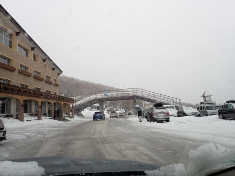

# 2024/1/21(日)の志賀高原焼額山スキー場，詳細レポート！…朝は強風での営業遅れ，雨＆みぞれで辛かったけど，午後から全面運転．湿った雪が降り続いたけど午後はなんとか楽しめた

📅 投稿日時: 2024-01-23 01:09:01

🏷️ カテゴリ: [2024スキー滑走日記](c453f687e8a0f05679e95831d0a02cd0c.md)

えー．

23日午後から25日にかけて…

冷えます．降ります．積もります！

24日は，志賀高原でも終日そこそこの

勢いで雪が降り続けるんじゃないかなぁ…

そのあとも，週末までは冷え続けて

くれそうなので…

今週末は1月らしいコンディションで

滑れそう…！！

ってなことで．

悲惨な日曜の雨＆湿雪を乗り越えた

志賀高原．

月曜の今日は，雨の後の冷え込みなので，

もしかしたらアイスバーンかな？

と思っていたけど…

日曜夕方にみぞれ→雪に変わって，

雪が5-10cmほど積もってくれたので．

月曜朝イチは，その雪が圧雪された

きれいなシマシマバーン！！！

…そして，天気もよさそうだし…

思ったよりいいコンディションじゃ

ないですかっ！！！

実際，日曜に積もった重い雪が

圧雪された，いい感じに締まった

圧雪で，コロコロも出ずに，

朝のうちはかなり良かったみたいです…

ただ，あさイチから-4度程度と気温が

高めで．

昼間も気温が高く…

ピークは山頂でも0℃くらいまで

気温が上がったようです（涙）

だもんで，昼頃には雪が緩んじゃって，

とても1月と思えない，春っぽい重い雪に

なっていったみたいだけど…

平日なので，ゴンドラもリフトも

ガラガラで，楽しめたみたいです…

いいなぁ…

日曜がこんなだったらよかったのに…

なぜ私が行く日曜が修行デーで，

翌日の平日がいい感じになるんだろう…（涙）

ってなことで．

昨日速報した，悲惨な日曜の志賀高原情報，

詳細レポートです！

えー．

まず．

昨日も速報に書いたように．

明け方から，かなりの強風が吹き荒れ…

朝7：40の段階で，焼額山は全リフトの

営業見合わせ（涙）

焼額山以外も，熊の湯や横手，

奥志賀はすべて営業見合わせ（泣）

宿の前に出ても．

風が強く，さらに雨も降っている，

かなり悲しい状況．

おかしい…

私の予想では，そこまで風が強くなる

予想ではなかったのに（泣）

とりあえず，いつ動き出すかわからない

ので，宿で天候回復を待っていると…

8:30には一ノ瀬ファミリーペア，

8:45には一ノ瀬クワッドが動き

出したという情報が流れ．

焼額も9:10ごろに第4ロマンスが動く

という情報が！！！

急ぎ宿を出て，車で10分ほどの

焼額に向かいますが…

走っている車から見る限りでは，

9時半ごろには，ダイヤや山の神は

動いてなかったけど，高天ヶ原も

動いてました…

そして，焼額も第4ロマンスだけじゃなく，

第2高速も動きはじめたようで…

何とか9時半過ぎに，第2高速リフトで

滑り始めることができました…！！

…いやーー．

朝8時ごろの段階では，

風速35mという，運転上限の

20mを大きく超える状態で，

いつ風がやむか分からないし，

今日営業できるかどうか未定

という絶望的な情報に悶絶して

のたうち回ってたけど．

2高と4ロマの2本だけとはいえ，

動いてくれただけありがたい…！！

とりあえず．

朝までに積もった新雪は20cmくらい．

朝，圧雪された上に2-3cmの雪が

積もっていた感じだったけど…

スキーで踏まれてない新雪部分は，

かなり水を吸って，板の滑走面に

張り付く妖怪板掴み状態（泣）

さらにゲレンデは強風の影響で，

木の枝がいっぱい落ちてたし…

限りなく雨に近いみぞれが降り続く，

リフト1本でびしょ濡れになる

天気だったけど．

もしかしたら今日は滑らずに帰るのか？？

という絶望状態から考えると，

滑れるだけで感謝…！！

ゲレンデは，こんな天気でほとんど人は

来ないだろう…という予想よりは多めの

人出だったけど．

混雑というには程遠いレベルの，

好きなラインで滑ることができる

人口密度．

雪は雨を吸ったずっしり重い雪で，

あさイチは妖怪板つかみも出たけど．

一通り新雪が踏まれると妖怪板つかみも

いなくなり．

ずっしり重い分，エッジがしっかり雪面に

食い込む，意外と気持ちいいバーン！

当然，この天気なので，リフト待ちも

少ないし…

雨に限りなく近いみぞれでびしょ濡れに

なることさえ我慢できれば，

思ったより楽しいのでは…？？←いや，普通の人は我慢できないから

と，思ったものの．

バーンコンディションは人が少ない分

荒れずにいい感じとはいえ．

びしょ濡れになっていくのは辛い…

早くゴンドラが動いてほしい…

と願っていた，午前12時前．

風向きが北に変わり，雨に近いみぞれ

だったものが，雪に変わってきました…！！

…ってか，かなり強い勢いで降ってきたん

ですけど…！！

強くなってきたのがが雨じゃなく，雪で

よかったんだけど．

ウエアやゴーグルに着いたらすぐに融ける

雪なので…

ゴーグルにも張り付くし，ちょっと前が

見にくい…（涙）

でも．

積もりやすい，湿った雪が強い勢いで

降ってきたうえ，昼休みタイムには

滑る人も少なくて．

積もった雪があまり蹴散らされず，

新雪がうっすらとゲレンデ全面を覆って

いきました…

そんな感じの午後1時ごろ．

もうお客さんも少なくなったし．

こんな時間になってからいまさら

ゴンドラの営業を始めるってことは，

もうないだろうなぁ…

と思っていたのに…

予想外にうれしい，第1ゴンドラの営業

開始の案内が！！

続いて午後1時20分ごろには第2ゴンドラも

動き出し…

いや，ただでさえお客さんが少ない日曜午後．

さらに午前の悪天候の洗礼を受け，さらに

滑走者が減っているこんな日に．

午後だけでもゴンドラを営業するとは…

いや，うれしい誤算！！

雨でなく雪になったとはいえ，ウェアに

着くと溶けていく雪なので，ぬれずに済む

ゴンドラはすごいありがたい…！！

そして，ゴンドラで登った山頂からのコースは，

まだ誰も滑ってないし…

そして，滑る人も少ないので，新雪が

うっすらゲレンデに乗ったまま！

で．

当然のごとく，午前中の修行コンディションで

淘汰されたため，生き残ったスキーヤーは

数少なく．

ゲレンデはガラガラで…

ゴンドラ1本目は，まだ誰も滑ってない

ほぼ無人状態のコースを独り占め！

昼間の気温は山頂でも0℃と，結構高かった

けど…

朝のうちの雨で濡れて滑りの悪くなった雪の

上に，昼からの雪がゲレンデの上に新しく

積もってくれて，板の滑りもかなり良くなり…

ゴンドラは1ゴン，2ゴンとも飛び乗り

レベルのガラガラだし…

朝のうちの，雨＆妖怪板つかみという

地獄に比べれば．

人が少なくて全く荒れておらず，

板も滑るようになったこんなバーンを，

貸し切り状態で滑れるなんて…！！

さらに午後3時過ぎには，雪もやんで

薄日が差すほどに天気も回復してくれて…

これは，

朝の修行タイムを淘汰されずに

生き残ったスキー〇カ強いスキーヤー

だけが楽しむことのできる，

選ばれし民への祝福に違いない…！！

と，ラストの約2時間．

こんな日に我慢して滑っててよかった…

というご褒美タイムを過ごして，

いつも通りの営業終了時間まで

滑り倒したのでした…

…でも．

普通の人なら，この日は午前中でくじけると思う…

## 💬 コメント一覧

### 💬 コメント by (you160)
**タイトル**: Unknown
**投稿日**: 2024-01-23 08:01:23

スキー◯カ？普通の人は帰る？言ってる意味がわかりませーんw

### 💬 コメント by (YETIからの再会者)
**タイトル**: Unknown
**投稿日**: 2024-01-23 10:04:36

日曜日は どうもありがとうございました。

私は 根性なく昼前に撤退した者のうちの一人です。

まだまだ修行が足りないっていうことですね。

たまに焼額に現れますので、 また次もよろしくお願いします

### 💬 コメント by (かず)
**タイトル**: Unknown
**投稿日**: 2024-01-23 11:13:52

明日からの風予報ってどうでしょうか？

### 💬 コメント by (レインボー76)
**タイトル**: Unknown
**投稿日**: 2024-01-23 12:12:15

火曜日の志賀高原情報

クルマの水滴が凍ってる。朝の上林-1℃　蓮池-4℃。標高1300mくらいから霧。

ダイヤ上陸してヤケビヘ。奥志賀や寺子屋はガスってるけど、ヤケビは大丈夫。

朝一の唐松は硬い。白樺は快適。オリンピックは少しコロがあるけど滑りやすい。GSはコロコロがあるし硬いし過密だし、最後の壁の地肌が全幅に拡がるし、今日のワーストの部で見事優勝。

霧が収まれば敬遠されてる奥志賀が最高なのに、それまで気持ちが持たない。

10時を過ぎると唐松やサウスもコロコロ地獄。最後のダイヤはガタガタカチカチでした。

### 💬 コメント by (油漏＠あちこち)
**タイトル**: Unknown
**投稿日**: 2024-01-23 18:48:20

日曜日と月曜日に志賀で滑っていました。

日曜日はカッパの上下を着て、濡れずに滑りました。手袋は3足用意し、2足使いました。強者はゴム手袋を重ねていたようです。日曜の午後、私は奥志賀で「祝福」を噛みしめました。

翌日の月曜日。投稿のとおりよいコンディションで、しかも空いており、昼ごはんも食べずに滑り続けました。捨てる神あれば拾う神ありですね。

### 💬 コメント by (Skier_S)
**タイトル**: これから雪が積もるよ！！１
**投稿日**: 2024-01-24 03:57:57

＞you160さま

いや…この日最後まで滑っているのはやはり異常な人かと…（笑）

＞YETIからの再会者さま

コメントありがとうございます～！

午後にゴンドラも動き，昼前に切り上げたのはちょっともったいない感じでした．

もう少し修行が必要そうです（笑）．

＞かずさま

24日は風はそこまで強くならないと思います．

25日はちょいとヤバめ．北向きの奥志賀はかなりヤバい．

焼額もゴンドラ運転に影響するかも…

26日はたぶん大丈夫．ただ，朝のうちは強い北風で奥志賀ゴンドラだけヤバいかも…

という感じです．

＞レインボー76さま

コロコロガチガチで，今日は結構コンディションが悪化したんですね…

明日からは激冷えの吹雪が続き，根性がないスキーヤーがふるい落とされる

天気が続きますので，お気をつけて…

＞油漏れ＠あちこちさま

日曜，午後まで滑ってらしたんですね！勝ち組ですね（笑）．

月曜は良かったみたいですね～…

月曜に滑れたのがうらやましいです．

