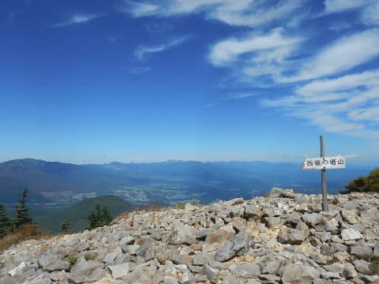

# ちょっと山登りに行ってきた…この週末は，天気が良かったので東篭の塔山へ

📅 投稿日時: 2017-10-03 02:00:48

先週，先々週と．

ちと仕事が忙しく．

週末もどこにも出かけることができず（涙）．

いろいろストレスが溜まっていたので．

この土曜日は．

発作的に，山登りへ行ってきました…

いや．

ホントに．

金曜に「今週末，土曜は仕事しなくて済みそうだ…」

と，前日に判明したので．

まさに発作的に

「土曜は，山にでも登ってリフレッシュしたいっ！！」

と思ったわけですね～←せっかく仕事しなくていいんだから，ゆっくり休めばいいのに…

まぁ．山登りって言っても．

娘を連れて行くことになったので．

せいぜいコースタイム1時間程度の，お気楽な山で．

そして，混みそうにないところ…

と，探したところ．

ありましたね～．

標高2228mと標高2000m超えで，

景色は360度すっきり見渡せるのに．

駐車場からコースタイムわずか40分でお気楽に登れる，

「東篭の塔山」（東篭の登山，と書いてあるところもあり）

って山が！！

場所は，アサマ2000と湯の丸の間．

…そう．

我が家から，片道車で3時間半くらいかかる

場所です…←日帰りなんだから，もっと近くに行けばいいのに…

まぁ，志賀高原日帰りで行って，一日滑り続けて

ナイターまで滑るのに比べれば．

片道3時間半で，登山＆トレッキングで3～4時間なんて，

超お気楽な息抜きですね～←基準がおかしい

ということで．

向かうは，アサマ2000のスキー場の奥．

紅葉が始まっている，高峰高原への登り坂を

登って…

さらに．

見慣れた場所．

アサマ2000のスキー場を突っ切って…

さらにその奥．

こんな砂利道を超えていくと…

池の平湿原の駐車場に到着！

…

この駐車場に行く場合は．

小諸インターから湯の丸経由で

上がった方が，ずっと舗装された

広い道なので，素直でいいです…

え？なぜ私は佐久から高峰高原経由で上がったかって？？

…シーズン前のアサマ2000を見たかったから（ぼそ）

そんな特殊な理由がない限り．

小諸側から上がったほうが，精神衛生上いいです．

ってことで．

駐車場ですでに標高2000m．

ここから，こんな感じの山道がスタートして…

この，向こうに見える山を登ります．

しかし，標高差わずかに200mちょい．

登山とも言えないようなお手軽道をトコトコ

歩くと…

20分ほどで，足元がゴロゴロして，

ちょっと急になってきますが．

途中から，もう八ヶ岳方面がすっきり

見えるようになってきます！

全く視界がない登山道に比べれば，

なんて快適なんでしょう…

この時期，花は少ないけど．

リンドウやら…

これは…

イワインチン？

クロマメノキも実がなってたし．

写真は無いけど，シラタマノキやら

マイヅルソウも実がそこらじゅうに

なってましたね～．

…そんなのを眺めていると．

30分ちょいで，こんな岩場の登り道へ

やってきます．

ここまでくれば，山頂はもうすぐ！

もう，天気は絶好の登山日和！

…

ってことで．

駐車場を出てから，わずか40分．

標高2228mの山頂に着いちゃいました…

早い…

早すぎる…

登山気分になる前に，あっという間に

着いちゃったよ…

急坂も最後のちょっとだけだし，こんなお気楽な

ハイキング気分で，標高2000m超えの山頂に

着けていいの！？？？

で．

お気楽に登れるにも関わらず．

山頂からは360度，全面きれいに見えるじゃない

ですかっ！！

南は八ヶ岳方面がクリアに見えますし…

八ヶ岳の左，金峰山方面の右肩部分．

ををを～！

見えてますね！

富士山がっ！！

そして，西を見ると，

南は御岳から，その北に連なる北アルプスが…

その北側には，拡大すると白馬方面までしっかり

見えます．

さらに北を見ると．

あー．

矢印で示したのが．

菅平スキー場から良く見える，根子岳ですね．

その右の山は，四阿山ですか．

さらに北に目を転じると…

をを！嬬恋から白根，

志賀高原方面が見えるじゃないですか！

拡大してみると…

おそらく，この矢印の左から，

笠岳，焼額，横手山かと…

横手山は，形が特徴的ですのですぐわかりますね！

横手の右に見えてるのは，岩菅じゃないかな？

…しかし．

こんなところからわがホームゲレンデ，焼額が

見えるとは…！！！！

感動～っ！！！

そして．

北東を見ると，

うーむ．

遠くて良く分からないけど…

谷川岳方面まで見えてますね…

東を見ると．

目の前に，ドドンと浅間山が！

南東を見ると…

麓にアサマ2000が見えるし．

向こうは赤城山方面かな？？

…って感じで．

ホントに気持ちいい，360度の見晴らし…

こらすごいわ．

こんなところで，

お昼ご飯を食べたけど．

ここだと，何を食っても美味いわ…

ってことで．

1時間ほどの山頂滞在で，下山しましたが．

下山ルートも快適だし．

こんな，駐車場から片道40分でお気楽に

360度パノラマを楽しめるという，

東篭の塔山．

山頂にいた時間含めても，3時間．

体力に余裕があれば，

西篭の塔山や水の塔山まで足を延ばしてもいいし．

駐車場から，池の平湿原散策してもいいし．

いや．

超満足～！！！

ここ，結構おススメかも…

## 💬 コメント一覧

### 💬 コメント by (michi)
**タイトル**: Unknown
**投稿日**: 2017-10-03 22:16:59

Sさま

うちも息子を連れてどこかに山登りに行こうかと思っていましたが、こんな良い所があったんですね。

近いので今度行ってみようと思います。

### 💬 コメント by (Skier_S)
**タイトル**: michiさま
**投稿日**: 2017-10-03 23:59:58

そうなんですよ～！

ここ，子連れで登るにはちょうどいい感じです．

最後の岩場も，そんなに急すぎたり危なすぎたりせず．

子供にとってはちょうどいい岩場の遊び場みたいな感じで

楽しそうでした．

何にしろ，山頂からの景色は，コースタイム40分の

山とは思えません…

登るときは，ぜひ天気の良い最高の日に

行ってください！

なかなかの景色です…

