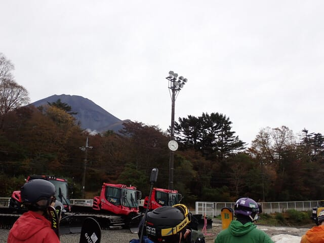
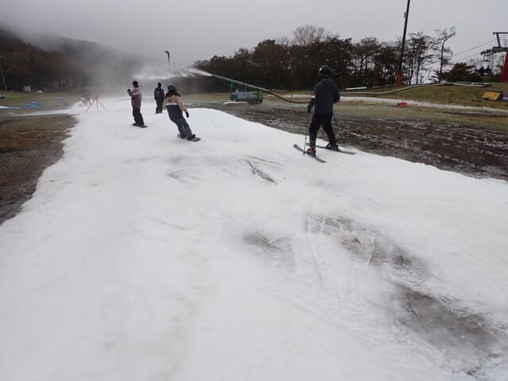
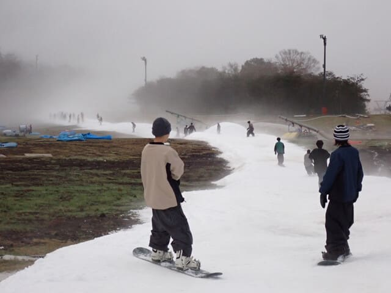
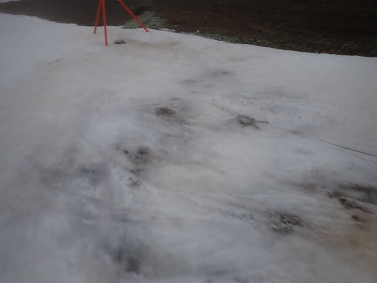

# 2024/10/26(土)のイエティ詳細レポート！…2025シーズンオープン翌日にしては雪も薄く幅も狭め(泣)．リフト待ちは少ないけどスタート待ち3-8分

📅 投稿日時: 2024-10-28 00:18:34

🏷️ カテゴリ: [2025スキー滑走日記](cacd3fbf84d4a679ee61a5894c3f95e14.md)

えー．

昨日の速報で，ゲレンデ状況がかなりよろしく

無い感じ…とお伝えしたのですが．

やはり日曜の本日もナイター無しで17時までの

営業だったらしく．

さらに，28日(月)は営業休止することになった

ようです…！

まぁ，日曜でかなりゲレンデはやられそうだし，

月曜は雨になりそうだから…

月曜，営業休まないとやばいだろうな，と

思ってましたが．

一応，今のところは火曜は営業再開する

という案内です！

…でも．水曜までひたすら雨が続きそうなので…

ホントに火曜営業できるかな…？？

ということで．

昨日はオープン翌日のイエティについて

速報レポートしましたが．

今日は詳細レポートです！！

まず．

9時営業開始のイエティ．

ゲートオープンに間に合うよう，8時40分

過ぎにリフト券売り場へ向かいますが…

リフト券売り場は意外と混んでおらず．

ゲートオープンを待つ人も，それほど

多くはなかったですね…

まぁ，今日のナイターをあきらめるほど，

ゲレンデコンディションが良くないという

情報が出ていたからか．

全体的に人数は少なかった感じ．

ってなことで，9時ちょっと前にゲートが

オープンして．

ゲレンデ前まで進みますが…

ゲレンデ整備が遅れているということで，

ゲレンデ前でかなり待たされ…

9時25分過ぎに，定刻25分遅れで

ゲレンデオープン！！

うおーーー！

雪だ，雪だっ！！！←アイスクラッシュの氷だってば

今シーズン初の雪だっ！！！

ってことで，いつもならここでコースに

飛び出し，滑り始めるところですが…

今日はいつもと違って，滑り始める前に

一旦スタッフに止められます．

そして，ある程度の間隔をあけつつ，

スタッフが声をかけて数人単位で

滑らせていきます…

このシステムのおかげで，前がクリアな

状態で滑れるので…

うん．

このシステム，いいかも…！！

とりあえず．

私の2025シーズンの初滑り，いただきます！！！

あさイチからちょっとバーンは凸凹してたけど．

それでも硫安が効いたバーンは締まってて，

板も気持ちよく走って…

いやーーー．

実に4か月半ぶりのスキー．

やっぱりスキーは気持ちいい…！！

スタート待ちシステムのおかげで，

コースの上ではそこそこ待つけど…

その代わり，リフト乗り場の待ちは

午前中はほとんどなくて，ストレスはないし．

さらにコース上は，仲間はある程度

まとまって滑れるし，その間の間隔が

スタート待ちでしっかり取られていて，

クリアなコースを滑れるし…

滑れる本数自体は少ないけど，1本あたりの

満足度はかなり高かった感じ…！！

コース幅は狭く，雪も薄かったけど．

午前中は比較的満足度高く滑れましたよ～！！

とはいえ．

午前11時ごろには，スタート待ちが5分を

越え，最長10分近くまで伸びちゃった

ものの…

それでも，引き続きスタッフがしっかり

スタートコントロールしていたので．

コース上の人口密度はしっかり抑えられて

いて．狭いコースでも比較的安全に

楽しく滑れたし…

普段のこのコース幅の狭さのイエティ

だったら，人が増えてきたらリフト降り場

から乗り場まで，人を避けながら降りて

来るだけになるところ．

昼過ぎくらいまでは，こんな人口密度が

低いコースを滑れて，ここ数年にないくらい

快適に滑れたかも…

ただ，このスタート待ちを待たなくては

ならないのが欠点か…

でも，スタート待ちは昼前には10分近くに

まで伸びたものの，昼休み時間にはいったん

短くなり．

リフト待ちもほとんどなかったので．

リフトで5分以上待たされて，コースが

混雑するより良かったかな～！！

特に，ときおりガスが出たこの日．

コース上の見通しがかなり悪くなる

タイミングもあり…

そういう時に，コース上の人数が制限

されているのは安心できてよかったかな！

ただ．

午前中からも，ところどころ凸凹していた

コース．

穴が開きそうなところは，人海戦術で

穴を埋めていたものの．

コース上のヤバいエリアはだんだん増えて

行き…

昼過ぎには，結構ヤバいエリアができて，

そこをスタッフが必死に埋めて…

という繰り返しで，何とか致命的な

穴がコースに開くことを防いでましたが．

コース上，そこかしこに茶色いエリアが

広がってました…(涙)

さらに午後になると，造雪機の雪の山が

コース上に造られ始め．

それも，コースの真ん中に山が数か所

作られて，結構滑りにくくなってきた

し…

雨も降らず，日も射さずの曇り空という，

雪にとっては一番マシな天気だったので，

コース上の硫安が効いていて，

終日板が結構滑っていたのが救いかな…

そして，午後しばらくはスタート

コントロールもしっかりしていて，

このくらいのセパレーションで滑らせて

くれていたので，まだ安心できたけど．

なぜか午後2時を過ぎたころに，

人数のピークがやってきて…

スタートの待ち時間があまり長く

ならないためなのか，スタッフによる

スタートコントロールが緩くなったので．

午後2時過ぎは，コース上の人口密度が

結構上がってきてしまいました…（涙）

まぁ，それでもいつものイエティよりは

コース上の人口密度は低めかな？

ただ，リフト待ちも増えてきたし…

（とはいえ，このくらいならいつもに比べれば

全然許せるレベル）

それでいて，コース上は視界が悪い中，

コースの真ん中に造雪の雪山もあり，

人口密度も朝より高めで．

かなり難易度が高まった感じ…（泣）

そして．

いつもなら17時からのナイターに備えて

16時にコース整備開始のところ．

本日はナイターが無いので，

薄暗くなる17時まで営業が続きましたが…

最後のコース状況は，かなり悲惨な感じ

でした…（ちょい涙）

ってなことで．

17時営業終了の10分前くらいにコース

クローズとなり．

初日からしっかり，営業開始から

営業終了まで滑り倒しました～！！

まぁ，スタートコントロールがあったので，

滑れた本数はいつもの6～7割くらいの

感じでしたが．

そのおかげで昼過ぎくらいまでは，人を

それほど気にせず滑ることができたので．

コース状況はあまりよくはなかったものの．

そんな中でも，比較的満足できた

シーズン初日でした～！！

ということで．

ついに私の2025スキーシーズン，スタートです！！
