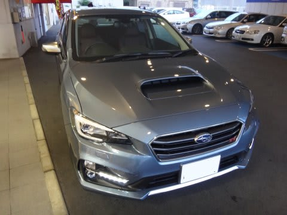

# LEVORG C型登場！今度は，レヴォーグ1.6 STI Sportに試乗してみた

📅 投稿日時: 2016-09-16 02:13:37

🏷️ カテゴリ: [車試乗](c07dec5709d34bd74e1f6cb9c8291061b.md)

ということで．

[1.6GT-Sを試乗](ebe47a6d9e4169ce5b894cca72e585fa4.md)したあと．

今度は，1.6 STI Sportに試乗してみました．

運転席に座ってみたところ．

…メータがレッドになり．

内装もチェリーピンクと，刺激的な内装ですね．

走り出すと…

エンジンはGT-Sと変わらん．

アクセルレスポンスは，当たり前ですが，

GT-Sと全く変わりません．

ただ，

足回りの味付けには，差を感じます．

…でも．

「ガタガタした揺すられ感がない」

という点でGT-Sと共通．

もっともっと締め上げられてる足かと覚悟して

乗ってみると，思いのほか肩透かしを食います．

想像よりずっとマイルド．

っていうか，スプリングレートはGT-Sと

ほぼ同じでは？？

…とはいえ．

やはり，GT-Sよりは締まった感はあるのですが…

でも．

それは．

スプリングレートが高い，スポーツ的な締まった感ではなく．

緩みやタプタプ感のない，高級車っぽい締まった感というか．

GT-Sのダンピングが，振動は柔らかくいなすけど，

グッとつぶすと踏ん張り感が出てくる

「グミ」みたいな感じとすれば．

STIのダンピングは，プリロードがかかったグミと

とでも言おうか…

しっかり振動は吸収するけど，遊びがなくダンパーの

効き始めが早い感じ．

これは．

ガンガンコーナーを攻めるための，

高いバネレートや太いアンチロールバーでギシギシに

締め上げた足というより．

ヨーロピアンサルーン的な高級さを狙ったのか…？？

少なくとも，同じSTIを謳っていても．

スパルタンさを追求したWRX STIとは全く違うなぁ…

うーむ．しかし．

レガシィB4やアウトバックよりお値段が高いから，

当たり前とも言えるけど…

レヴォーグSTIの方が，レガシィB4よりよっぽど

ヨーロピアン高級車っぽい乗り心地なんだけど…？？？

とはいえ．

普通に街乗りしている限りでは．

GT-SとSTIの差は感じられるというものの．

これだけの差額を払ってSTIに

乗るかというと…

うーむ．

私にとって，GT-Sで十分かも（笑）

GT-Sだって，完成度高いもん．

ってことで．

かなりいい感じのLEVORG C型だったわけですが．

LEVORGを試乗した後．

わが愛車のBR E型レガシィに乗ってみると．

あぁ…

LEVORGに比べると．

締まりのない，タプタプした乗り心地に感じることよ…（涙）

と思わずにいられないのでした．

いかん．

物欲を刺激する車だなぁ…．

## 💬 コメント一覧

### 💬 コメント by (まいる)
**タイトル**: レヴォーグは・・
**投稿日**: 2016-09-16 22:56:51

Sさん、こんばんは。またまた久し振りのコメントです。SAJの会員更新しました。そろそろメンテナンスでショップに起きっぱなしの板を取ってこないと！

レヴォーグはいいくるまですよねー

私の用途だとアウトバックになってしまうのですが。アウトバックのC型が出たらレヴォーグと合わせて試乗に行こうと思います。

### 💬 コメント by (Skier_S)
**タイトル**: まいるさま
**投稿日**: 2016-09-17 05:10:38

あれ？SAJ会員だったのですね．

私も昔はSAJ会員だったのですが…

レヴォーグ，乗ってみるとだんだんほしくなってくる

車です．

現行アウトバックは，我が家にはちょっとデカすぎて…

なにぶん，RBレガシィが精いっぱいの

細い裏道を走らねばならないので．

でも．

レヴォーグ．

アウトバックと変わらないくらいの価格…

高いですね～（涙）

### 💬 コメント by (miya)
**タイトル**: 価格は…
**投稿日**: 2016-09-20 12:34:16

こんにちは。

前回の投稿でレヴォーグ納車をお伝えしましたが、

私もそのときアウトバックも検討してました。

1.6GT S-StyleとアウトバックS.Editionでしたが

価格差は30万くらいでしたねー

装備の差もあって、助手席パワーシートやら

シートメモリー、シートヒーターが我が家では

迷ったところでした。

ちなみに決定に多大な影響を与える家族が

両車に試乗したところ、アウトバックとBRの差が

よくわからないようでした。

室内の広さはあまり変わらず、若干アイポイントが

高いかなーというレベル。。

1.6GT-Sとだともう少し価格差は少ないかもしれない

ですねー。

今はアウトバックにも新たな特別仕様車が

出てるみたいですけど、やっぱり大きいですしね…。

レヴォーグなら自動車税も安くなりますよー。

### 💬 コメント by (Skier_S)
**タイトル**: miyaさま
**投稿日**: 2016-09-21 01:58:19

あ，アウトバックも候補だったんですね…

うちも，リヤシートの広さ，リヤシートヒーター

（後ろに乗る人にとって，スキーの行き帰りには重要…）

の2点が魅力的なのですが．

＃実燃費も意外とLEVORGと変わらなさそう

LEVORGは，リヤが狭く，

冬は寒そうで．

さらにリアのエアコン噴き出し口が

なく，夏は暑そう…

ってので，評判が…（汗）．

でも．

やっぱり走りはLEVORGがいいので．

なんとか次の車はLEVORGに

したいところです～！

