# 2014年8月　オスロブagain…再び，子連れでジンベエザメと泳ぐぞ！　ファイナル

📅 投稿日時: 2014-10-24 02:34:14

ということで．

ついにやってきてしまった，

帰国の日．

眠い目をこすりつつ．

2時過ぎに起き出して．

まだ完全に乾ききっていない器材を

片づけたら…

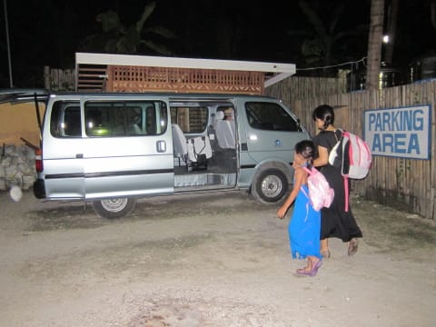

深夜3時にピックアップ．

空港に向かって，これから3時間弱の

ドライブです…

…眠かった我々3人は，車の中で完全

熟睡モード．

気づいたら，空港へ到着してました…

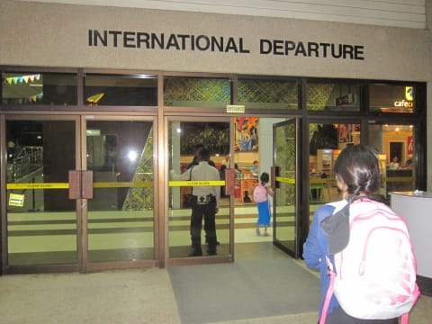

なんだか，ぐっすり寝てたので．

ほんの10分くらいで空港に着いちゃった気分…

んで．

空港到着は，朝6時前．

…眠いよ…

まだオープンしていない，閑散とした

カウンターに並んで，

オープンを待ってチェックイン．

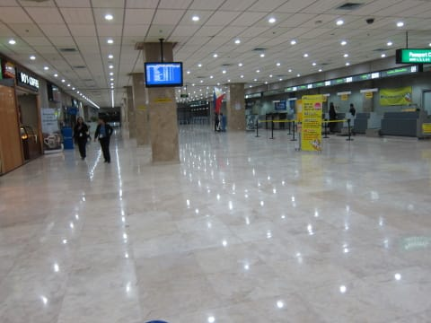

チェックインの後は，出国税一人当たり550ペソを

カウンターで払って，出国審査を通りますが…

…やはり，ここでも別室に連れていかれたよ（涙）（涙）（涙）．

もう，フィリピンの入出国は鬼門だな…（泣）

そして．出国審査後の荷物チェックを

過ぎたところに．

お土産屋さんがあるので．

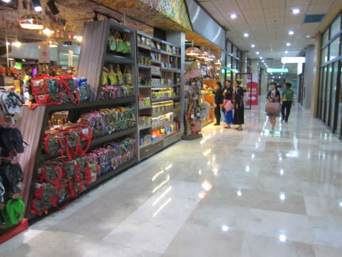

我が家はいつもここでお土産を買って…

そして，お土産屋さんの奥にある軽食コーナーで

朝食，というのがパターン．

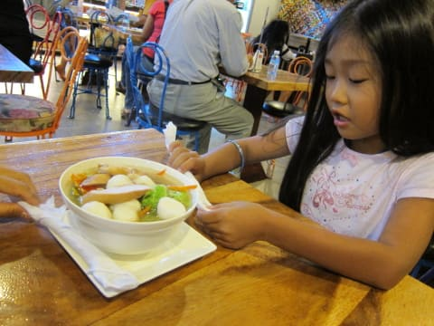

そうこうしているうちに，7時半のボーディングタイム．

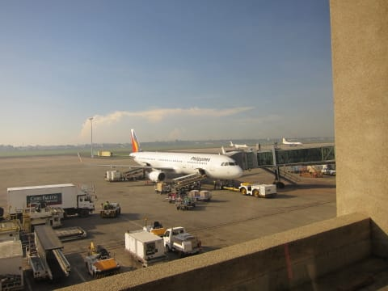

さらば，フィリピン！

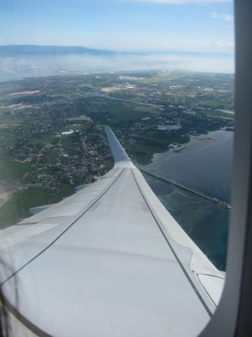

久しぶりの昼間のフライトで，娘も窓に

かじりついて，景色を眺めてます

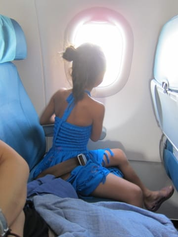

そして，娘の楽しみにしている，機内食が

やってくるわけですが．

こんな大人の食事に対し…

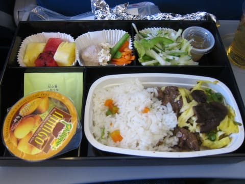

チャイルドミールはこんな感じで．

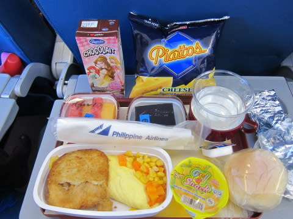

やはり，チャイルドミールの方がおいしそうに

感じるのは，気のせい？？

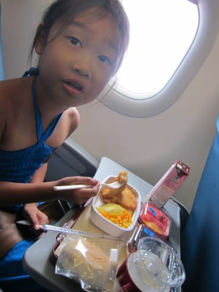

娘のいうところの「飛行機のお弁当」を食べたら，

あとは，日本まで順調に飛行を重ね…

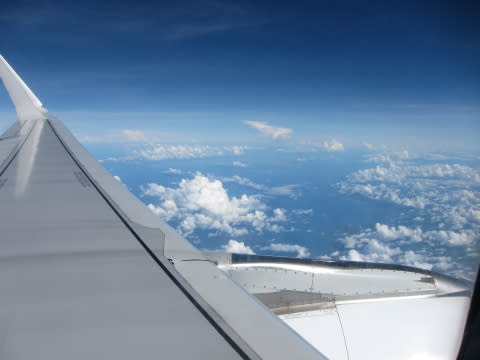

5時間のフライトで，午後2時前に，日本到着！

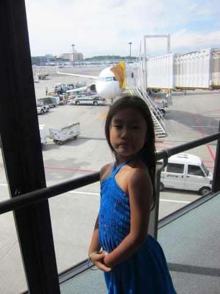

こうして．

全く想定外に，

1年経たずに連続で訪れることになってしまった，

フィリピン・オスロブ旅行．

無事，妻の

「突発性ジンベエがみたくてガマンできない病」

治癒という目的を達成し，帰宅できたのでした…
