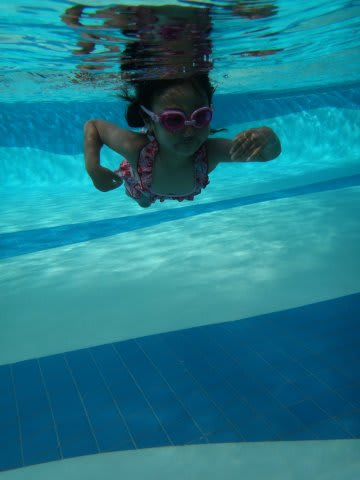
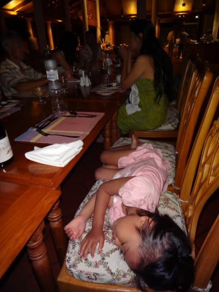

# 2012年　子連れモルジブ　ダイビング旅行記　その10

📅 投稿日時: 2012-10-26 00:39:31

🏷️ カテゴリ: [ダイビング日記](ce3a7a8d424d112fce83ee85c81a0e344.md)

あー…

すでにスキーシーズンに突入したので．

いまさらダイビングレポートってのもなんだかな～…

って，思いつつも．

もしかすると，ダイビングレポートを楽しみにしている…

っていう．

きわめて極めて奇特な方もいるかもしれないので．

…とりあえず，モルジブレポートを再開してみましょうか…

-------

っつー感じで.

午後のダイビングに行くみんなを見送った後．

娘と一緒に島の中をお散歩しつつ，プールへ向かいます．

桟橋の付け根には，こんなブランコが…

気持ちよさそうです．

ブランコを楽しんだ後は，海辺をしばしうろついて…

プールへ到着．

「さぁ，泳ぐよ～！」

あとはひたすら泳いだり…

遊んだり…

…こっちはとりあえずプールサイドで見ておけば良いので楽だわ．

…って感じで．

2時間ほど泳いでましたが．

私「娘～．そろそろ，みんなダイビングから帰ってくるけど，お迎えに行く？」

娘「うん．」

え，ええええ～っ！

珍しいっ！

あっさり帰ろうって言うなんて…！

さすがに朝から合計6時間も泳いで，そろそろ疲れてたのかなー．

…め，珍しいこともあるもんだ…

ってことで．

桟橋でしばらく待つと，ダイビングボートが帰ってきます，

娘「お帰り～！！」

ダイビングに行っていたママたちが戻ってきたのをお出迎えしたあとは．

テラスでゆっくりとくつろいで…

こんな海を見ながらのんびりすごします．

うーむ．

ゼイタクな娘よのぉ…

そして．

夕日が沈み行くのを眺めてみる，と．

うーむ．

ゼイタク．

ゼイタクすぎるっ！

夕日が沈むと，夕食タイムがやってくるわけですが…

なんだか，6時間泳いでいた娘はお疲れだったのか．

レストランの中で熟睡してるんですけど…

私も食後，部屋に帰ると．

娘の横で，仲良く並んで即座に熟睡したのでした…

## 💬 コメント一覧

### 💬 コメント by (伽羅)
**タイトル**: Unknown
**投稿日**: 2012-10-26 18:51:29

はい、モルディブレポート楽しみにしている奇特な人間です（笑）

雨季でも天気良いですね～

### 💬 コメント by (KENKEN)
**タイトル**: 奇特な人間 ２人目
**投稿日**: 2012-10-26 23:17:29

私も引き続き楽しみにしてます。

ところで娘さん４歳にして浮き輪をせずに泳いでいるようですが・・・・

スキーの腕前といい、かなり運動ができるのでは？

### 💬 コメント by (マルハバ)
**タイトル**: 3人目
**投稿日**: 2012-10-26 23:50:50

羽田発で日中にモルディブ入りできる

ルートができたんですか！？

という事は・・・

遥か上空から各環礁が見られたんでしょうね！

これは日本人にとって

長年の夢の実現じゃないでしょうか？

### 💬 コメント by (Skier_S)
**タイトル**: 伽羅さま
**投稿日**: 2012-10-27 01:26:37

奇特な方No.1のエントリーありがとうございます～

日に1回ずつくらいスコールはありましたが，

基本的に終日天気はよかったですよ～っ！

### 💬 コメント by (Skier_S)
**タイトル**: KENKENさま
**投稿日**: 2012-10-27 01:36:29

奇特な方No.2エントリーありがとうございます～

Yetiレポート以来，明らかにアクセスIP数が倍増したので，

やはりスキーヤー中心サイトなんだなぁ，と思っていたんですが．

ダイビング日記応援感謝です～．

我が娘ですが，まだ息継ぎができないので，続けて泳げるのはまだ5m程度です…

でも，足が着くプールだと，もう浮き輪やらフローとなんかは

「いらない」

って言うようになりました…

まぁ，もうすぐ5歳ですからね～．

### 💬 コメント by (Skier_S)
**タイトル**: マルハバさま
**投稿日**: 2012-10-27 01:40:54

No.3エントリーありがとうございます～．

いやー．

そうなんですよ．

羽田発のSQなら，深夜0時30分発，チャンギ乗継で，その日の昼前にマーレについちゃいます…

夢の昼間着です．

上空から，マーレやフルレを見ながら到着です．

…でも．

景色が見えるとはいえ．

水上飛行機の景色を見ちゃうと，

国際線から見た景色の印象はかすんじゃうんですけど～（笑）．

