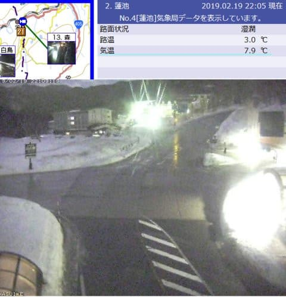
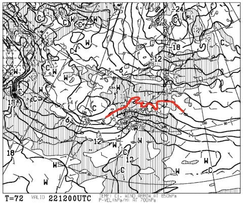
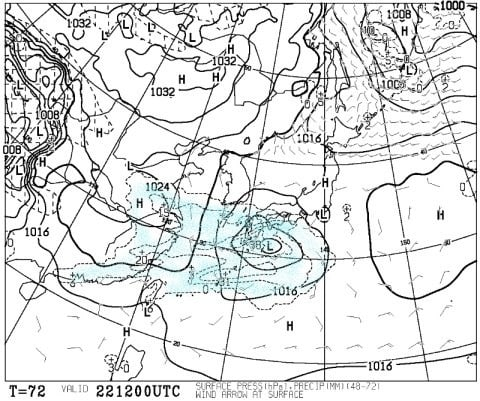
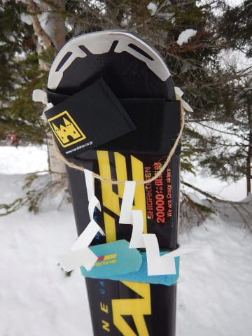
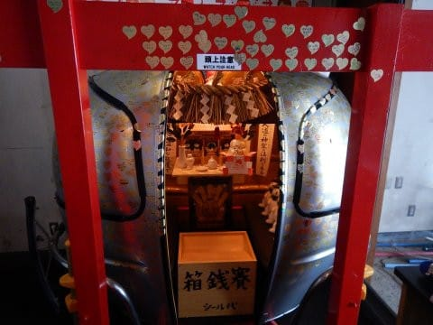
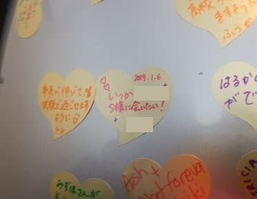
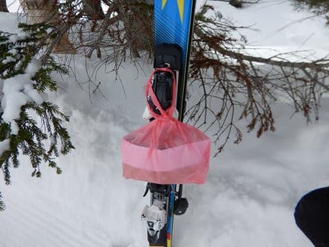

# わがスキーはご神体じゃないんだけど…今度はお供え物！？？

📅 投稿日時: 2019-02-20 02:20:25

ということで．

…大変残念ながら．

本日昼過ぎから予想通り，

志賀高原でも雨になったようです…（涙）

夜10時の志賀高原で，気温が7.9℃って

どうゆうことよ…（泣）

2月の志賀高原としては，気温が高すぎるんですが…（涙）

雨の量は，ザーザー降りではなかったようですが．

…でも，この雨でゲレンデはまた

アイスバーン化しますね…（涙）

ただ．20日（水）は午後から雪になり．

21日（木）の朝までは，わずか10cm程度

かもしれないけど，雪が積もってくれそうなので．

これで何とかゲレンデがちょっとだけでも回復してくれないかな…

だけど．

21日午後はすっきり晴れて，あんまり

積雪はなさそうなのが，惜しい…（涙）

そして．

次の高温の危険日として予告していた，

22日ですが…

をを！？

赤く塗った850hpaの0℃線．

志賀よりは南にあるように見えますよ…！！

で．この日は志賀よりかなり南寄りを

低気圧が通過しそうで…

低気圧に向かう強い南風が，

志賀を襲うことは無さそうで．

さらに，降水域も志賀よりかなり南に

ずれてます！！

これは…

今の天気図のままなら．

22日から23日にかけては，雨の心配はしなくてもよさそう！！

…今日の雨は残念だったけど．

高温予想の22日が雨にならなさそうな

天気図になってきたのは．

きっと私の全身全霊の冷え冷え踊りの

効果に違いないっ！！←いや違う．そこ，違うから．

ってなわけで．

長い前フリのあとは，

本題へ．

…先々週末のこと．

なぜか知らぬ間に注連縄が飾られていた，

わがスキーですが．

どなたかが，呪われた私のために

魔除けの注連縄を着けて行ってくれたんだろう…と．

自分に都合のいいように解釈しているのですが．

…もしかしたら，

私のことを神か何かと勘違いして．

スキー板をご神体として拝んで行ったのでは…？？？

という可能性もあるわけで．

…なんてったって．

寺子屋スキー場にある，こんなところに．

なぜかこのような神頼みの願い事（？）が

貼られているくらいなので…

某20000mシルバーな方，情報ありがとうございました…

でも，これ，私のことなのかな…？？

とりあえず，お返事書いておきました(笑)

まぁ，こんな方がいらっしゃるくらいだから．

私のスキー板を拝んで行った奇特な方

がいても，不思議じゃないかも…

と思ったわけですが．

注連縄事件の次の週末．

…いつもの場所に立ててある

わがスキーを見てみると…

…なんだ，これは…？？？

こ，今度は．

わがスキー板にお供え物が…っ！？？？

…注連縄の次は．

お供え物か…っ！！！

まさか，スキーをご神体と勘違いして，

お供え物をしていく人がいるとは…！←違うと思う

とりあえず．

どなたが置いて行ってくださったかは分かりませんが．

お供え物はありがたくいただきました…

…もう．

注連縄は飾られるし．

怪しい金のお札は貼ってあるし．

お供え物されていくし．

今度はご神体である板の前に．

お賽銭箱でも置いておこうか

と思った，Skier_Sなのだった…

## 💬 コメント一覧

### 💬 コメント by (Seeker.NT)
**タイトル**: ・・・
**投稿日**: 2019-02-20 10:27:47

う〜ん・・・

リアリズムな世界観のBlogから、だんだんスピリチュアルなモードに・・・。

なんか凄い・・・。

### 💬 コメント by (若杉勲71)
**タイトル**: Unknown
**投稿日**: 2019-02-20 15:36:27

本日の志賀高原

悪質な濃霧で視界不良のうえ雨に近いびしょ濡れに。奥志賀、GS、オリンピック、一ノ瀬と。

僅かに白樺だけが見える。

そして、ついにやってきました。ズクッというブレーキ。

そんな悪条件のなか、今日も２時きっかりに二ゴンに帰着したレインボークラブ員でした。

帰りの温度は、たかま3ど、蓮池2ど、上林6どでした。

### 💬 コメント by (Skier_S)
**タイトル**: 回答遅れました
**投稿日**: 2019-02-21 07:50:16

＞Seeker.NTさま

このBlog.

これまでにいろんな神がかった人が出てきてたので．

ある意味宗教っぽいところがありましたが(笑)

＞若杉さま

あら…水曜昼間も雨っぽかったんですね（涙）

木曜は見事なアイスバーンとなりそうです．

そして，週末まで見事なアイスバーンが

キープされそう…

登り坂ツルツルだと思うので，運転ご注意ください．

### 💬 コメント by (yumi)
**タイトル**: Unknown
**投稿日**: 2019-02-21 15:53:25

Ｓさぁ～ん😅🌱🎁

お供え物✨

うけるぅ～～～(笑)😁

ある事件とは、この事だったのね🍀

### 💬 コメント by (Skier_S)
**タイトル**: ＞yumiさま
**投稿日**: 2019-02-22 03:07:39

そうなんです．

このことだったんです…

…って，このお供え物をしてくれた人，もしかしたらyumiさんかな，

って思ってたんですが．

やっぱり違うんですね…

一体，誰が残していってくださったのやら．

