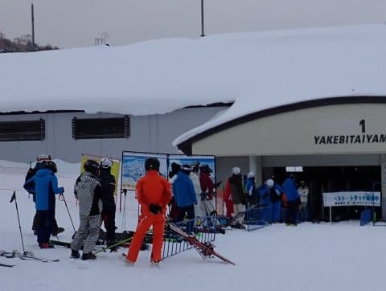
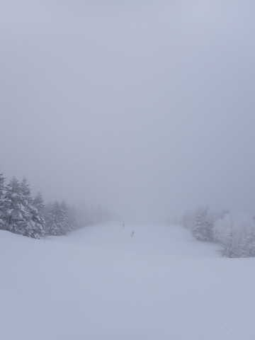
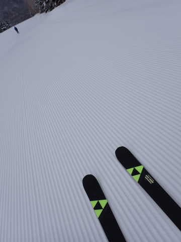
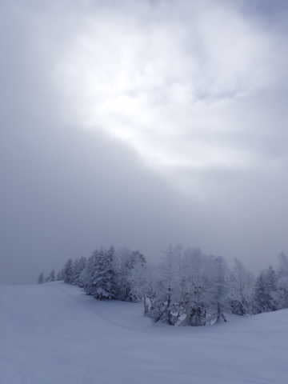
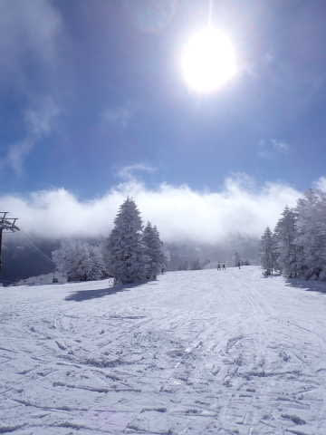
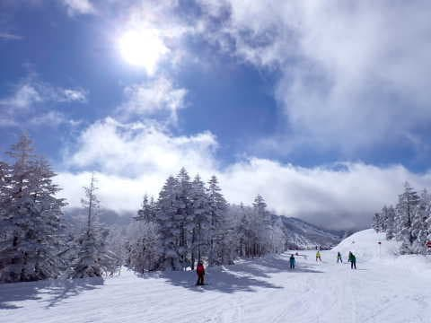
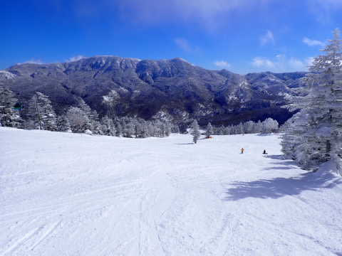
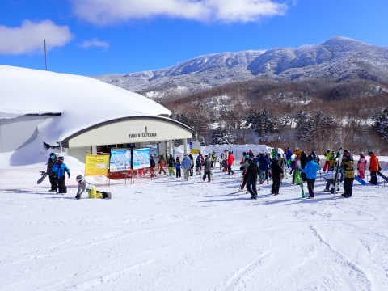
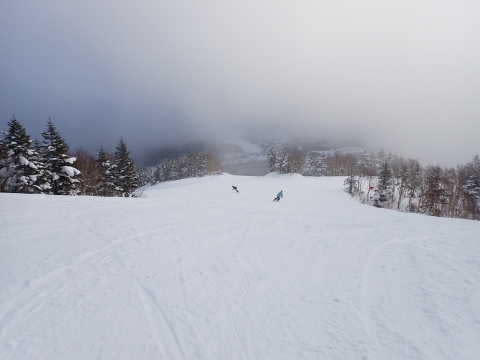
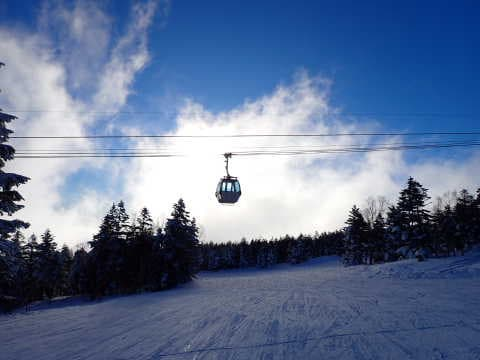

# 2023/2/5(日)，志賀高原スキー場に私の幻が現れたようです…幻による速報レポート！朝は小雪だったけど，9時過ぎから晴れの一日

📅 投稿日時: 2023-02-06 01:27:28

🏷️ カテゴリ: [日記](cc4b5682fb7b8b144980957a978653fb0.md)

えー．

本来なら仕事をしなくてはならなかった

土日ですが．

…土曜一日仕事をしている間に．

志賀高原特派員からのあまりもの

うらやましすぎる写真を大量に見て

しまい．

どうやら滑りたい欲求が限度を超えて

しまったらしく…

幻が本人から幽体離脱して，

志賀高原まで行ってしまったようで．

えらくリアルな志賀高原の夢を見ました…

ええ．

夢です．

この状況で，私が志賀高原に行けるはずが

ありません．

普通なら絶対に行きません．

幽体離脱した私の幻が志賀高原に行って，

私に見せた夢です…

ってなことで．

土曜も深夜まで仕事していたのに．

私の幻は，日曜はなぜかファーストトラックから

滑っていたようです…！

私の幻．

よっぽど滑りたかったんでしょうね…

でも．

残念ながら，日曜の朝は曇り空＆小雪の

スタートで．

昨晩からの積雪は2-3cmほど．

雪質は最高だったけど，曇り空だったのが

惜しい…

どうせ夢なら，最高の夢を見せてほしかったのに…

とはいえ．

雪質は冷え冷え最高のヤケビクオリティ

圧雪！！

焼額の圧雪は，ホントに他のスキー場と

比べて質が高く．

圧雪の段差なども陣も感じさせない，

超絶に気持ちいいロングターンがかませる

快楽バーン！！

そうだよね…どうせならせっかくの

夢だし，いい夢みたいよね…

…と思っていたら．

朝9時ごろには雲が切れていき…

9時10分ごろには，一気に青空になってきました！！

…惜しい…あと1時間早く，ファースト

トラックから晴れてほしかった…

でも．

そのあとはずっと太陽が射す，

最高のスキー日和！！

10時過ぎには，朝は雪降りだったのが

信じられないほどの晴天になりました～！

ただ，先週末までよりはちょっと人が多く．

ゴンドラもゲートの外まで列がつくことが

ありましたが．

午前10時～11時ごろに数回ゲートの外まで

列が伸びたくらいで．

午後はガラガラ！

ただ，最高気温が-3℃とマイナスキープ

ながら，日差しが強かったので．

ごくわずか，日が当たる南斜面はちょっと

ダマダマに固まった感じの雪になった

ところもありましたが…

南斜面のブナコースと唐松の一部を

除けば，トップシーズンの最高雪質！！

人が多めだったので，バーンは多少荒れ気味

のところもあったけど．

でも，午後は人も少なく，夕方まで大回り板で

全然問題なかったし．

午後4:15のラストリフト1本だけ，またちょっと

雲が出てきたけど．

それまではすっきり晴れてたし．

仕事をしなくちゃならない状況にもかかわらず．

日が沈むラストまで，私の幻はスキーを楽しんで

きたようです…

ということで．

幽体離脱をした幻による志賀高原レポート

でしたが…

幽体離脱した反動として．

2時間睡眠のあと，23時間連続で

起きてる状況です…

これから何時に寝られるか分からないし．

明日Blog更新できない可能性があります…（涙）

明日更新が無かったら，

「幽体離脱するのに，無理したんだな…」

と，暖かく見守ってやってください（泣）

いや．

かなり無理した幽体離脱だった…

## 💬 コメント一覧

### 💬 コメント by (naoちゃんねる)
**タイトル**: Unknown
**投稿日**: 2023-02-06 10:10:24

いや…日曜の朝イチ駐車場でSさんの幽体を見た時は驚きを通り越して親娘で爆笑してしまいました！

しかもFT〜ラストまでガンガン滑ってるという…

Sさんのスキーba・……失礼…スキー愛には感服します。

でも、体マジで気を付けてくださいね！！！

### 💬 コメント by (大阪のK)
**タイトル**: Unknown
**投稿日**: 2023-02-06 12:06:48

Sさんの幽体とファーストトラックでお会いして話をしましたが、本当に無理し過ぎですよ。

2月のヤケビは🤤が出るくらい滑りたいゲレンデですが、身体あっての事です。

出来るならば、１日でも身体を労ってください🙇

そして万全の状態でヤケビをかっ飛びましょう❗

…結局誘ってる😅

### 💬 コメント by (you160)
**タイトル**: Unknown
**投稿日**: 2023-02-06 12:24:09

ファーストトラック終了寸前に、幽体なのに、いつものように超速でブーツを外し、1ゴンに走って乗り込む姿をみて家族共々、笑ってしまいました。

確かに、幽体化してでもスキーやらないと死んじゃうんでしょうし、悔しさ、滑りたい気持ちを助長した1人としてなんですが、ご自愛くださいませ。

### 💬 コメント by (炎の北海道民)
**タイトル**: Unknown
**投稿日**: 2023-02-06 12:35:14

本当の幽体になっちゃいますよ。

### 💬 コメント by (レインボー75)
**タイトル**: Unknown
**投稿日**: 2023-02-06 22:20:52

月曜日の志賀高原情報

今日は感激バーンの一日。満足感に満たされた日でした。白樺、唐松、オリンピック。どこも非の打ち所無し。

エス様、幽体離脱するなら、今日も続けるべきでしたね。

ワンデイベストは奥志賀エキスパート。どこにも人類の姿が確認できないスタート。毎日滑っててもなかなか遭遇できないシチュエーション。これだけで欲浅の(？)私は大満足。

昨日から私はやっと気づいたのですが、奥志賀からの連絡道をこいだ後は、必ず足が終わって最低の滑りになると。痴呆に足を踏み入れてる私も機敏にそれを察して、今日は当然バス移動。

これもよかった。西館のウエストサイドでステーキ昼食。終わりは当然レインボー(２時)きっかりてすが、夜も旧友と一献！

幸せ過ぎます。

### 💬 コメント by (Skier_S)
**タイトル**: 眠い…
**投稿日**: 2023-02-07 04:01:57

＞naoちゃんねるさま

私も行くとは思ってませんでした~！

とりあえず眠い．

かなり疲れてます…

＞you160さま

いや…

ホントに今週はちょっと無謀だった…

滑っている時は気にならないけど，帰宅してかなり疲れて仕事をする

気力が残ってませんでした…

＞炎の北海道民さま

いや…今日の仕事中は，ホントの幽体になるかと思いました…

＞レインボー75さま

月曜も良かったんですね…！

週末から気温が上がって雪がダメになっていきそうなので，今週中に

楽しみまくっておいてください！

