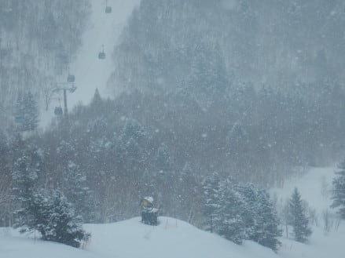
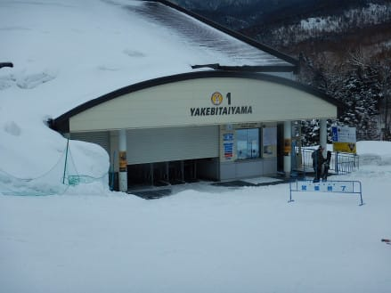

# 2019/3/16(土)の志賀高原，焼額山スキー場は…真冬の冷え冷えの一日で，雪もトップシーズン並み！天気は良くなかったけど…この時期としては恵まれた一日！

📅 投稿日時: 2019-03-17 00:59:29

🏷️ カテゴリ: [2019スキー滑走日記](c3e4496fc0fb7f9c17ff21214a35b1ace.md)

ということで．

昨晩夜遅くに帰宅して．

睡眠時間4時間で，本日朝4時に

家を出てきたというのに．

ナイターを滑ったあと．

さっきまで志賀高原の某飲み屋さんで飲んで

ました…

そして．

明日の朝は焼額の早朝営業に行こうという

かなりご無体プランなので．

本日の志賀高原レポートは，ちょいと手短の，

ショートバージョンで！←いや，これで十分長いから…

まず．

朝の志賀高原の登り坂ですが．

かなりのツルツル路面です．

本格冷え込みの，気合が入った

凍結路面です．

途中で登れなくなった車が，対向車線まで

ふさぎ．

車が動けなくなること，しばし（涙）

明日もツルツルだと思うので，ご注意を…

だもんで．

本日は，通常営業開始の8:30から10分ほど遅れて（泣）．

ゴンドラに飛び乗り．

山頂に向かうと…

あさイチの山頂の気温は，-5℃を

ちょい下回る程度と．

トップシーズンよりは暖かいけど．

十分の冷え冷気温です！

で．

山頂は…

ちょいと残念な雪降りながら．

雪質は最高トップシーズン！

冷え冷えの軽い雪が，しっかり締まった圧雪の上に，

数㎝～10㎝ほど積もってます！

早朝営業をやっていたから，シマシマじゃないけど…

でも，いい感じの圧雪バーン！！

雪質は，冷え冷えのトップシーズン並み！

今日は，それほど混まず．

コース上は最大この程度混む瞬間も

あったものの…

ゴンドラ待ちも，ピークの一瞬だけ，

ちょっとゲートを超えた瞬間もあったけど．

それ以外は，搬器数台待つ程度の，

ガラガラ状態！！

コースも時折混むタイミングもあったけど．

午後はガラガラ！！

…とはいえ．

天気は，時折雪が降ったり…

一瞬日が差したかと思えば…

またすぐに曇って…

雪が降ったり．

時折山頂付近ガスが出たり…

という天気で．

ちょっと安定しない天気で，残念…（泣）．

これですっきり晴れると最高

なんだけどな～…

でも，まぁ．

雪質は夕方まで最高のままだったし．

バーンも，コースの一部は荒れたけど．

思ったほどひどく荒れず，

午後まで比較的フラットをキープし続けて

くれたし．

今日も一日，日が暮れる，

リフトストップまで．

ひたすら滑り続けたのでした…

で．

はいはいはい．

まだ，ナイターは営業してますよ．

まだ終わってませんよ～！！

今日もダイヤモンドナイターへ参戦！！

今日のナイターは．

先週のコロコロ地獄と違って．

トップシーズンの最高級シマシマっ！！！

この最高級冷え冷えトップシーズン

雪質のナイターを．

これも夜9時まで堪能しました～！！

いやーー．

今日も滑ったなぁ…

…そして．

明日も朝6:30からの，

焼額早朝に参戦予定です．

あと4時間半で起きないと…（涙）

では，また明日も志賀高原

滑ってます～！

## 💬 コメント一覧

### 💬 コメント by (ほっぽ)
**タイトル**: 昨日
**投稿日**: 2019-03-17 07:34:27

Ｓさん

昨日は１ゴン山頂でお会い出来ました。

ゲレンデでお会いするのは久しぶりな気がします。(^^;

昨日は日帰りでボーダー二人連れていたので

ご挨拶だけで失礼しました。

ヤケビも奥志賀も３月とは思えないコンディションで

同行の年イチボーダーも喜んでいました。

また、次の週末はよろしくお願いします。

http://www2.tokai.or.jp/nana_hoppo/

### 💬 コメント by (花粉症スキーヤー)
**タイトル**: Unknown
**投稿日**: 2019-03-17 13:26:24

こんにちは、三年前にリフトでご挨拶した花粉の時期に現れる花粉症スキーヤーです。今サンバレーで鍋焼きうどんであったまっています。今日と明日、志賀高原をツアーしてます。今雪が降ってますね、固い雪面がマイルドになるなるといいですね（＾_＾）

### 💬 コメント by (今回はホームアサマ2000特派員m&t)
**タイトル**: Unknown
**投稿日**: 2019-03-17 19:13:21

先週は土曜日アサマ、日曜日八方で技術選見学、月曜日有休で志賀だったm&tです。

今回は、ホームアサマの報告です。

先週土曜日には地面がこんにちはしていて、春休みまでもつのか心配でしたが、ちょっと遠出している間に30cm程積雪があったようで、志賀同様トップシーズン並まで回復しました。

第2ステージは全面ピカピカ圧雪、アンテロープも雪が付きコブ斜面2本出来てます。

今週末試乗会に来る方は、安心して下さい。(週半ばの高温が気になりますが…。少なくとも午前中はもつと思います。m&tは用事があり不参加です。)

アサマでシルバーステッカーを貼っている番外編特派員m&tでした。

### 💬 コメント by (Skier_S)
**タイトル**: 日曜は雪質最高だったよ！
**投稿日**: 2019-03-18 03:10:12

＞ほっぽさま

土曜は一瞬だけお会いできましたね(笑)．

年一のボードが今週に当たったのは，運がいいですね…

今週末はコンディションがかなり厳しそうですから（涙）

では，また焼額でお会いしましょう！

＞花粉症スキーヤーさま

お久しぶりです～！！

実は，私も11時過ぎくらいにサンバレーで鍋焼きうどん

食べてました．

12時ごろにお店を出たので，時間がかなりずれてた

ようですが…

1時ごろまで子連れの集団でサンバレー滑ってました．

月曜は，雪も天気も良くて，最高だと思いますよ！！

＞m&tさま

えええええ！！

先週土曜，アサマ2000はもう土が出てきてたんですか…

ここ数日の雪で回復したようですが，また木曜の

雨で

どうなることやら…

今年のアサマ2000試乗会は不参加なのですね．

私は日曜に参加するかもです…

### 💬 コメント by (マルハバ)
**タイトル**: 本来ならば・・・
**投稿日**: 2019-03-18 21:12:51

この最高級ダイヤモンドナイターを

Sさんと滑っているはずでした・・

その為に大会では使わないSL用の板も

一緒に持ってきました・・

しかし・・

前日の寺小屋で転倒大怪我を負ってしまい

レスキュースノーボート→救急車で搬送され

病院でチューブに繋がれて2泊するハメになってしまいました（涙）

昨日ようやく帰宅できましたが

しばらくは松葉杖のお世話になりそうです（激涙）

そんな時に限って「最高級！」だったんですね～

また来年を楽しみにしております

### 💬 コメント by (Skier_S)
**タイトル**: マルハバさま
**投稿日**: 2019-03-19 02:23:39

えええええ！！

病院で2泊するほどの大怪我だったんですか！？？

それは…大変でしたね．

さすがに今シーズンはもうスキーは無理ですか…

大変だと思いますが，来シーズンに向けて

しっかり怪我を治してください…

今シーズンはお会いできず残念ですが，

また来シーズンお会いしましょう！

怪我が早く治ることを祈ってます！

### 💬 コメント by (りやま)
**タイトル**: Unknown
**投稿日**: 2019-03-27 11:08:45

リアルで役に立つ情報いつも楽しく読ませてもらっています。

さて、レポートの中に｢凍結路を登れなくて立ち往生する車｣がしばしば出てきますが、こうした車の多くはFFスタッドレスですか？LEVORG2.0 ﾖｺﾊﾏｱｲｽｶﾞｰﾄﾞでも登れなくなることは時にはありますか？チェーンを使うことはありますか？来シーズンを目標に16年間乗ったWRXからLEVORG2.0に乗り替えを検討中です。車選びの決め手は立ち往生するしないで焼額山にたどり着けることです。

よかったらアドバイスください。

### 💬 コメント by (Skier_S)
**タイトル**: ＞りやまさま
**投稿日**: 2019-03-28 06:25:16

ご愛読ありがとうございます～！

そして，コメントもありがとうございます．

登れなくなってる車は，おそらくほとんどがFFだと

思います…

私のLEVORGでは，登りで不安になったことはありません．

滑って登れなくなったことなんてないし，

そもそもチェーンを持ってないです(笑)．

チェーンを巻かなきゃヤバいと思ったことは

一度もないです．

まったく立ち往生せずに焼額に行けますので，

ぜひLEVORGをお買い上げください．

アイサイトも便利でいいですよ…！！

