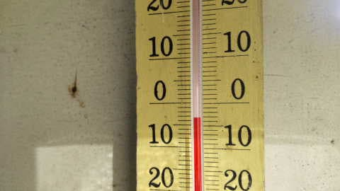

# ダメだ…かなりクリティカル

📅 投稿日時: 2023-03-09 02:39:11

🏷️ カテゴリ: [日記](cc4b5682fb7b8b144980957a978653fb0.md)

本来なら，週末のスキー場天気予想を

したいんだけど…

天気図を読み込む時間も気力もない（涙）

眠い…

とりあえず，こんな状況でも．

志賀高原の特派員からのレポート写真です…

今日も朝から終日晴れ！

シマシマは…

ちょっとボソボソした感じに見えますね…

気温はあさイチはマイナスだったようで．

あさイチは硬めのシマシマだったようですが…

これ，一見きれいな圧雪だけど，すぐ崩れて

コロコロ地獄になったんじゃないかな～…？

そして昼間は，山頂でも気温が+7℃まで

上がっちゃったみたいで…（泣）

東斜面の焼額は，日差しで雪が緩み，

ちょいと滑りが悪い雪になっちゃった

ようですが…

西斜面の高天ヶ原は，昼過ぎくらいまでは

いい雪だったようです…

うーん．

気温が上がったけど，西側斜面はまだ

そこそこ行けるようだけど…

これ，10日に液体が降って，雪は

残念な感じになるのかも…

ってなことで．

今週末の詳細天気予想をしたいところなのですが．

もう，気力がないので簡単に要点だけ．

10日(金)：朝から液体がぱらつく(泣）

　でも，ザーザーぶりにならず，一日

　ぽつぽつと液体が落ちてきたり止んだり

　という天気

11日(土)：朝から晴れ，気温は午前から

　プラス．

　朝の雪は硬くてボロボロ崩れていき

　殺人コロコロになると思うけど，

　すぐに高温+日差しで柔らかくなる．

　午後は雪がザブザブになり，バーンは荒れる．

12日(日)：この日も土曜と同様，

　終日晴れて気温が上がって

　雪はザブザブした感じになる

ってな感じでしょうか…

残念ながら，週末は冷え冷え雪では

滑れなさそうだけど．

まぁ，春スキーと割り切れば，

天気もいいし良い週末かも？？

## 💬 コメント一覧

### 💬 コメント by (レインボー75)
**タイトル**: Unknown
**投稿日**: 2023-03-09 14:12:56

木曜日の志賀高原情報

暖かい穏やかな日は今日まで。

朝一の唐松は硬め。すぐにオリンピックに行ったけれど、早くも柔らかい。

さすればエキスパートだ。うん、今週のMVPは君にあげよう。月曜日は野沢に浮気していたけど、火曜水曜木曜と満足させてくれました。ただ今日は、レッスン軍団が多かったせいか少し密でしたね。

早くもじゅくじゅくのダウンヒルから、10時46分のバスでいちごんに戻ったけど、パノラマも唐松もサウスも荒れはじめていました。

連絡路が負担な人には是非ともバスがお勧めです。

それから妖怪板掴みに会いたい人は、サウスの最後の分流に行ってくださいね。朝一番は会えませんが。

### 💬 コメント by (レインボー75)
**タイトル**: Unknown
**投稿日**: 2023-03-09 15:53:20

木曜日の志賀高原情報2

書き忘れました。この時期、朝は焼額山や奥志賀。ゆるんできたら朝は硬めのファミリーや寺子屋がお勧めかと。

### 💬 コメント by (ヒータロゥ)
**タイトル**: Unknown
**投稿日**: 2023-03-09 19:02:17

昨日、今日は貴重な平日休み。志賀高原全山の遠足しました。

昨日は横手、熊の湯方面。渋峠はこの気候でも緩まず楽しめましたが、いかんせんリフトが、、、

本日はヤケビスタートから中央エリア。レインボーさんのおっしゃるとおり昼過ぎは寺小屋がベスト。ジャイアント〜西館はゆるゆるでしたが幸いにも妖怪は出ませんでした。ジャイアントは高校総体で規制中。もっといいコンディションで大会させてあげたいと思いました。

春スキーだと思えば十分楽しめた二日間となりましたが、長期予報みたら今後ずっと高温傾向。かなり心配です。寺小屋の例年一番最初に薄くなる箇所がすでに薄くなってましたよ。このままでは4月以降かなりヤバそうです。

### 💬 コメント by (Skier_S)
**タイトル**: 明日は朝だけ雨
**投稿日**: 2023-03-10 01:45:53

＞レインボー75さま

今日は気温が高かったですね…

これからの気温を見ると，もう冷え冷え雪で滑るチャンスは無いのかも…

＞ヒータロゥさま

平日スキー，いいですね…

天気も良かったし，春スキーだと思えば良かったんじゃないでしょうか．

しかし，これから1か月，全然冷えそうにないですね…（泣）

