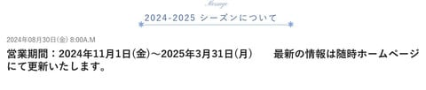
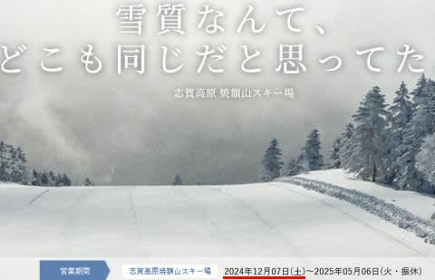
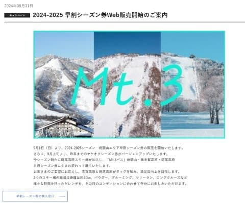
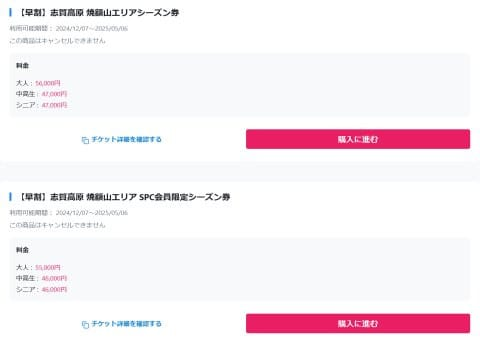
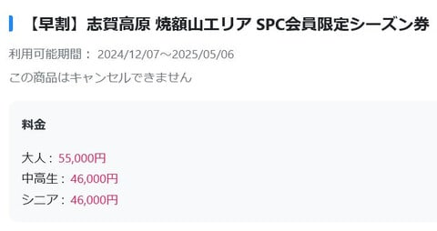
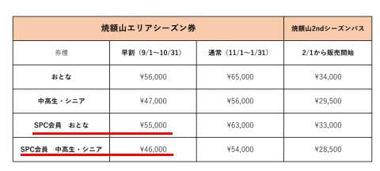
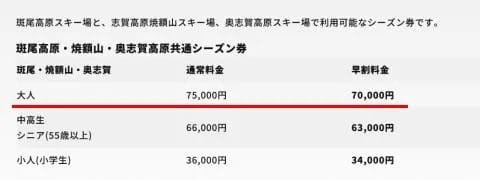

# 軽井沢スキー場，11月1日オープン決定！そして志賀高原の焼額山スキー場限定シーズン券情報が出たよ！価格は据え置き！

📅 投稿日時: 2024-09-01 03:16:23

🏷️ カテゴリ: [スキー雑談](c1f9d2cb7478308da16419928ea3945e9.md)

え？

9月？？

9月って…

1月が始まってから4か月目くらいでしたっけ？

2024年って，24月くらいまであるんでしたっけ？

…にわかに信じがたいことですが．

2024年も早くも2/3が終了したようです…

ウソだ…嘘だと言ってくれ…

しかし．

時が早く経つように感じるということは，

次のスキーシーズンもすぐやってくる

ように感じるということなので．

夏休みも終わってしまった今，

それだけを楽しみにこれから過ごそう…

しかし，イエティオープンまであと2か月弱で

2025シーズン突入か…

ってなことで．

そろそろスキー場の2025シーズンのいろんな

情報が出始めましたが．

まずはこいつ．

軽井沢スキー場．

例年11月3日の祭日オープンだったのが，

昨シーズンは11月1日オープンになり．

2日早まったなと思ったところ…

どうやら2025シーズンも11月1日オープンが

確定したようです！！

（[軽井沢スキー場ホームページ](https://www.princehotels.co.jp/ski/karuizawa/winter/)より）

営業期間は11月1日から3月31日まで．

昨シーズンと変わりませんが，

うーむ．今シーズンは，11月2，3，4日と

3連休だから，3連休の来客を見込んで，

その前日の1日オープンにしたのかな？

（[軽井沢スキー場ホームページ](https://www.princehotels.co.jp/ski/karuizawa/winter/)より）

で．

次の話題が…

我がホームゲレンデ，焼額山スキー場．

まぁ，こちらは例年通りの12月第1週の土曜

ということで，12月7日オープン．

うーん．その前の週は11月30日でまだ11月

とはいえ，日曜は12月1日で12月に突入

しているので，11月30日オープンだと

嬉しいんだけど…

昨シーズンは12月2日オープンなので，

実質1週間近いオープン遅れに感じて，

曜日の都合上ちょっと残念な感じ（ちょい涙）

（[焼額山スキー場ホームページ](https://www.princehotels.co.jp/ski/shiga/winter/)より）

そして…

本日公開されたほやほやの情報．

焼額山限定シーズン券のお値段が公表され，

早割購入サイトがオープンしました！

（[焼額山スキー場ホームページ](https://www.princehotels.co.jp/ski/shiga/informations/seasonpass/)より）

案内ページにはお値段が書いてないので，

[購入サイト](https://jp.wamazing.com/snow/resorts/yakebitaiyama/partner_ec/items?utm_medium=referral&utm_source=yakebitaiyama&utm_campaign=ec)に行ってみると…

（[志賀高原焼額山早割リフト券購入Webサイト](https://jp.wamazing.com/snow/resorts/yakebitaiyama/partner_ec/items?utm_medium=referral&utm_source=yakebitaiyama&utm_campaign=ec)より）

無料で入れるプリンスクラブ会員だと，

シーズン券は早割55000円．

中高・シニアが46000円ですか…！

（[志賀高原焼額山早割リフト券購入Webサイト](https://jp.wamazing.com/snow/resorts/yakebitaiyama/partner_ec/items?utm_medium=referral&utm_source=yakebitaiyama&utm_campaign=ec)より）

昨シーズンの情報を振り返ってみると．

シーズン券は，昨シーズンからお値段据え置き

ですね…！！

値上げがないのはありがたい…！！

（↓2024シーズン価格表）

斑尾・奥志賀・焼額の3山で使える3山共通券は

焼額山の早割リフト券購入サイトからは見えませんが，

[こちらのサイト](https://www.madarao.jp/ski/price/madaraoseasonpass)で購入手続きができます…

（[Webket，早割シーズンパス【斑尾ヤケオクMt.3パス】購入ページ](https://www.madarao.jp/ski/price/madaraoseasonpass)より）

こちらも早割70000円（チケット保証金500円込み，

リフト券返却で500円返金）なので，価格据え置き…

というか，昨シーズンの焼額・奥志賀2スキー場

共通券シーズン券と同じ値段なので，実質

値引きというのは，[以前お知らせした](e43df302476dc8d57e1ed3c933ce2acfb.md)通り．

（[斑尾スキー場ホームページ](https://www.madarao.jp/ski/price/madaraoseasonpass)より）

ってなことで．

焼額山，1日券は500円値上がりしたものの，

シーズン券は2024シーズンから価格据え置きです～！

ということで．

まだまだ暑い日が続くけど．

暦ではもう秋に突入．

スキーシーズンまで，あと2か月弱

ですよ～！！！

## 💬 コメント一覧

### 💬 コメント by (はなげ親分)
**タイトル**: Unknown
**投稿日**: 2024-09-01 04:10:40

ヤケビの2ndシーズン券は全山券との2枚持ちするには微妙に悩む金額だなぁ～

でも、S様は今期は購入決定ですよね(笑)

### 💬 コメント by (Unknown)
**タイトル**: NAGANO6 Powder Dream Pass
**投稿日**: 2024-09-01 11:33:13

NAGANO6 Powder Dream Pass　販売について

https://www.togakusi.com/ski/information/2024/nagano6-powder-dream-pass/

Mt.3パスのシニア条件が５５才から６０才にこっそり書き換わっている。

### 💬 コメント by (Skier_S)
**タイトル**: Unknown
**投稿日**: 2024-09-01 23:06:59

＞はなげ親分さま

昨シーズンと同じなら，シニア券28500円．

早朝と2月のナイターやってこの値段なら絶対お買い得だと思います…

大人料金の33000円だと，ちょい微妙な感じ．

ナイター4回，早朝6回で元が取れる感じなので，GWまで雪が残りそうかどうかで

買うか買わないか考えるのがいいですね…

＞Unknownさま

NAGANO6はノーマークでした．

でも，12万円か…ちょっと買える金額じゃないですね（涙）

mt3パス，確かにシニア料金が55歳からだったはずが，

確かに60歳からに書き換わってますね…！

