# 12月30日の志賀高原・焼額山のコンディションは…朝は良かったけど，午後はやっぱり荒れたかな

📅 投稿日時: 2014-12-30 22:41:45

🏷️ カテゴリ: [2015スキー滑走日記](c09ea645cfc085f86dfcd80f49599dd89.md)

えー．

本日，また志賀高原に舞い戻ってきたわけで．

気合の入った雪道を登って，いつもどおり

焼額第1ゴンドラ営業開始の8時半に間に合うように

ゲレンデに到着すると…

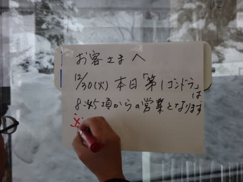

はうあっ！！

なんだと？

第1ゴンドラ営業開始が遅れてる？？

今度は第1ゴンドラが不具合か！？？

…ついに，第1ゴンドラもやばいか？？

＃15分遅れの予定が，実際は5分ちょい遅れで営業開始

無事，営業開始された第1ゴンドラで山頂へ上ると…

ふむ．

気温はマイナス8度．

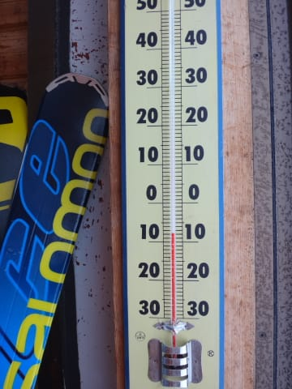

この時期の平均的な朝の気温ですね．

…ただし．

予想通り．

山頂は雪が降り…

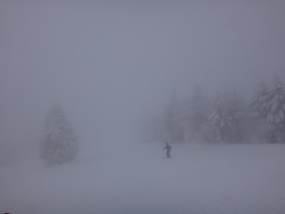

山頂付近はちょいとガスが出て．

ちょいと視界が悪いかな～．

だけど．

雪質も予想通りで．

しっかり締まった圧雪の上に，よく冷えた粉雪が

乗っている，すごいすべりいいコンディション！

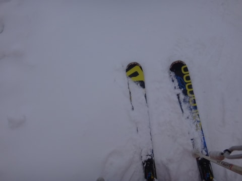

しっかり締まっていて，超快適快楽ハイスピードバーン！！

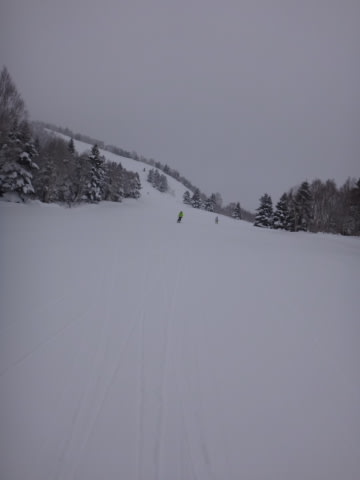

午前10時ごろまでは，かなり快適な大回りバーンを

おいしくいただくことができました．

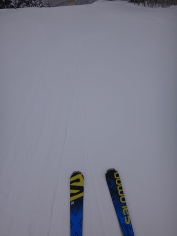

…と，思ったら．

いつもどおり，10時前には人が増えてきて…

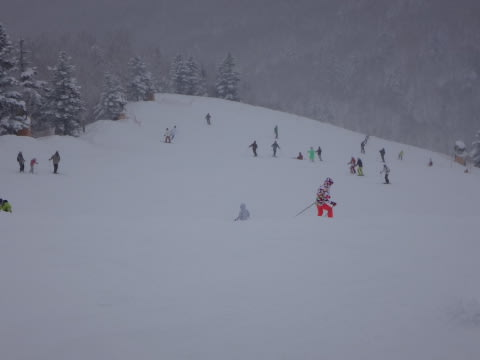

あうーーん．

ゴンドラ10分待ち…（涙）

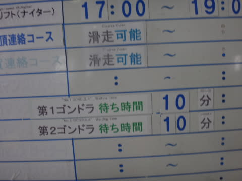

でも，ゴンドラ待ちがあったのは，今日も10時から11時前までの，

わずかな時間．

11時には，ゴンドラ待ちもなくなってました…

でも．

ゲレンデの人はやっぱりちょっと多めで．

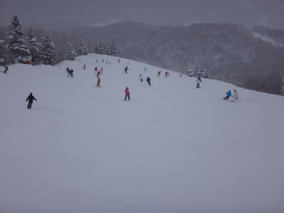

山頂は，雪が降ったりやんだりで，時折ガスも出て．

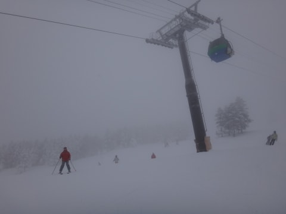

ここも予想通り，やっぱり日が差さない一日で．

午後に向かって，雪が荒れていきます…

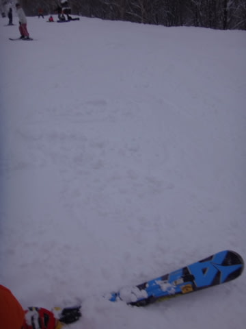

…雪質はいいんですけどね～．

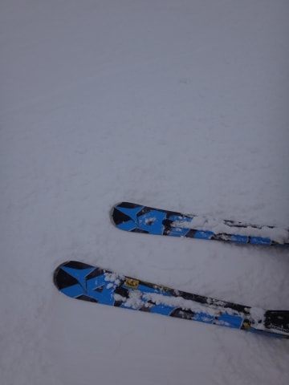

って感じで．

すっきり晴れてはくれなかったものの，

結構しっかりした圧雪でがんがん飛ばせた朝イチから，

人が増えてちょいと滑りにくい午前，

荒れてバンピーになっていき，さらに

曇っていてでこぼこが見えにくかった午後…

という感じで．

朝イチ以外は，もうちょっと…という感じの

一日でしたが．

それにもかかわらず．

夕方，でこぼこバーンを照明がつくまで滑り続け…

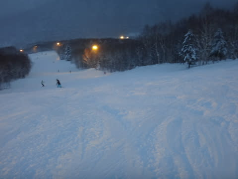

なぜかその後．

ナイターまで滑ってしまったのでした…

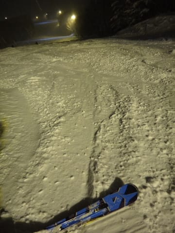

ナイターでもちらちら雪が降っていたので．

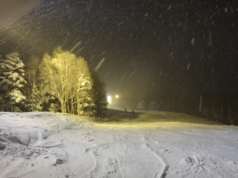

明日の朝も，きれいなやわらかい圧雪かな！

…しかし．

焼額ナイター．

午後5時から7時までの2時間になりましたが．

昼間の営業からそのままひきつづきの営業で．

ナイター営業開始前に圧雪がかからないのが，ちと惜しい！！

今日みたいな荒れ荒れの午後のままのバーンだと，

ちょっと快感度が低いな～（残念）．

やっぱり，ダイヤモンドナイターがいいかな～，

と思った，Skier_Sなのでした．
