# 今週の志賀高原スキー場の天気は，どうもあまり良くなさそう（涙）…そして，2021/2/28(日)の特派員情報！

📅 投稿日時: 2021-03-01 01:18:46

🏷️ カテゴリ: [日記](cc4b5682fb7b8b144980957a978653fb0.md)

ということで．

本日の記事も，志賀高原の特派員情報から

スタートするわけですが．

朝7:50からの焼額山のファーストトラックに

参加した特派員によると．

朝からすっきり晴天で．

冷えて締まった，いい感じのシマシマ

バーンを堪能できたようです…！

うらやましすぎる…

ただ，通常営業開始の8:30には，

焼額第1ゴンドラには結構な人が

並んでいたようで．

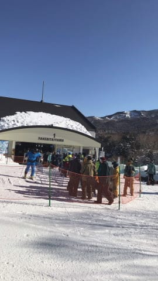

そして，通常営業開始時の

山頂気温は-１℃と，この時期の

朝としては異常な高温！

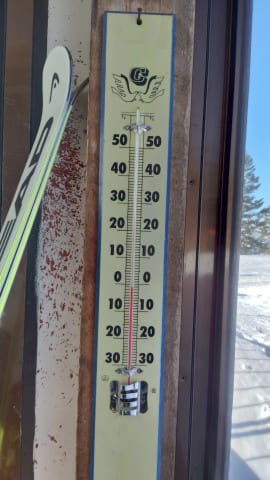

天気も晴れてるから，雪質はかなり緩んで

悪化するんじゃないかな…？

と思ったところ．

標高の高い寺子屋は，午前中は

勘違いバーンというレポートが

入るくらいのいいバーンだったようだし．

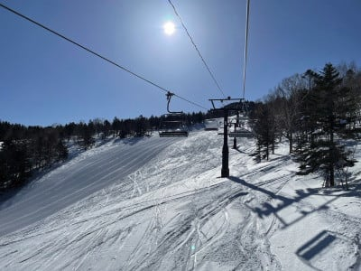

奥志賀エキスパートは昼を過ぎても

いい雪質をキープして．

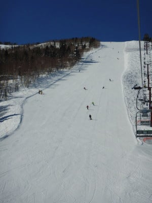

標高の低い西館，ジャイアントも，

ちょっと雪が緩んだものの，雪が

ずっしり重くなるほどではなくて，

結構良かったみたいです！

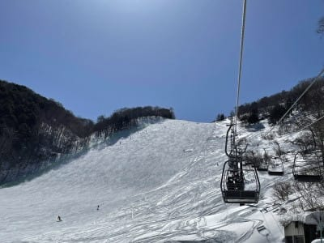

昼間の最高気温は+5℃を超えたと

いうのに．

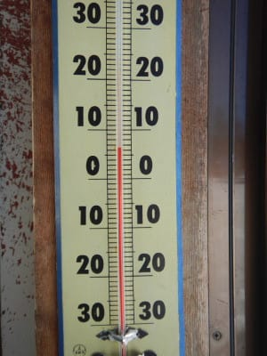

午後になっても，奥志賀や…

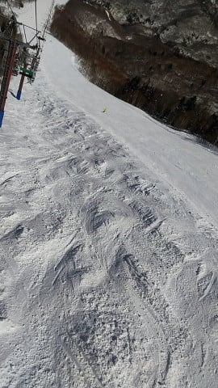

寺子屋はいい雪をキープして．

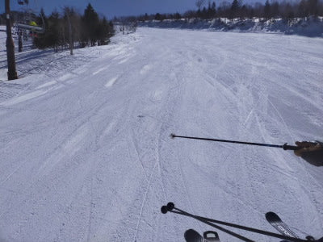

焼額のGSコースも，午後まで

いい感じのフラットを

キープしたようです！

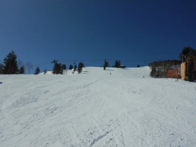

うーむ．

かなり今日は雪が緩むと思ったのに．

こんな晴天でいい雪質をキープしたとは…

ただ，焼額のゴンドラは，第1ゴンドラも．

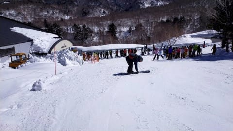

第2ゴンドラも結構混んだみたいで．

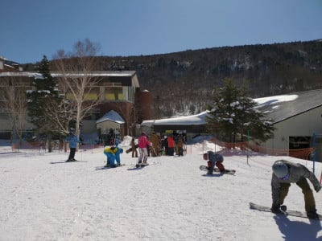

昼休みの12時過ぎくらいに，

一瞬人が減ったものの…

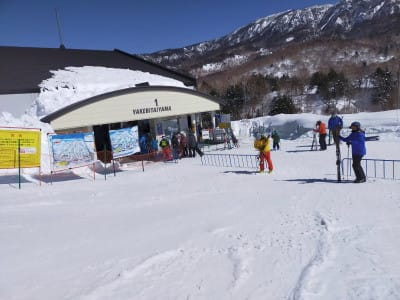

結局，営業終了の時間まで5分近い

待ちがあったようです…

あ，でも．

焼額，奥志賀ともにに，リフトは終日

ほぼ待ち0．

一の瀬も，ファミリークワッドが1-2分

まちがあった程度だったようです…

が．

一の瀬ファミリーは，朝にペアB線が

故障して，リフト搭乗者が救出されるという

事態があったようですね…

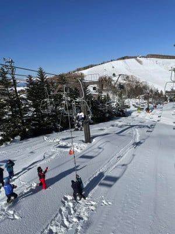

でも．

やっぱり午後はゲレンデはガラガラで．

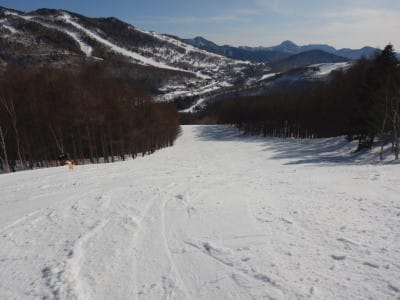

終日晴天の，いい感じで楽しめる

一日だったようです…

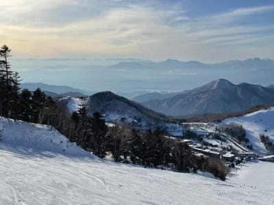

ということで．

このいいコンディション．

一体いつまで続くのか？？

また天気図を見て，ちょっと占ってみま

しょうか…

まず，3月1日（月）の850hpa図ですが．

…赤い0℃線は志賀より北．

志賀高原は赤い0℃線と水色の+3℃線に

挟まれているので…

気温は結構上がりそうですね(涙）

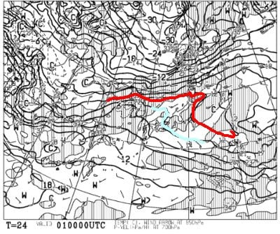

ただ，この日も地上天気図では

降水域が志賀にかかっていないので．

一日晴れの，いい天気になりそう…

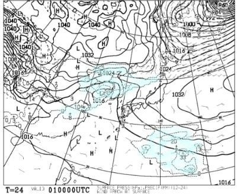

…ただ，朝のゲレンデは硬いかも．

で，2日(火)の850hpa図を見ると．

うげげげげ！！！

この日は，水色で示した+6℃線が志賀より

北に上がってますけど…！？？

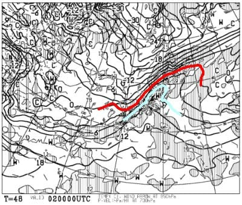

で．

地上天気図を見ると…

…

…（即死）

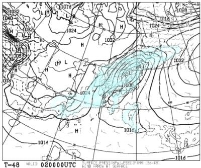

これは…

2日は諦めてください．

激荒れの南風が吹く，雨降りの

一日です…（激涙）

ただ，2日（火）の夜9時には．

こんな感じで，水色の-6℃線が

志賀にかかるほどに

冷え込んでくれて…

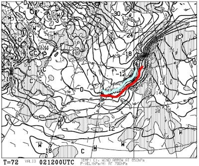

翌3日の地上天気図では，降水域も

本州をすっぽり覆う感じなので．

…これは，2日夕方ごろから

3日にかけては，雪が積もってくれそう…！

…でも，3日の昼には止みそうなので．

積もっても10~20cmくらいかな…

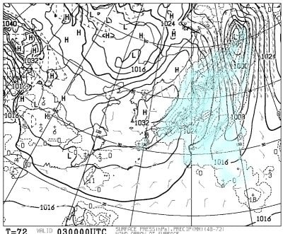

で．

そのあとの4日（水）の850hpa気温を見ると．

この日はギリギリ0℃線が志賀にかかってますが…

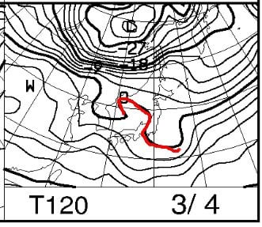

高気圧に覆われそうなので．

この日は雪は降りませんね…

でも，そんなに気温が上がりすぎない

晴れの一日なので．

3日にしっかり雪が積もってくれれば，

意外と悪くないかも…？

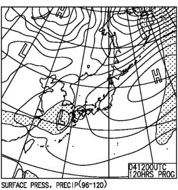

そして，5日（木），6日（金）の

850hpa気温図を見ると．

うううう――む．

どちらも，水色の+3℃線が

志賀にかかる程度なので．

朝はマイナスながら，昼間は

+6℃くらいまで上がりそうで…

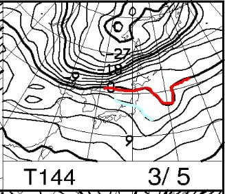

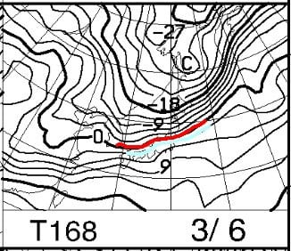

で，地上天気図を見ると．

どちらもギリギリ降水域が

かかっているようで．

運が悪ければ，液体が降りそう…（涙）

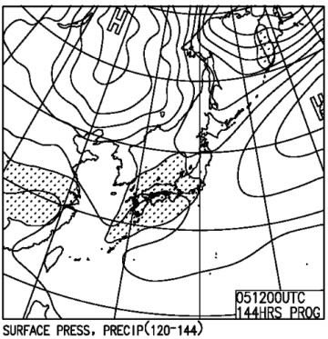

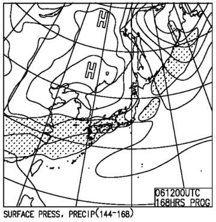

ただ．

木・金の予想はまだ精度が低く．

降らないでいてくれる可能性も

高いかな…

と，思ってます．

ってなことで．

まとめると．

1日（月）：おそらく終日晴れ．

　朝はマイナスながら，昼間は気温が

　むちゃくちゃ上がり，朝はコロコロ，

　すぐに緩んで重い雪になっていきそう…

2日（火）：諦めましょう．

　強烈な南風で，ゴンドラ動かないかも？

　そして，朝から液体が降ってます．

　…ただ，午後のどこかの段階で雪に

　なっていきそう…

　ただ，ウェアに着くと濡れるような

　重い雪ですが．

　夕方から激烈に冷え雪が降り続く．

3日（水）：朝までに10~20cm積もってるか？

　この日は朝は-10℃クラスの冷え冷え！

　ガチガチ硬い雪の上に新雪．

　午前中に雪は止む．

　午後は晴れていくかも…

　昼間も-5℃程度と冷える一日

4日（木），5日（金）：朝はマイナスだけど，

　昼間は+5℃以上に気温が上がりそう．

　曇り~運が悪ければ液体が降る．

　積雪の期待は0．

…ということなので．

次の週末は，あまりいい雪を期待しないで

いたほうが良さそうです…（涙）

…緊急事態宣言が解除になるころを狙って，

雪が悪くなるとは…（泣）

この，狙ったかのようなタイミングの悪さには，

何か悪意を感じるのは，私だけではないはずだ…

## 💬 コメント一覧

### 💬 コメント by (northfox)
**タイトル**: Unknown
**投稿日**: 2021-03-01 09:04:59

昨日はスッキリ青空の下何処滑ってもバーンが良くて最高に楽しめました。（こんな日を待っていました）

一日中夢中で滑りましたね。

お陰で脚の筋肉痛が凄いです。^ ^；

### 💬 コメント by (レインボー73)
**タイトル**: Unknown
**投稿日**: 2021-03-01 13:16:40

月曜日の志賀高原情報

５日も滑ってないと人間だめになる（ごめんなさい）。運転姿勢が一番悪いので、お尻に低反発マットを敷いて、いざ！

道路は油断

できないつるつる氷。危険が危ない！

蓮池ー２℃、山頂１℃。雪質は腰には危険なカチカチ山。カラマツは一番乗りだけと、この硬さではそんなの関係ない。

カラマツもシラカバも硬い。ＧＳも然り。

9時30分オリンピックは緩み始めた。コロコロもあるけど、柔い方が腰に良い。

10時30分１ゴン上５℃。太陽はsunsunと照りつける。ブナは早くもゆるゆる。サウスも腰痛持ちには優しい状態に。

奥志賀に行った仲間によると、朝は硬かったけど、一時間もするとエッジが食い込んだそうな。

今日は高天の銀嶺で旧友と待ち合わせなので、11時終了で、車移動。腰は大丈夫でした。旧友によると、ジャイアントが良すぎたのでずっと滑ってた。朝一からカミカミだったとのこと。圧雪する時間帯によって、雪質は大きく変わるんでしょうね。

帰路の高天７℃　蓮池10℃　上林13℃。今頃はあちこちで妖怪ブレーキに悩まされていることでしょう！

それと、寺子屋も、タンネも、西館も、普通に動いてますねえ。だけど志賀高原は過疎の町。

### 💬 コメント by (スシネコ)
**タイトル**: Unknown
**投稿日**: 2021-03-01 13:17:32

初めまして。突然のコメント失礼いたします。

昔から毎日楽しく読ませていただいております。ありがとうございます。

（ひょっとしたら家が近いのではないかと思っております。）

昨日、有名な方々と初めてお話することができ、とても嬉しかったので、つい、書き込ませていただきました。貴殿とお会いできるのを楽しみにしております。

p.s.

12/30と2/15の１ゴンスタート写真の両端に、私は映っております（笑）

### 💬 コメント by (アリス)
**タイトル**: 休日の客足少しづつ回復
**投稿日**: 2021-03-01 15:16:31

Skier_S様

休日の客足ですが、1月から見ると少しづつ回復しているようですね♪

ファミリーのペアリフトからの避難ですが、初めて見る光景です。あの様子だと、搬器からロープにつかまって地上へ降りるのでしょうか？

例えば体重が極端にあって腕力のない人は可哀そうって考えてしまいます。

レインボー様

復活おめでとうございます。

いつも志賀高原情報楽しみに拝見させていただいております。

### 💬 コメント by (レインボー73)
**タイトル**: Unknown
**投稿日**: 2021-03-01 15:53:14

お借りします。

アリス様、ありがとうございます。11時まで滑ったんですが、大丈夫でした。帰って温泉入って整骨院。完璧です。明日は強風横風なので多分休養日になりそうです。

そうそう、隣のゴールデンリトリバーがずっと懐いていて、私は勝手に『エス』と名付けて、上から目線でかわいがっています。スキーではどうしてもエス様を下から目線でしか見られないので、ここで憂さ晴らしをしてるんですよ。エス様、犬にしてしまってごめんなさい。

それから今日は結婚記念日。

私『45年間ありがとう』

妻『はーい♥今後ともよろしくね』

私『まかせとけ』

娘『いつもいないくせに』

家庭内で私の権力はゼロです。皆様、見習わないでくださいね。

### 💬 コメント by (かず)
**タイトル**: Unknown
**投稿日**: 2021-03-01 20:49:30

さすがに明日の特派員さんはいなそうですね…

### 💬 コメント by (しんちゃん)
**タイトル**: いい雪でした
**投稿日**: 2021-03-02 00:53:29

この土日、ナイター含めてよく滑ったなと思います。

雪質もよく、気持ちよかったです。

ヤケビオールスターの方々とのセッション本当に楽しかった!!帰りにはレインボー様にもご挨拶でき充実した週末でした。皆様大変お世話になりました。

Northfoxさん同様、脚が張っています。最近筋肉痛を少しでも緩和させるためビタミン剤やアミノ酸を摂取している今日この頃。。。

シーズンも後半戦。寺子屋のスキー神社で安全祈願しておきました。安全に楽しくスキーできますように。そしてＳさんが毎週志賀に来れますように(笑)

### 💬 コメント by (Skier_S)
**タイトル**: 明日は荒れ荒れ
**投稿日**: 2021-03-02 01:21:45

＞Northfoxさま

この週末は良かったようですね…

筋肉痛になるほど滑っていたとは…！

＞レインボー73さま

ゲレンデ復帰おめでとうございます！

レインボーさんファンの読者の方が喜んでいることでしょう…

でも，復帰後一発目が重い雪の春スキーで大変だったかと…

腰を傷めないよう，注意して滑ってくださいね～！

＞スシネコさま

特派員との交流，お疲れ様した（笑）．

かなり楽しんでもらえたのではないでしょうか．

また志賀高原でお会いした時はよろしくお願いします！

＞アリスさま

リフトからの救出は，ロープのわっかの中にぶら下がる形で

しっかり体が確保されているので，落っこちることは無いです…

救助スタッフがゆっくりロープを下して，安全に下まで下してくれますよ！

＞かずさま

いや…

明日も一応山まで上がってみた…という人が数人はいそうな予感（笑）

### 💬 コメント by (Skier_S)
**タイトル**: ＞しんちゃんさま
**投稿日**: 2021-03-02 01:24:48

土日とも，いい天気の中たくさん滑れたようで良かったですね…

日曜はラストまで滑ったんですか？

あと，安全祈願ありがとうございます．

早くコロナが収まるよう，神にでも何にでも祈りたい気分です…

