# 4月13日の志賀高原焼額山の状況は…朝は最高っ！！！！

📅 投稿日時: 2013-04-13 21:59:45

🏷️ カテゴリ: [2013スキー滑走日記](c91dbe557f9a69230b1600e48622fdd61.md)

えーー．

本日．

我が家を深夜2時半過ぎに出て．休むことなく一人で運転．

…早朝スキー開始の7時ちょうどに焼額にやってきたわけですが．

今日の早朝は．

むふふふふふふ．

ふははははっ！

最高っ！

だったのだっ！！！！！！！

朝の道路状況は，久しぶりのつるつる雪道で…

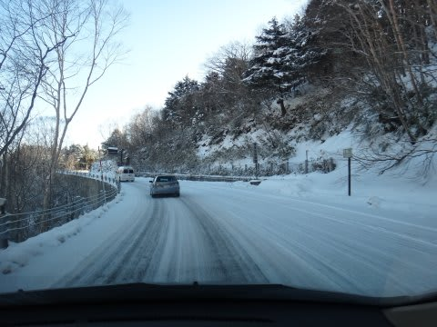

うむ．この路面の積雪は．

ゲレンデ状況に期待がもてるぞっ！

で．

スキー場に着いて，早朝ゴンドラに乗り込むと…

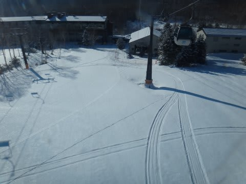

…これは，新雪？

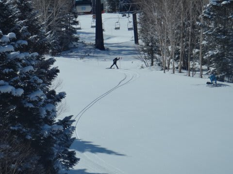

朝のゴンドラ営業開始直後，誰も滑ってないゲレンデを，パトロールの人が

シュプールをつけているのを見て…

こ，これは…（よだれだらだら)

は，早く滑らせろ～！

ゴンドラ，加速だっ！！←しないって

山頂に着くと…

なんと，気温はマイナス4度！

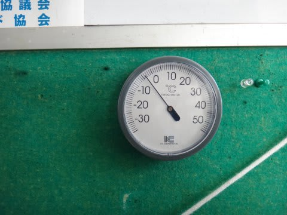

そして…

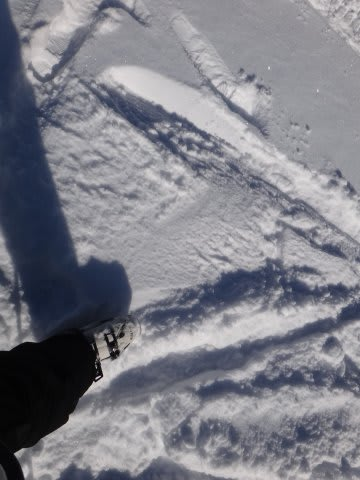

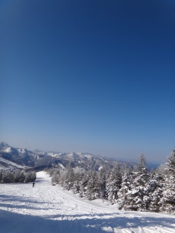

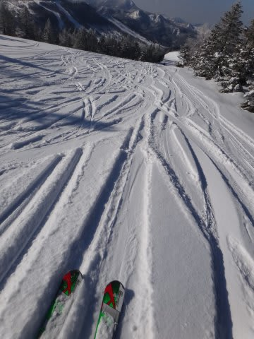

…多くは語りません(笑)．

写真のとおりです(喜)．

マイナス4度のパウダーが，5cmほどとはいえ積もってます…

その下はしっかりと固まっており．

上のふわふわを蹴散らしつつ．

快楽の大回りじゃーっ！！！！！！

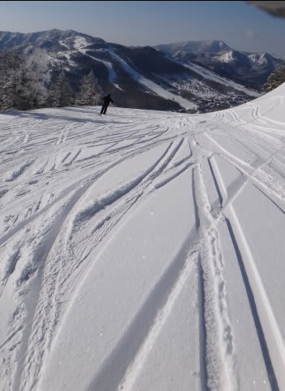

今年は最低の3月だったし．

今年の3月，ここまで良いコンディションは無かったのでは…

気温も低く，天気も晴れて．人も少なく．

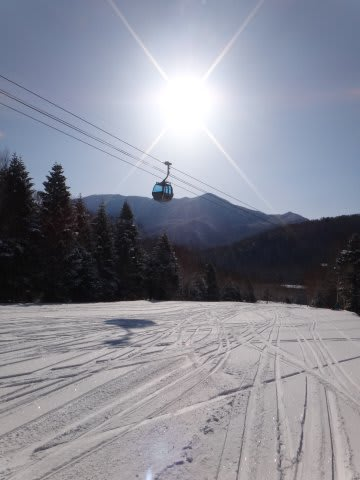

ああ．．．．幸せ…

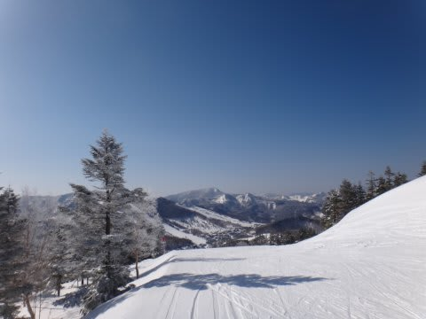

最低の3月＆地獄の先週を過ごしてきたので．

この幸せが身にしみる…

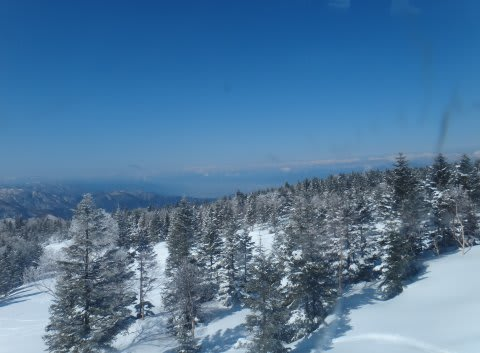

ただ．

やっぱり昼になると残念ながら気温が上がり，

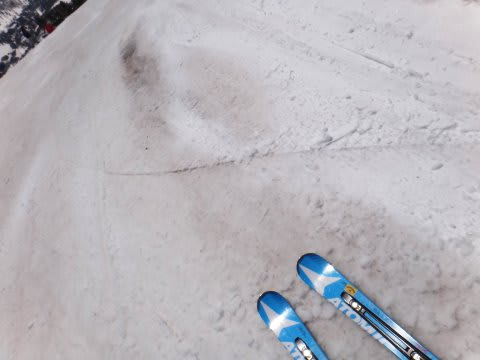

ところどころ汚れた雪が，新雪の下から顔を出してきました…

んで．

11時ごろにはこんな感じの雪質になり…

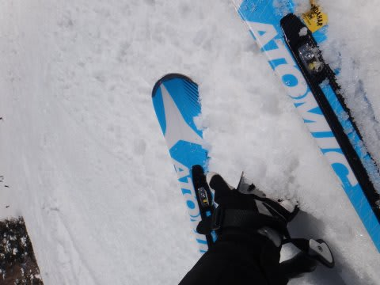

午後に向かって，だんだんと荒れていきました…

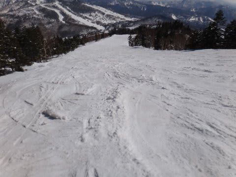

リフトストップのころにはこんな感じでしたが．

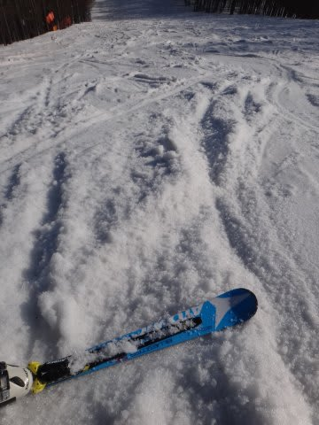

幸いなことに，板が張り付く雪にはならなかったので，ラッキー！

＃昨日の予想，「張り付く雪になるかも…」って所をはずしちゃったということは黙っておこう．←だからここに書いてる時点でばればれだって

んで．

今日は，一の瀬ナイター無料開放の日！（ぱちぱちぱち）

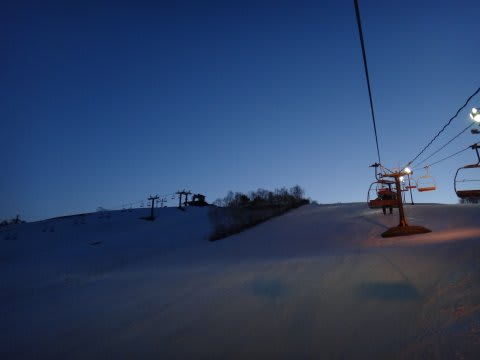

いやー．

雪は結構硬かったですよ～．

膝にびりびり来る感じ．

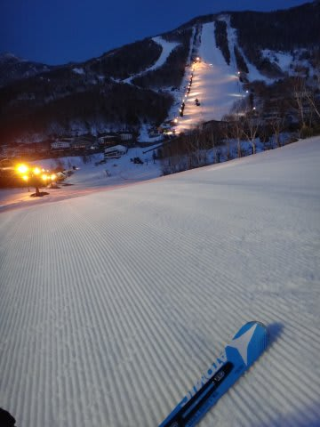

リフトに乗りあったレーサーは「コンディション最高ですねっ！」と

喜んでましたが…

でも，タダナイターを満喫！

いやー．しかし．

今日は早朝からナイターまで．

すべりまくったぞ～！(満足)

PS.今日の昼間は暖かかったので，現在道路は一の瀬エリアまで，

　ほぼ完全にドライになってます…

　ただし，トンネル内とかまだ凍ってるかも．

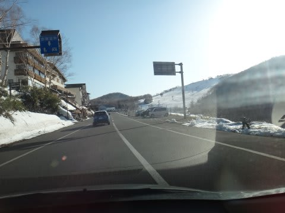

## 💬 コメント一覧

### 💬 コメント by (gokuraku skier)
**タイトル**: Unknown
**投稿日**: 2013-04-14 06:54:06

いや～昨日は最高だったですね。

私はあの後数本滑って一ノ瀬方面に移動しました。

それにしても、早朝＋通常営業＋ナイターって凄すぎます。

skilineは20,000超えですか？

### 💬 コメント by (aqura)
**タイトル**: Unknown
**投稿日**: 2013-04-14 14:03:16

幸せそうな書き込み、読んでいてもニマニマしちゃいます。私の車は昨日、冬仕様解除です。まだまだ、スキーレポート期待しています。

### 💬 コメント by (Skier_S)
**タイトル**: 最高の土曜日でした～
**投稿日**: 2013-04-14 23:48:45

>gokuraku skierさま

土曜日の朝はゆっくりお話できなくてごめんなさい…

いや，あまりにも早朝が良かったので，

あと1-2分待てば，ご一緒できるかなぁ，とは思ったのですが．

あまりにも雪質が良いゲレンデに引っ張られ，

ついつい急いでゴンドラに向かってしまいました…

でも，ゲレンデ状況は最高でしたねっ！

>aquraさま

いやーー．

良かったですよ！この週末は．

冬試乗解除って，もうシーズン終わりですか？

私のシーズンはまだまだ続きますよ～．

### 💬 コメント by (Skier_S)
**タイトル**: gokuraku skierさま
**投稿日**: 2013-04-14 23:59:12

あ，あと追記ですが．

この日のナイターは無料で，リフト券がなかったので

Skilineの記録が無いんですよ…

でも，私のAltimaxの記録ではだいたい

早朝：2500m

昼間：12000m

ナイター：3500m

で，18000mってところなので，残念ながら20000mは行かなかったです…

### 💬 コメント by (gokuraku skier)
**タイトル**: Unknown
**投稿日**: 2013-04-15 18:53:23

あの雪の状況でフルに一日滑れる脚力は凄い！の一言です。

私なんて9000ｍチョイで太もも売り切れでしたから。

### 💬 コメント by (Skier_S)
**タイトル**: gokuraku skierさま
**投稿日**: 2013-04-15 23:43:47

いやー．

http://www.skiline.cc/skiing_day/12g4ug14nfn

http://www.skiline.cc/skiing_day/12g4ug02g04

この日は滑走距離よりも，前日夜10時まで会社にいたのに，

朝2時半に起きて，夜9時のナイターストップまで活動し続けたほうが，

自分にとってはアホだなぁ…

と思うところです(笑）．

今日も眠いです…

