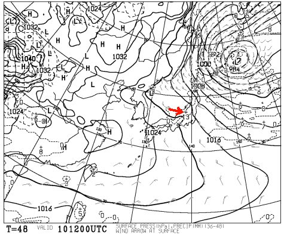
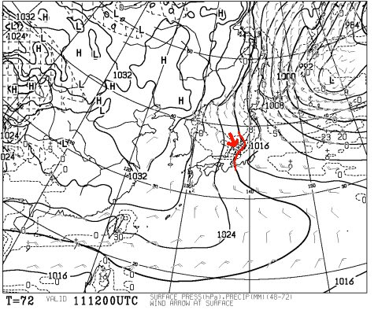
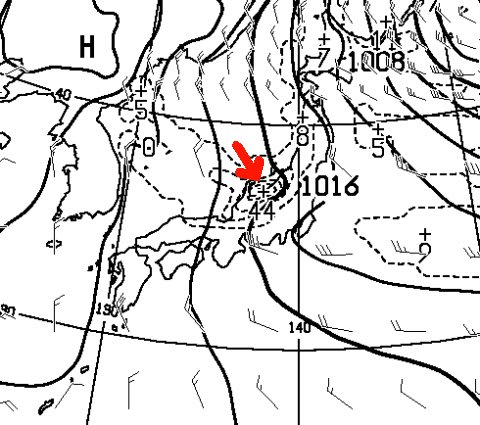

# あれ？3連休，中日は結構な雪っぽい…むしろ，初日の方が晴れ間が見えるかも？？

📅 投稿日時: 2015-01-09 02:00:26

🏷️ カテゴリ: [日記](cc4b5682fb7b8b144980957a978653fb0.md)

えー．

焼額のゴンドラ降り場で．

ゴンドラを降りたあと，板を履いて滑りだすまでの

私の動作を見ていた，全く見ず知らずの人に

「早っ！」

と，驚かれてしまったSkier_Sです．

＃あまりにもゴンドラに乗り続けたおかげか，

＃私のゴンドラ乗り場や降り場での動作には

＃無駄が無くて早いよっ！

さてさて．

本題．

…昨日の天気予想では．

3連休初日の10日は曇り～雪，

2日目の11日は曇り～雪だけど，風が西に回れば晴れ間も…

って感じでしたが．

…今日の最新の天気図を見てみると．

ありゃりゃ？？

10日，午後9時の予想地上天気図は，

こんな感じで，志賀高原近辺の等圧線が，

なんだかビミョーな感じでゆがんでいて．

赤矢印で書いたように，西風が入る感じに

なってますね～

…これは．

もしかすると．

10日に，晴れ間が見えるタイミングがあるかも…

そして．

3連休2日目の，11日の地上天気図を見てみると．

こんな感じで，10日とは逆のゆがみが出ているので…

赤矢印で書いたように，北風が入ってます．

…これは，志賀でも雪になる風向きですね…

さらに．

この地上天気図を拡大すると．

矢印の先，新潟付近に「44」という数字が見えます．

これは，24時間降水量が44mmになる予想．

雪だと，44cmの積雪ってことで．

…かなりの積雪ですな，これは．

んで．

この降水域は，北信州まで伸びているので…

11日の昼間，結構な勢いで雪が降るかも…

ってことで．

昨日の天気予想は多少修正．

10日：朝は10cm位の新雪がつもっているかな…

　　圧雪コースは，柔らかい圧雪の上にうっすら新雪．

　　曇り時々雪，午後は晴れ間も見えるか．

　　午後にコースは荒れていく．

11日：この日は，朝はブーツパフくらい積もっているかも？

　　基本的に雪降りの一日．雲の高度が下がるタイミングでガスるかも．

　　時折強く降り，昼間もコースに雪が積もっていく．

　　午後は，積もった雪が蹴散らされ荒れたバーンに

って感じかな…

ただ．

等圧線のゆがみは，正確に予想しにくい，

プチ低気圧によるもの．

このプチ低気圧の南北のわずかな位置の違いによって，

風向きが全く変わっちゃうので．

実際の天気は大きくずれちゃうんですね～

ってことで．

まだ予想は変わる可能性はあるし．

ちょっと志賀高原のピンポイント予想は難しい状況かな～．

…と，予想が外れた時の予防線を張っておく（ちょっと弱気）

＃いや，これまでの経験上，こういう天気図のとき，予想天気図と

＃実際の天気図が違うことがかなり多いので…

## 💬 コメント一覧

### 💬 コメント by (はなげ親分)
**タイトル**: 晴れの日を!!
**投稿日**: 2015-01-09 11:36:52

還暦スキーヤーの私は視力が落ち、暗い日は技術の無さも相まって非常に苦手です（悲）

是非、是非、強大なS様のお祈りにて晴れの日を１日で結構です、私にお与えくださいませ!!

### 💬 コメント by (ひろちゃん)
**タイトル**: 楽しみましよ
**投稿日**: 2015-01-09 22:49:13

ご無沙汰しております。この度は、奥様大変でしたね。心中お察しします。エス様は、幸せな方ですね、多分奥様は、まだ、怪我癒されていないが、志賀に、送り出して、もらえたですね、公私頑張っている、ご褒美です、楽しみましょう

### 💬 コメント by (Skier_S)
**タイトル**: 3連休は…何とか1泊2日かな
**投稿日**: 2015-01-10 04:18:10

＞はなげ親分さま

えええ！還暦だったんですかっ！！

てっきり，わたしよりちょっと上くらいだと

思っていました…

3連休も志賀ですか？

私は10日は行けないので，

祈るとしたら11日以降に晴れるよう祈りたいところですが．

うーむ．

やっぱり，晴れるなら10日っぽいです．

…10日だけ晴れて，あとの天気が悪かったら．

私の日ごろの行いが…ってことかな…

＞ひろちゃんさま

思った以上に早く回復しているので，

3連休も1泊2日か日帰りで滑りに行かせてもらえそうです．

楽しんできます！

…とりあえず，明日はスキーに行かず，

妻を病院に連れて行って，家事を手伝います…

