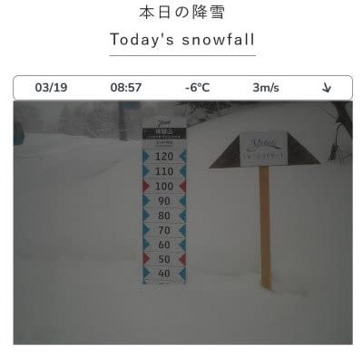
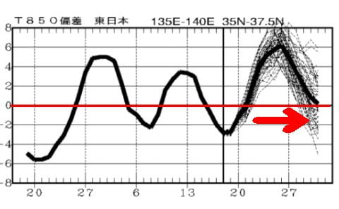

# 3月22，23日の週末の志賀高原スキー場の天気は…土日とも晴れ！ただ気温が4月下旬並みに上がる

📅 投稿日時: 2025-03-20 00:48:34

🏷️ カテゴリ: [スキー天気予想](c6554f5c3c106093b511a8daae23757e8.md)

えー．

本日水曜の志賀高原は，ちょっと重めの

雪ながらも，朝までに40cmくらい

積もったようです！！！

（[焼額山スキー場ライブカメラ](https://www.princehotels.co.jp/ski/shiga/livecamera/)より）

そして，昼間もさらに10cmくらい積もり，

ゲレンデは完全にトップシーズンの

状態に戻ったんじゃないかなと

思います！！

…これはいい感じですよ～っ！！

果たしてこれから，このGoodな

コンディションが続くのか？？

水曜深夜恒例，志賀高原の天気を予想

してみましょう…！！

えー．

今日はあんまり時間が無いので，

天気図解説はなくていきなりまとめから

行くと．

20日(木)：朝のうちはちょっと雲が残るか

　もしれないけど，晴れの一日！！

　気温は朝イチは-9℃くらいと冷えて，

　昨日の新雪が圧雪された，1月や2月の

　ような冷え冷え新雪圧雪の最高

　シマシマバーン！

　昼間もマイナス気温をキープするので，

　雪は緩まず，トップシーズン並みの

　雪を晴天で滑れる，3月下旬と思えない

　いいコンディション．

　雪が柔らかめなので，夕方は急斜面は

　ちょっとバーンが凸凹して，

　一部下の硬めのところが出てくるかも．

21日(金)：この日も終日晴れ！

　朝は気温が低く，いい感じの締まった

　最高雪のシマシマバーンです！

　ただ，昼間は気温が上がるので…

　日差しの良いバーンは雪が緩みそう．

　日差しがそれほどないバーンはそこまで

　緩まず，この日も結構楽しめそう．

22日(土)：3日連続晴れ！

　朝イチはこの日結構締まった感じで

　板が走るけどエッジが食い込む

　いいバーン！

　でも，この日は朝から気温が高く，

　昼間は山頂でも+8~9℃くらいまで

　上がるので…

　昼間はだんだん雪が緩んで，

　午後には完全に春の重いねっとり

　した雪になっていく．

　午後はちょっとバーンが荒れ気味に．

23日(日)：おそらくこの日も終日晴れ！

　朝はかなり硬めのカリカリバーン．

　でも，朝から気温が0℃くらいなので，

　日差しもあって雪はすぐ緩む．

　朝のうちは硬いのがだんだん緩んで

　エッジが効いていくいい感じだけど，

　昼前にはユルユルに緩んでいく．

　午後は3月末らしい，重い春の雪に

　なっていく．

　でも天気も良く暖かいので，

　春スキーと割り切れば楽しい．

という感じでしょうか…

これから4日間は基本的に晴れの天気に

なりそうで．

20，21日はかなり良さそう…

特に20日は最高に違いない…っ！！！

というか，23日以降は3月29日ごろ

まで，気温が高い日がずっと続きそう

なので…

これ，3月20日はトップシーズンの

柔らかい圧雪を滑れる，今シーズン

最後のチャンスじゃないか？？？

…最後のチャンスじゃなかったとしても，

こんな絶好の天気で最高の雪を滑れる

日はそうそうないんじゃないか…？？？

…

そして．

明日は祭日だ．

…明後日は仕事だけど．

…

今日は仕事から帰ってきたのは0時過ぎ．

…今はもう1時前．

…これから2時間半睡眠で，行くか？？

行くのか？？？

そして，日帰りで600km以上運転して

帰ってきて，また睡眠不足で金曜も

朝から仕事して．

…そしてまた土日に滑りに行くのか…？？

体力と精神力がもつのか…？

とりあえず．

これから2時間半後に起きることができて，

志賀高原に向かっているかどうか…

乞うご期待！！←何に期待するんだ？

## 💬 コメント一覧

### 💬 コメント by (kyotoヒロシ)
**タイトル**: Unknown
**投稿日**: 2025-03-20 05:58:34

昨日は夜中から降り出して一気に積もった重い湿雪が板の進路を阻む滑りにくいコンディションでしたが、10時ごろには志賀高原らしいプラチナパウダーが降り出し、バーン状態は一気に良くなりました。

人も少なくなっていたので、その後はパフパフの新雪を堪能させて頂きました

特に、唐松ゲレンデは良かったです

今日は朝イチから楽しめそうです

お待ちしてます（笑）

### 💬 コメント by (まっt)
**タイトル**: Unknown
**投稿日**: 2025-03-20 11:35:05

もしかして起きられなった　😂

### 💬 コメント by (レインボー77)
**タイトル**: Unknown
**投稿日**: 2025-03-20 20:53:15

木曜日の志賀高原情報

朝の蓮池-8℃。ダイヤのサラ場が超最高、食い込む快感ピークの5点。唐松も然り5点。白樺も5点満点。こんな時期にシーズンベストとは！エス様の無理してでも来るという英断はやっぱりすごい。

GSは少し荒れだして4点。奥志賀三高も同様3点で、ヤケビに戻る。エンヤコラ漕いで体力限界。イーストは5点でよかったけど、目指すはタンネ。

ここがまた良かった。荒れてなくて快感の連続。三人で横滑りの練習がてらコースをならしたら、やっぱり何人かに滑られてしまったのは、仕方ないけど悲しかった。

そうそう、今日はエス様と同じウエアの影武者にお会いしました。

話すといろいろ繋がっているんですね。雪山アプリの私のフォロワーだし、彼の両親ともお話ししてるし、極めつけが、一昨年GSサイドで彼の外れた板を私が探して見つけてあげたとのこと。繋がってますねえ。さらに彼は20000mやってるし、えきっぷブーッと板。あのウエアはエス様より先に買ってるらしい。

そんなこんなで、爽やかな楽しい一日となりました。

### 💬 コメント by (Skier_S)
**タイトル**: 今日の志賀は良かったよ！！
**投稿日**: 2025-03-21 00:52:52

＞kyotoヒロシさま

今日はあさイチから楽しめました～！

いやー．良かった．無理して日帰りで行った甲斐がありました！！

＞まっtさま

かなり辛かったですが，何とか起きられました…

＞レインボー77さま

今日は無理していく価値がある一日でしたね！！

そして影武者…どっちが本物なのか…後でウェアを買った私の方が影武者ですね…たぶん(笑)

